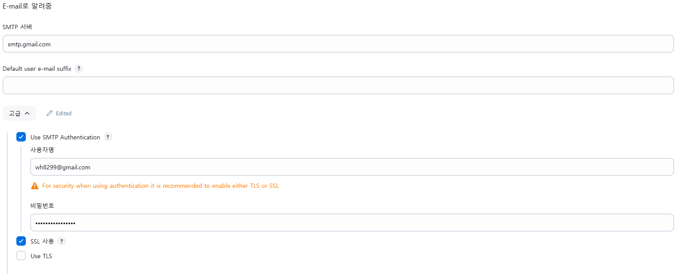
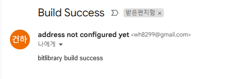

# Jenkins 빌드메시지 Gmail 알람 구축




- 젠킨스 설정을 추가한다
- gmail smtp SSL(465) port를 이용한다
- gmail의 비밀번호는 일반적인 비밀번호가 아닌 App 비밀번호를 생성해서 입력해주어야 한다
    - https://myaccount.google.com/apppasswords
## jenkins script

- step 에 post 항목에 mail을 추가시켜야 한다
- post항목이 한개가 아니라면 에러가 생기니 주의해야 한다
```jenkins
    <!-- 오류 발생 -->
    post {
        success {
            echo 'success'
        }
        failure {
            echo 'failed'
        }
    }

    post {
        success {
            mail to: 'wh8299@gmail.com',
                 subject: "Build Success",
                 body: "bitlibrary build success"
        }
        failure {
            mail to: 'wh8299@gmail.com',
                 subject: "Build Failed",
                 body: "bitlibrary build failed"
        }
    }
```

## Docker 내부 캐시 삭제 스크립트 추가
- 사용하지 않는 이미지, 컨테이너, 볼륨 삭제
- docker system prune -a