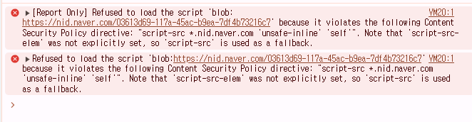

# Https 설정에 생긴 문제들

## linux 권한 설정 문제
- ec2-user이 파일의 소유자라면 jenkins가 사용할 수 없다
- 소유자를 jenkins로 바꾸는 편이 명확하다
- 파일만 바꾸는 것이 아니고 -R 옵션을 사용해 재귀적으로 폴더의 권한까지 줘야 jenkins가 CP동작을 수행할 수 있다.

## spring boot docker image build 중 생긴 Connection confuse exception
```shell
#9 0.959 Downloading https://services.gradle.org/distributions/gradle-8.11.1-bin.zip
#9 1.641 
#9 1.643 Exception in thread "main" java.net.ConnectException: Connection refused
#9 1.646 	at java.base/sun.nio.ch.Net.pollConnect(Native Method)
#9 1.646 	at java.base/sun.nio.ch.Net.pollConnectNow(Net.java:672)
```
- 메모리때문에 생긴 단순 오류일 가능성이 있어 다시 시도해봤다(실패)
- jenkins 서비스 재시작 시도(살패)
- tmp 폴더 용량 분배(실패)
    - `sudo mount -o size=4G -t tmpfs tmpfs /tmp`
- EC2 인스턴스 재부팅(성공)
    - `free` 명령어로 남은 메모리 용량을 찾아보니, jenkins가 한번 빌드될때 ram에 무언가를 cache시키는데, 한번 빌드 되면 이후 빌드부터는 cache로 인해 용량이 부족해서 해당 증상이 발생하는 것 같다.(추측)
    - 매번 인스턴스 재부팅을 하면 빌드시 인터넷 연결 오류가 발생하지 않는다..

## application.yml 설정 문제

- yaml파일의 들여쓰기는 \t , \n을 구분한다.
- \t 로 \n과 같은 칸을 이동하더라도, 이는 파싱할때 문제를 일으켜 정상적으로 인식되지 않는다.
- 주의해야 한다..


## OAuth2 로그인을 하더라도 Cookie 미지급 오류
- application.yml 설정 https로 변경 후 빌드 - 실패
- cors 설정 변경, spring security cors 설정 변경 - 실패
- 브라우저 콘솔창에 해당 메시지가 나오고 리다이렉트 되고 있었다..



- CSP spring security 설정 변경 - 실패

### X-Forwarded-Proto 헤더 설정/쿠키 설정 변경/iptables 설정 변경(실패)
- iptables 규칙으로 443port를 7777port로 라우팅 시키는데, OAuth2의 요청은 443port로 들어오지만, protocol을 spring boot가 인식하지 못한다는 생각이 들어서 설정을 바꿔봤다
- X-Forwarded-Proto 헤더 설정
    - 클라이언트가 원래 요청을 보낼 때 사용한 프로토콜(HTTP 또는 HTTPS)을 나타내는 HTTP 헤더
- Spring Security에서 ForwardedHeaderFilter를 활성화해 Spring이 HTTPS 요청으로 인식하도록 설정했다

```java
@Bean
public FilterRegistrationBean<ForwardedHeaderFilter> forwardedHeaderFilter() {
    FilterRegistrationBean<ForwardedHeaderFilter> bean = new FilterRegistrationBean<>();
    bean.setFilter(new ForwardedHeaderFilter());
    return bean;
}
```
```yaml
# application.yaml
# X-Forwarded-Proto가 https로 인식시키기
server:
  port: 7777
  forward-headers-strategy: framework
```

- Spring Boot가 HTTPS를 신뢰하도록 SameSite=None과 Secure 옵션을 추가한다.

- spring security 설정 반영
```java
// Spring Boot가 HTTPS 요청을 강제하도록 설정
http.requiresChannel(channel ->
        channel.anyRequest().requiresSecure()
);
```

- iptables 규칙 수정
    - iptables에서 443 → 7777 포트로 단순히 포워딩만 하고 있는 것을 DNAT (Destination NAT)와 MASQUERADE를 사용해 HTTPS 트래픽을 더 명확하게 처리한다.
```bash
# 기존 규칙 삭제
sudo iptables -t nat -D PREROUTING -p tcp --dport 80 -j REDIRECT --to-port 443
sudo iptables -t nat -D PREROUTING -p tcp --dport 443 -j REDIRECT --to-port 7777

# HTTP를 HTTPS로 리디렉트
sudo iptables -t nat -A PREROUTING -p tcp --dport 80 -j DNAT --to-destination 127.0.0.1:443

# HTTPS 요청을 Spring Boot의 7777 포트로 전달
sudo iptables -t nat -A PREROUTING -p tcp --dport 443 -j DNAT --to-destination 127.0.0.1:7777
sudo iptables -t nat -A POSTROUTING -p tcp --dport 7777 -j MASQUERADE
# 80번 포트로 요청이 들어오면 443으로 리디렉트
# 443번 포트(HTTPS)로 온 요청을 7777로 전달
# 클라이언트가 HTTPS로 접근하면 Spring Boot도 HTTPS로 인식할 수 있게 한다.
```
- 결과적으로 설정을 해도 cookie를 못 받아와서 실패..
- 해당 방법이 맞는 방법같지만, 하다보니 더 좋은 방법이 생각나서 밑의 방법으로 시도해보니 성공하여 해당 방식으로 작업은 중단했다

## spring boot를 443 port에서 실행(성공)
- 의외로 정답은 정말 간단한 방법이였다..
- 굳이 443 port를 spring boot를 다른포트에 켜서 라우팅할 필요 없이, 443 port에 spring boot를 키니 문제가 발생하지 않았다.
- 원인을 생각해보면 

### 443port를 7777port로 라우팅
- 클라이언트 → 443(HTTPS) → iptables(7777로 포트 포워딩) → Spring Boot
- 하지만 Spring Boot는 7777 포트에서 HTTP로 실행 중이므로, OAuth2 로그인 과정에서 SameSite=None; Secure 쿠키가 제대로 지급되지 않고 있다
- 브라우저는 HTTPS에서 Secure 쿠키를 요구하는데, Spring Boot는 요청을 HTTP로 인식해서 Secure 옵션이 빠진 쿠키를 내려보내는 문제가 생긴 것 같다.
- iptables의 포트포워딩이 protocol까지 그대로 보내 모든 정보를 전달해주는 것인줄 알았는데 그 것이 아니고 단순히 포트를 변경하는 역할을 하며, 원본 요청의 프로토콜 정보(HTTP/HTTPS)는 전달되지 않는 것 같다. 따라서 Spring Boot는 클라이언트의 원래 요청이 HTTPS였는지를 인식하지 못하고, HTTP로 요청이 들어왔다고 판단해 Secure 옵션이 빠진 쿠키를 내려보낸 것인것 같다.
- HTTP요청에는 요청이 HTTP인지, HTTPS인지 포함하지 않기 때문에 발생한 일인것 같다.
- 서버는 요청에 응답을 할 뿐이므로 개발자가 지정 해줘야하니 다음부터 주의해야 할 것 같다.

### X-Forwarded-Proto 설정
- X-Forwarded-Proto를 설정해도 Spring Boot가 이를 신뢰하도록 ForwardedHeaderFilter를 활성화해서 실행시킴
- 해당 방식은 되어야하지만, 해당 방식을 하던 중 다른 방식으로 선회해서 작동 여부를 확인 못했다.. 아마 이론상 될 것 같다