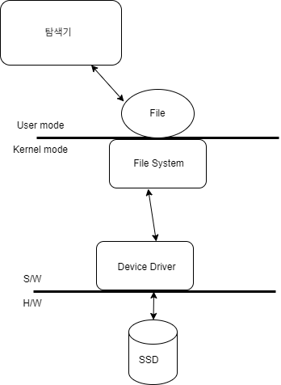

# File

## 파일 시스템 기본 이론

- 2차 메모리를 관리하는 방법으로 파일 시스템 사용
- 윈도우 파일 시스템(NTFS)에서는 논리 드라이브 단위 및 경로 사용
- .은 현재, ..은 상위 디렉토리를 의미
- 절대경로와 상대 경로가있음
- 파일은 프로세스가 접근 주체(핵심 문장)
  - 여러 프로세스가 존재하는 시스템에서 한 파일에 대한 동시접근 시 데이터가 엉키는 문제가 발생할 수 있음
  - 한 프로세스가 읽을 때, 다른 파일이 Read를 하기위해 접근하면 거부 당할 수 있다
- 파일 입/출력에 사용되는 내부 버퍼가 있을 수 있음
  - Buffered I/O
  - 옵션이지만 거의 대부분 버퍼를 가지고 사용한다
- 장치는 파일로 추상화됨
- 파일에 대한 접근은 RWX 3가지가 있다
  - 여기서 파생된 OPEN/CLOSE가 있다

## 파일 시스템 구조



- H/W를 사용하기 위해서는 1차 S/W로 동작을 가능하게 하는 기능을 추상화한 Device Driver가 있고, 또 그 동작을 추상화한 Kerner의 System call들이 있다
  - User mode에서는 이 System call을 효율적으로 사용해 H/W를 움직이는 Application을 개발하는 것이 목적이다
  - 디바이스 드라이버(Device Driver)는 하드웨어를 직접 제어하는 1차적인 소프트웨어이다
    - 각 하드웨어 장치(e.g. 그래픽카드, 키보드)의 복잡한 동작 방식을 추상화하여, 운영체제(OS)의 Kernel이 일관된 방식으로 장치에 접근할 수 있도록 인터페이스를 제공한다
    - OS에서 제공하는 일반적인 형태의 하드웨어 인터페이스가 있고(window, linux) 그에 맞게 하드웨어 제조사들이 구현해놓은게 하드웨어 드라이버이다
  - Kernel과 System Call에서 kernel은 운영체제의 핵심으로, 하드웨어(디바이스 드라이버를 이용)와 응용 프로그램 사이의 중재자 역할을 한다. 커널은 드라이버를 통해 하드웨어를 관리하고, 파일 시스템, 프로세스 관리 등 핵심 기능을 수행한다.
    - System call은 user mode의 애플리케이션이 Kernel mode에서 실행되는 커널의 기능(예: 파일 열기, 네트워크 통신)을 사용할 수 있도록 제공하는 유일한 통로이자 인터페이스이다.
- User mode는 kernel 모드에 직접적으로 절대 접근할 수 없고, File System에 접근하기 위해서는 File interface를 통해 접근할 수 있다
  - File은 장치를 추상화 한 것이다
  - 탐색기는 File Interface를 통해 정보를 가져와서, 그 정보를 바탕으로 GUI로 시각화해서 보여주는 프로그램이다
- OS에는 File System과 Driver 사이에 Filter가 있다
  - Filter는 실시간 감시 엔진이라고 불리며, V3와 같은 것이 실시간 감시 엔진이다
  - Filter는 파일이 바이러스에 감염되었는지 등 파일에 대한 것을 판단한다
- Console은 I/O를 모두 처리하고, 장치(모니터,키보드)를 추상화 한 것이다
  - 추상화한 것이 File의 형태로 존재하는 것이 Console이다

## 파일 스트림

- bit(byte) stream과 같으며, 2차 메모리(HDD,SDD)에 저장한 것이다

### 대체 스트림이란 무엇인가?

- 일종의 자료구조(데이터의 흐름(입출력 경로)에 대한 추상화)라고 생각하면 되며, 특징은
  1. 1차원 선형구조
  2. 빈틈없이 연속됨
- 스트림 = 데이터의 흐름에 대한 1차원 선형 추상화라고 표현할 수 있다
- 스트림은 데이터를 끊기지 않고, 순차적으로 흘려보내거나 받아들이는 개념이다
  - 중간에서 건너뛰거나 뒤로 되돌아가는게 기본적으로 불가능하다
  - 앞에서부터 순차 접근하는 것이 기본이다
  - 데이터가 한 방향으로 흐르는 파이프라고 생각하면 된다

## 파일명, 확장명, 바이너리와 텍스트

- 윈도우 시스템에서 파일명은 파일이름과 확장명으로 구성
- 파일 형식은 바이너리와 텍스트로 나누며 텍스트는 바이너리에 포함되는 것으로 볼 수 있음
- 텍스트 파일은 문자열로 해석할 수 있는 바이너리만 담긴 파일

## FILE I/O 예제

- C의 런타임 라이브러리 fopen_s를 사용한다
- 열린 상태에선 file에 lock을 건다
  - lock을 해제하기 위해선 close해야한다
```C
#include <stdio.h>

int main(void)
{
	FILE* fp = NULL;
	fopen_s(&fp, "TEST.txt", "w+");
	if (fp == NULL)
	{
		puts("ERROR: Failed to open file!");
		return;
	}

	// FILE I/O
	// BLOCKING
	// result: 7byte
	// 48 45 4C 4C 4F 0D 0A
	// 0D 0A 는 \r \n 이다
	// 예전에는 \n은 수직으로 내려가기만하고 앞으로가지 않아서
	// 두개 모두 적었어야했던 과거의 잔재이다
	fprintf(fp, "%s\n", "HELLO");

	fclose(fp);
	return 0;
}
```

## 파일 플러싱

- file interface에서 write buffer, read buffer가 있다
  - process가 요청시 read할 수 있도록 read buffer에서 값을 전달해준다
  - process에서 stdin을 통해 write buffer에 값을 작성한다
- 이 것을 왜 쓰는가? buffer가 없다면 더 효율적일텐데
  - 연결을 더 효율적으로 하기위해서
    - I/O 호출은 CPU 대비 매우 느려서 전체 성능이 크게 떨어진다
  - 디스크 접근 최소화
    - 매번 read()를 호출하면 느려, 한 번에 여러 바이트를 읽어와 프로세스에 조금씩 전달한다
    - 매번 write()를 호출하면 느려, 일정량 쌓이거나 flush()를 호출해 디스크로 쓰는게 효율적이다

### 버퍼 디버깅

```C
#include <stdio.h>

typedef struct IOBUF_TEST
{
	// 현재 버퍼 포인터
	char* pCur;
	// 기준 포인터(idx = 0)
	char* pBase;
	// 버퍼 사이즈
	int bufSize;
} IOBUF_TEST;

void print_iobuf(IOBUF_TEST* pBuf)
{
	printf("Base: %p\n", pBuf->pBase);
	printf("Current: %p\n", pBuf->pCur);
	printf("Buffer Size: %d\n", pBuf->bufSize);
	printf("Written Size(zero to cur): %zd\n\n", pBuf->pCur - pBuf->pBase);
}

int main(void)
{
	FILE* fp = NULL;
	fopen_s(&fp, "CON", "w");

	print_iobuf((IOBUF_TEST*)fp);

	fputs("Hello", fp);
	print_iobuf((IOBUF_TEST*)fp);
	fputs("World", fp);
	print_iobuf((IOBUF_TEST*)fp);
	
	fclose(fp);
	return 0;
}
```
- 결과
```plaintext
Base: 0000000000000000
Current: 0000000000000000
Buffer Size: 0
Written Size(zero to cur): 0

Base: 0000023A492A2830
Current: 0000023A492A2835
Buffer Size: 4091
Written Size(zero to cur): 5

Base: 0000023A492A2830
Current: 0000023A492A283A
Buffer Size: 4086
Written Size(zero to cur): 10

HelloWorld
```

- FILE* fp가 관리하는 쓰기/읽기 버퍼(pBase, pCur 등)는 사용자 공간(User space) 메모리에 존재한다
  - C 런타임 라이브러리(stdio.h)가 프로그램 실행 시 malloc 등으로 버퍼를 할당
  - OS가 직접 할당해주는 것이 아님 → OS는 시스템 콜 시점에만 관여
- pBase는 기준 점을 가르킨다(idx 0)
- pCur은 버퍼에서 읽고있는 현재 포인터를 가르킨다
- BufferSize는 C 라이브러리에서 미리 정해진 크기로 할당하는 값이며, 페이지 단위(4KB, 4096Byte)이다
  - 쓰일때마다 버퍼 사이즈가 줄어드는 것을 알 수 있다