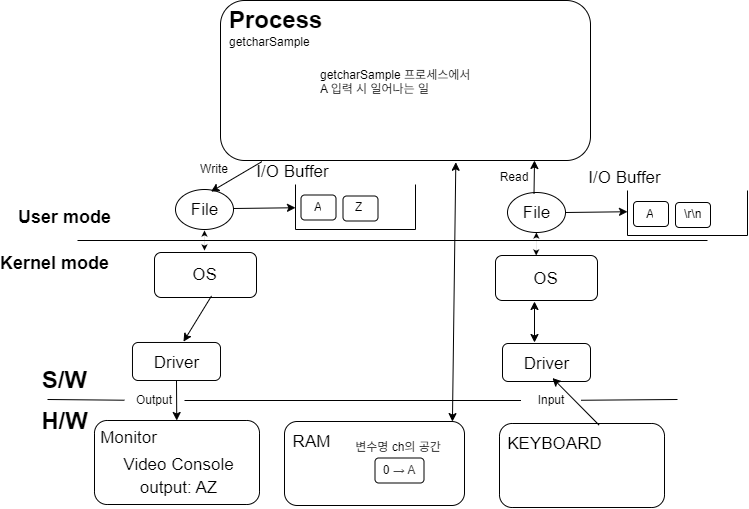

# getchar()로 설명하는 I/O

```C
//.. getcharSample.c
#include <stdio.h>

int main(void)
{
    // character도 결국 숫자, 범위의 차이이다
	char ch = 0;

	ch = getchar();

	// I/O Buffer에서 하나를 가져오는 함수
	// I/O Buffer는 Queue형태로 되어있어, 첫 입력값을 가져온다
	putchar(ch);
	putchar('Z');

	return 0;
}
```

- 해당 파일을 실행하게 되면 getcharSample이라는 process가 생성된다
  - process는 os에서 file interface를 통해 i/o를 할 수 있는 주체이다

## 위 코드가 실행될 때 일어나는 일



- 입/출력(I/O) 대부분의 장치는 Buffered I/O를 채택한다
  - Buffer라는 버퍼라는 메모리 공간을 두고 read/write를 한다
- 이 모든 과정이 매우 빨라서 우리 눈에는 바로 출력되는 것처럼 보이는 것이다
- getchar()/ putchar()
  - Buffered I/O
  - getchar() = "버퍼에서 하나씩 반환"
- _getch() / _getche()
  - Non-Buffered I/O
  - 키보드의 입력 자체에 대한 감지(intterrupt를 감지)
  - 위 그림과 완전히 다른 아키텍처를 사용한다
  - Driver와 OS를 거치지만, File interface와 buffer를 거치지 않고 바로 반환
  - 진행을 원하면 키를 누르세요.. 에 사용된다