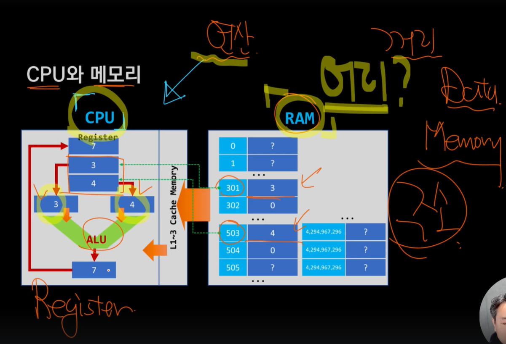
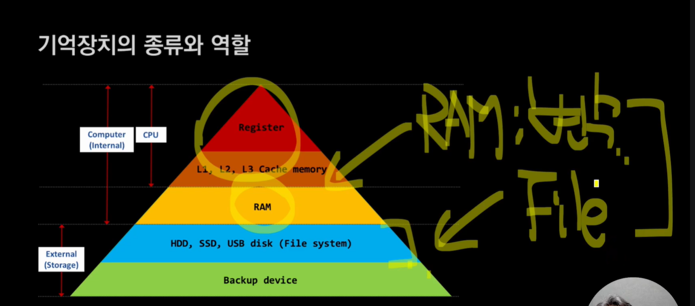

## CPU와 메모리

- 컴퓨터의 연산은 단순하다
  - CPU는 계산을, RAM은 필요한 데이터를 가지고 있다
  - 메모리에서 데이터를 가져와서 CPU에서 계산 한 후 메모리에 다시 넣어놓는 것이 기본 방식이다
    
  - RAM에서 필요한 데이터를 Register로 가져온 다음, ALU를 이용해 덧셈을 해서 결과를 내어 Register에 넣은 후, 필요한 메모리에 저장한다
    - 컴퓨터에서 가장 중요한 연산은 ALU를 이용한 덧셈이다
- 프로그램은 CPU에 명령을 내리는 연산의 집합체이다
  - 이것을 기술하는 방법론이 바로 프로그래밍 언어이다
- 프로그래밍 언어를 차지하는 대다수는 연산에 대한 이야기와 자료를 다루는 것에 대한 이야기이다
  - 즉, 메모리만 잘 사용해도 언어의 상당부분을 이해할 수 있다
  - 연산도 당연히 중요하다

### 메모리



- Register와 L1, L2, L3 Cache도 존재하긴 하지만 C언어에서 많이 다루진 않는다
- 우리에게 가장 필요한 것은 RAM(변수), File System 두 가지이다
- 주 기억장치의 공간은 '일련 번호'로 관리한다
  ```plaintext
  주소 0x00000000 → 1byte
  주소 0x00000001 → 1byte
  주소 0x00000002 → 1byte
  ...
  이 주소를 일련 번호라고 부른다.
  2^32 bit의 주소는
  0 ~ 4,294,967,296(2^32-1)
  까지 있다
  ```
  - 32bit 운영체제에서는 메모리 주소가 32bit로 표현되지만, 기본 단위는 여전히 1byte이며, CPU 구조에 따라 접근이 워드(4byte) 단위로 정렬될 수 있다.
  ```plaintext
  주소 폭: 32bit → 한 주소를 표현하는 데 32bit(4byte) 사용
  표현 가능한 최대 주소 개수: 2^32 ≈ 4GB
  주소 자체는 4byte 크기의 값이지만, 여전히 메모리 관리 단위는 1byte다.
  ```
- 즉, 32bit 운영체제를 사용한다면 주 기억장치를 4GB까지 밖에 사용 못한다
  - 그래서 현대 컴퓨터는 64bit를 사용
