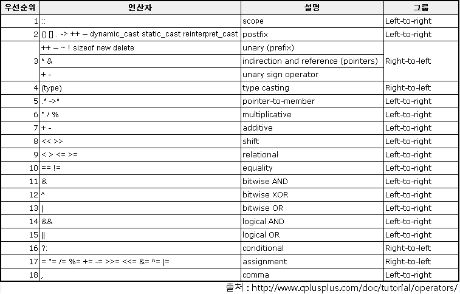

# 연산자(Operator)

- 컴퓨터는 결국 CPU와 RAM을 사용해 연산을 한다
  - 그 연산과정을 추상화 시켜논 것이 프로그래밍 언어이다
  - 이 연산과정을 연산자를 통해 표현할 수 있다

## 산술 연산자

- +,-,\*,/
- 대표적인 2항 연산자
- 연산의 결과로 임시결과 발생
- 정수 간 나눗셈의 결과는 반드시 정수가 되며, 소수점 이하는 절사
  - int, double의 연산은 결과가 다를 수 있다

### 2항 연산자

- 2항 연산자(Binary operator) 라는 말은 두 개의 피연산자(operand)가 필요하다는 뜻

### 산술 연산과 형 승격(Type promotion)

- 임시결과는 피연산자 표현범위 이상의 표현이 가능해야함
- char+ int의 결과는 int
- double \* int 의 결과는 double
- 4/3과 4.0/3은 전혀 다른 연산

### 0으로 나누면 안되는 이유

- 나누기의 원리는 빼기이다
  - 그래서 0을 빼면 문제가 생긴다
- 사용자의 입력을 믿지 않는 것이 시큐어 코딩의 기본논리이며, 해당 예외를 언제나 조심해야한다

## 대입 연산자

- =
- 단순 대입연산자는 두 피연산자 중 오른쪽 피연산자의 값을 왼쪽 피연산자에 저장하는 연산자
- l-value(변수)는 overwrite가 발생하며 기존 값이 사라짐
  - l-value의 l은 location(메모리, 주소)를 뜻한다
  - 상수는 l-value가 될 수 없음
  - 배열의 이름은 l-value가 될 수 없음(배열의 이름은 '주소상수' 이다)
    - `char szBuffer[32] = { 0 } , szBuffer = 'A` X
    - `char szBuffer[32] = { 0 } , szBuffer[0] = 'A` O

### C언어의 자료형

- 일정 길이의 메모리에 저장된 정보를 해석하는 방법
  - 수: 변수(메모리,주소를 쓰는 문법)/상수가 있다

### 복합 대입 연산자

- 기능상 단순 대입 연산자와 산술 연산자, 비트연산자가 조합된 연산자
- 누적 연산시 += 연산자 활용

## 형변환 연산자

- C의 경우 char(1byte), int(4byte)이다
  - int는 사실 char과 같지만, 가장 다른 것은 크기의 차이이다
  - 큰것이 작은것이 되는 것은 문제가 없지만, 작은것이 큰 것이 되는 것은 문제가 생길 수 있다
  - 작은 것을 큰 것으로 형변환시키는 것은 위험하고, 강제로 캐스팅을 하기 위해 (int) 를 사용해야 한다
- 피연산자의 형식을 강제로 변경해주는 단항 연산자
- 부적절한 변환 시 정보가 유실될 수 있음
  - pointer 
  ```C
  #include <stdio.h>

  int main(void)
  {
    unsigned int data = 257;
    unsigned char ch;

    ch = data;

    printf("%d\n", ch);
  }
  ```
  - 결과값은 1이 된다
  - char형은 1byte, 255까지 1111 1111로 표현되며 4byte인 int형을 1byte인 char형에 대입할 시, 하위 비트 빼고는 모두가 유실되어 1이 된다

## 단항 증/감 연산자

- 프로그래밍에서는 계수가 많이 일어난다
- 그 것을 표현하기 위한 연산자이다(++, --)
- 피연산자에 저장된 값을 1씩 증가시키거나 감소시키는 연산
- 피연산자는 반드시 쓰기가 가능한 l-value
- 전위식, 후위식 표기가 가능하며 후위식이 될 경우 연산자 우선순위가 전체 식을 평가한 후로 미뤄짐

## 비트 연산자

- 비트끼리 연산시키는 AND, OR, NOT, XOR, Shift left, Shift right
- NOT만 단항 연산자, 나머지는 모두 2항 연산자

### 비트 마스크 연산

- 데이터에서 특정 영역의 값이 모두 0이 되도록 지우는 연산
- AND의 특징을 이용
  - 0과 AND 연산을 수행하면 결과는 무조건 0
  - F와 AND 연산을 수행하면, 1이 있는 곳은 1이나오고 다른 곳은 0이 된다
  - 이 두가지 특징을 이용한다
- C언어는 하드웨어 제어를 많이 하기에, 잘 알아야한다
  - C를 이용한 하드웨어 프로그래밍에서 8bit는 bit flag로 생각을 한다

### 엔디안

- 리틀엔디안/ 빅엔디안이 있고, CPU H/W레벨에서 정의되는 것이다
  - Intel x86 계열은 리틀엔디안을 사용한다
```C
int main(void)
{
  int nData = 0x12345678;
  printf("%08X\n", nData);
  return 0;
}
```
- 해당 코드를 디버깅 모드로 선택후 &nData의 위치를 검색하면
  - 78 56 34 12 로 출력된다(리틀 엔디안)
  - 즉, 리틀 엔디안의 경우 우리의 생각과 달리 뒤집어서 들어간다
  - 빅 엔디안은 우리의 직관적인 생각과 같게 메모리에 들어간다

| 메모리 주소 | 0   | 1   | 2   | 3   |
|-------------|-----|-----|-----|-----|
| 리틀 엔디안 | 78  | 56  | 34  | 12  |
| 빅 엔디안  | 12  | 34  | 56  | 78  |


## 관계

- ==(관계 연산자), < , >, <= , >= (비교 연산)
- 두 피연산자의 값을 비교(뺄셈)해 결과 도출
- 상등, 부등, 관계 연산자로 분류
- 상등(==), 부등(!=) 연산은 좌항에서 우항을 뺀 결과를 비교하는 관계연산
- 실수형에 대해 상등, 부등연산은 불가, 해당 사항은 심각한 논리적 오류, 보안 결함이 발생할 수 있다

```C
// F는 float형을 뜻하고, 부동 소수점 해상도가 떨어진다
printf("%d", 300 == 299.99999F); // 1 (true)
// 명시하지 않으면 long형이 되어 해상도때문에 false가 된다
printf("%d", 300 == 299.99999); // 0 (false)
// 해상도가 떨어져도 일정 범위까진 판별이 가능하다
printf("%d", 300 == 299.9999F); // 0 (false)
// 해상도 차이로 제대로 찾지 못한다
printf("%d", 300 == 300.00001F); // 1 (true)
```

## 조건 연산자

- C언어의 유일한 3항 연산자
- 조건식 ? 항A : 항B
- 논리적 오류를 피하려면 선택 대상 항은 괄호로 묶어 표기

## 논리 연산자(&&, ||)

- 항 혹은 연산식을 피연산자로 두는 논리합(OR), 논리곱(AND) 2항 연산자
- 논리 부정 연산자는 단항 연산자
- 값의 범위 표현 시 사용되는 것이 보통
- 결합성이 L-> R 이므로, 왼쪽에 등장하는 연산식을 우선 평가하고 이어지는 연산식을 수행할 것인지 판단
- 0은 거짓이고, 0이 아니면 모두(음수 포함) 참
- &&연산은 L->R 부터 판정하기에, 판정시간이 짧은 것을 앞으로 둬야한다(Short circuit 단축평가, OR도 비슷한 동작[맞으면 바로 PASS]를 한다)

### Short circuit(단축 평가)

- 논리 식은 왼쪽부터 실행
- 피연산자 항이 식일 경우 식부터 평가
- 논리합의 경우 왼쪽 조건이 만족되면 이후 식은 연산하지 않음
- 논리곱의 경우 마지막 식까지 모두 평가해 모든 결과가 참인지 확인


## sizeof 연산자

- C언어는 메모리의 조작이 가능하기에, 내 메모리의 크기를 알아야할 때 사용한다
  - byte의 크기를 반환한다
- 피연산자의 자료형에 대해 수행하는 컴파일 타임 연산자(런타임에 실행되는 예외존재, 하지만 거의 다 컴파일타임)
  - C의 time은 compile, link, run time이 있다
    - compile time, link time은 합쳐서 build time이다
      - compile time은 소스 코드 → 오브젝트 파일, 문법/타입 체크, 상수 계산, 컴파일러가 실행
      - link time은 오브젝트 파일 → 실행 파일, 외부 심볼 연결, 최종 주소 결정, 링커가 실행
      - 우리가 작성한 소스코드가 제대로 만들어지는 시기는 link time이다
    - compile time은 코드가 해석되기도 전에 실행되는 시기이며, 이 시기에 sizeof를 계산해 코드에 넣어준다
      - 즉, CPU를 사용하지 않는 연산자다
- sizeof(5)와 sizeof(int)는 결과가 같음
- 배열에 대해서도 적용 가능
- 최대한 자주 사용할 것

## 주소 연산자(단항 연산자)

- 변수 이름 앞에 &를 넣어 사용하며, 메모리의 주소를 반환한다

## 연산자 우선순위



- 항이 될 수 있는 것의 우선순위가 높다
