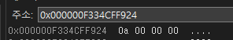
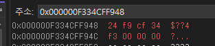

# 포인터

## 컴퓨터와 메모리

- CPU는 연산할 코드와 대상 정보를 모두 메모리로부터 가져옴
- 메모리는 변수를 통해 사용
- 모든 메모리는 고유한 주소를 가짐(바이트 단위)
  - Excel을 생각하면 쉽다
  - 주소의 본질은 위치정보이다
- 64bit 시스템에서 메모리 주소 길이는 64bit임
- 메모리는 계층형 구조를 가지고 있다
- C언어는 장치제어를 목적으로 사용하기도 한다
  - 범용 CPU를 사용하는 경우도 있지만 아닌 경우도 많다

### 메모리 종류

- 일반적인 PC라면 가상(Virtual) 메모리 시스템을 사용한다
  - IT에서 Virtual이라는 것은 Logical(Software)적 구현이라고 생각하면 된다
  - 가상 메모리는 RAM과 HDD,SDD의 메모리를 추상화한 것이다
    - 즉, 가상 메모리는 프로세스가 사용하는 메모리이며 프로세스가 사용하는 RAM/HDD/SDD 추상화를 뜻한다
  - 아주 큰 1차원 배열이라고 생각해도 된다(개념적으로 유사)
- Stack
  - 자동 변수, 보통 1MB
- Heap
  - 동적 할당 메모리(=런 타임)
- 실행 코드 저장 영역(PE, Portable Executorable)
  - text section(실행 코드 기계어, 코드 섹션)
    - CPU에게 연산을 보내 연산을 시킨다
  - data section
    - read only(문자열 상수)
      - "HELLO WORLD\0"
    - Read/Write(정적 메모리)
- C언어는 이 메모리 측면에서 자유도가 높고, 그 자유도 만큼 책임도 개발자가 져야한다

## 포인터 변수

- 메모리의 주소를 저장히기 위한 전용 변수
  - 다른 종류를 넣지 못한다
  - 메모리의 위치 정보를 뜻한다
  - `char* data = &ch`
    - ch의 주소가 data에 들어있고, 그 주소로가면(간접 지정) char형이 들어있다는 의미
- 64bit 시스템에서 주소 상수, 포인터 변수는 모두 64bit(8byte)
- 1byte char형 변수의 메모리 주소는 64bit

### 간접 지정과 직접 지정

- 특정 메모리 공간을 int로 지정할 때 상수로 지정하면 직접 지정
- 포인터 변수로 지정하면 간접 지정
- 간접지정은 변경될 수 있는 임의의 기준주소로 상대적인 위치를 식별하는 방식

### 예제

```C
#include <stdio.h>

int main(void)
{
	// 브레이킹 포인트로 확인
	// F10 -> 다음줄 진행
	// alt 8 로 디스어셈블 모드
	// 실행할때마다 nData의 주소는 다르게 나온다
	// ASLR 때문이다
	// 운영체제의 보안때문에 Address Space Layout Random으로 결정하기 때문이다
	// 실행할때마다 바꿔야 함부로 조작을 못하기 때문
	int nData = 10;
	printf("%s\n", "nData");
	printf("%d\n", nData);
	printf("%p\n", &nData);
	int* nDataPointer = &nData;
	return 0;
}
```
- &nData의 결과
  
- &nDataPointer의 결과
  
- CPU가 인텔의 리틀 엔디안이라 해당 결과가 나옴

## 포인트와 1차원 배열

- 포인터를 사용하는 경우 많은 경우 1차원 배열을 위해서 사용한다
- 배열을 이루는 요소 형식에 대한 포인터 변수를 선언하는 것이 일반적
- char []는 char*로 관리
- int []는 int*로 관리
- 간접 지정 연산(*)의 결과는 형식이 있는 변수로 생각할 수 있음
- *형으로 부터 위치를 계산할수 있다(+,- 연산사용, */ '/' 사용 불가)
  - 배열 * 형의 + 1은 숫자를 뜻하는 것이 아닌, 한 개를 뜻한다

## 메모리 동적 할당 및 관리

- Heap 영역을 사용하는 방법
- 프로그램 실행 중 필요한 메모리를 OS에 요청(할당)해 사용하며 반환(해제)의 책임이 있음
- 할당 받은 메모리는 쓰레기 값이 들어있음
  - 필요하다면 clear를 해야한다
    - 크기의 용량과 필요에 따라 해야한다(ex.1gb를 clear 하려면 오래걸려서 안하는게 좋음)
    - 문자열을 저장할 것이라면 clear를 해주는 게 좋다
- malloc() / free()

### 동적 할당 예제

```C
#include <stdio.h>
#include <stdlib.h>

int main(void)
{
	int* pList = NULL;
	pList = (int*)malloc(sizeof(int) * 3);
	// c에서 [] 연산자는 [] 연산자는 사실 포인터 연산 + 간접 참조(dereference)를
	// 편하게 쓰는 문법적 설탕이다
	// aList[i] 는 *(pList + i)를 의미한다

	pList[0] = 10;
	pList[1] = 20;
	pList[2] = 30;

	// 빌드타임에 문제 없이 작동한다
	// 하지만 명확한 메모리 규칙 위반
	// Canary bit(fdfdfd..)를 건드리기 때문에 free시점에 잘못된 것을 알게되고, 에러를 반환한다
	// pList[3] = 0xFDFDFDFD 를 할당하면, 문제가 생기지 않는다
	// C언어와 메모리 동적 할당이 어려운 이유이다
	pList[3] = 40;

	for (int i = 0; i < 3; ++i) {
		printf("%d\n", pList[i]);
	}

	free(pList);
	return 0;
}
```

- malloc()을 이용한 동적할당의 경우 메모리 cdcdcd... 로 초기화 되고, 이후 fdfd.. 이 온다
- 지역변수 할당의 경우 cccccc.. 로 초기화 된다
- 디버거로 테스트해보면 pList에는 pList[0]의 메모리 주소(0x12491aaa..) 이 들어있고, pList[0]에는 할당된 값(10)가 들어가있다


### 할당 단위와 페이지

- OS는 4KB단위로 Page를 관리한다
- 요청 메모리가 남은 페이지가 클 경우, 새로운 페이지를 요청한다
- 이 로직이 낭비를 유발할 수 있다

## 메모리 값 복사

```C
#include <stdio.h>
#include <string.h>

int main(void)
{
	char charArr[] = { "Hello" };
	char *charArrp = &charArr;

	while (*charArrp != '\0') {
		printf("%c\n", *charArrp);
		charArrp++;
	}
	char newCharArr[6] = { 0 };

	// java와 다르게 참조의 변경을 허용하지 않는다
	// newCharArr = charArr;

	printf("------\n");

	memcpy(newCharArr, charArr, 6);
	char* newCharArrp = &newCharArr;

	while (*newCharArrp != '\0') {
		printf("%c\n", *newCharArrp);
		newCharArrp++;
	}

	return 0;
}
```

- 단순 대입 연산자의 두 피연산자가 모두 변수라면 메모리 값을 복사하는 것으로 생각할 수 있음
- 배열에 대해서는 단순 대입연산으로 배열 전체를 복사할 수 없으며 반복문을 통해 개별 요소를 하나씩 복사(단순 대입)
  - 깊은 복사
- memcpy()

### 메모리 복사 오류

```C
#include <stdio.h>
#include <stdlib.h>


int main(void)
{
	char szBuffer[12] = { "HelloWorld" };
	char* pszData = NULL;

	pszData = (char*)malloc(sizeof(char) * 12);
	// c에서 해당 방식을 사용하면
	// pszData는 할당된 포인터를 잃고, szBuffer의 포인터로
	// 위치가 옮겨져 malloc된 데이터는 유실된다
	// free도 되지않아 오류도 발생하지 않는다
	
	//pszData = &szBuffer;

	// szBuffer는 배열이며, 첫 원소 주소를 가르킨다
	pszData = szBuffer;
	puts(pszData);
	return 0;
}
```

## 배열 연산자 포인터로 풀어쓰기

- 배열의 이름(상수)은 기준 주소
- 인덱스를 이용해 상대위치를 계산
- *(기준주소 + 인덱스)는 기준주소[인덱스]로 쓸 수 있다

## realloc()

- 기존에 할당 받은 메모리의 크기를 조정해 다시 할당
- 메모리 chunk 크기 조절에 실패할 경우 전혀 새로운 위치로 이동
- 잘 쓰지 않는 함수, 메모리를 늘릴수 있다면 좋지만 아닌 경우 재할당이 일어나서 memory copy까지 추가로 일어나서 느리다
- malloc()
  - OS에서 할당하는 과정이 많기 떄문에 생각보다 느린 함수
  - 최적화하기 위해서는 최대한 적게 사용해야한다
  - malloc(15)라도 OS는 최적화를 위해 15byte가 아닌 적절한 chunk가 있다면 더 많이 할당 할 수도 있다

## 기억부류 지정자(Storage-class specifier)

- 기억 부류 지정자 예약어
  - extern: 외부 변수 선언, c파일이 여러개 일때
  - auto: 거의 사용하지 않음, 자동 변수 선언, 일반적인 지역 변수
  - static: stack을 사용하지 않고 다른 메모리를 사용한다(동시성 문제 생길 수 있다)
    - 전역 변수라고 생각하면 된다
  - register: 일반적인 PC 환경에서는 컴파일러가 허용해주지 않는다(임베디드 환경 같은 곳에서 사용)
    - register는 cpu 내부에 있는 가장 빠른 장치
    - register마다 고유의 이름을 가지고 있다(EAX, EBX, ECX..)
- 자동변수는 Stack을 사용하며 일반적인 지역변수는 모두 자동변수
- 정적 메모리는 프로그램 시작 시 확보되는 영역이며 프로그램 종료시까지 유지(동시성 이슈 있음)
- call stack
  - 일반적으로 1MB가 최대
    - 컴파일러에서 설정할 수 있고, 일반적으로는 1MB이다
    - 즉 call stack의 크기는 컴파일 타임에 결정난다
  - `char szBuffer[1024*1024]`
    - 실행은 되지만, 디버깅 모드로하면 바로 stack overflow가 발생하고 프로그램이 죽는다