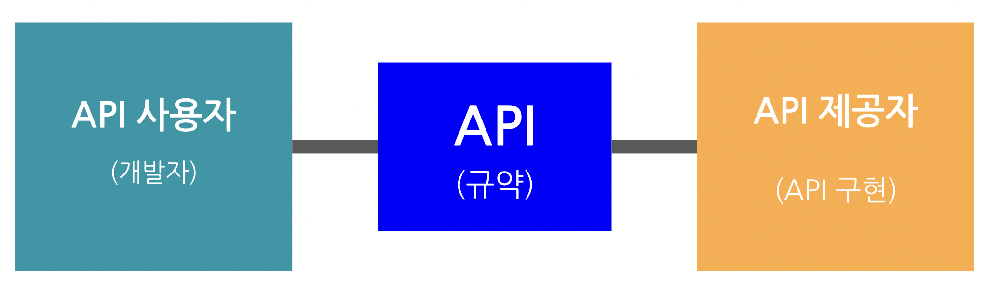

# API

> 웹 API는 클라이언트와 웹 리소스 사이의 네트워크 통신을 위한 게이트웨이이다. 애플리케이션 프로그래밍 인터페이스(API)는 다른 소프트웨어 시스템과 통신하기 위해 따라야 하는 규칙을 정의한다. 

> API란 개발자와 API 제공자 사이에 프로그램을 작성하기 위해 만든 규약(Protocol)이자 계약(Contract)이다. 더 자세히 들어가면 API는 Application Programming Interface의 약자로 개발자가 Application을 Programming하기 위해 만든  인터페이스이다. 개발자는 API 제공자가 정의한 프로토콜을 이용해 API 제공자가 정의한 기능을 사용할 수 있다.

## 사용하는 이유?

> API를 사용해 개발자들은 추상 레이어에서의 개발이 가능해진다. 추상 레이어에서 개발이 가능하다는 것은 내부에 어떻게 구현되어있는지 상관하지 않고 공개된 인터페이스만을 이용해 개발이 가능해짐을 뜻한다. 이는 이후 API의 내부 구현이 바뀌더라도 정해진 결과값만을 받으면 되므로 개발 단에서는 변경을 하지 않아도 된다.