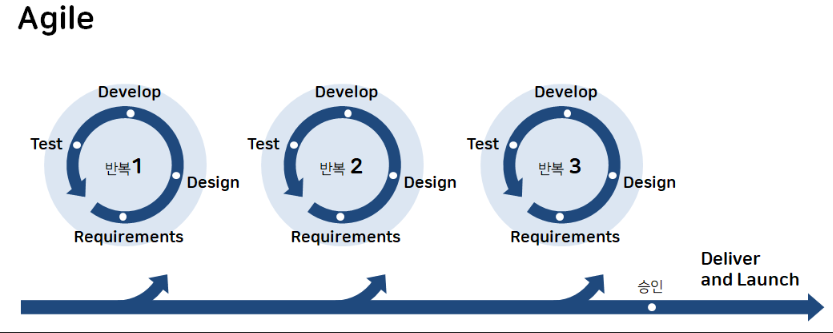
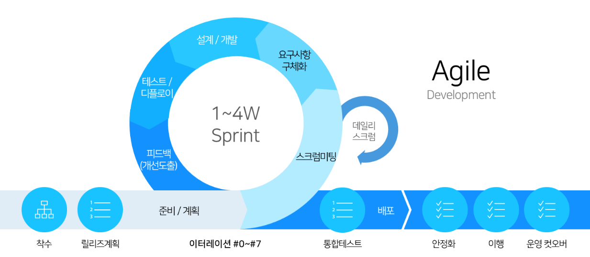

# Agile Software Development(AGILE)이란 ?

소프트웨어 개발 방법론의 하나로, 처음부터 끝까지 계획을 수립하고 개발하는 폭포수(Waterfall) 방법론과는 달리 개발과 함께 즉시 피드백을 받아서 유동적으로 개발하는 방법이다.

정식 명칭은 애자일 소프트웨어 개발(Agile Software Development). 한국에서는 주로 애자일 방법론 이라고 부른다. 켄트 벡이 주창한 익스트림 프로그래밍(XP, Extreme Programming)과 테스트 주도 개발(TDD)이 대표적이다.

## 애자일 선언

> We are uncovering better ways of developing software by doing it and helping others do it.
Through this work we have come to value:
  
 Individuals and interactions over processes and tools  
Working software over comprehensive documentation  
Customer collaboration over contract negotiation  
Responding to change over following a plan  
  
That is, while there is value in the items on the right, we value the items on the left more. 
© 2001, the Agile Manifesto authors  
This declaration may be freely copied in any form, but only in its entirety through this notice.
  
애자일 소프트웨어 개발 선언
우리는 소프트웨어를 개발하고, 또 다른 사람의 개발을 도와주면서 소프트웨어 개발의 더 나은 방법들을 찾아가고 있다.
이 작업을 통해 우리는 다음을 가치 있게 여기게 되었다:
  
프로세스와 도구보다 개인과 상호작용을  
포괄적인 문서보다 작동하는 소프트웨어를  
계약 협상보다 고객과의 협력을  
계획을 따르기보다 변화에 대응하기를  
  
가치 있게 여긴다. 
이 말은, 왼쪽에 있는 것들도 가치가 있지만, 
우리는 오른쪽에 있는 것들에 더 높은 가치를 둔다는 것이다.  
Kent Beck, Mike Beedle, Arie van Bennekum, Alistair Cockburn, Ward Cunningham, Martin Fowler,
James Grenning, Jim Highsmith, Andrew Hunt, Ron Jeffries, Jon Kern, Brian Marick, Robert C. Martin
Steve Mellor, Ken Schwaber, Jeff Sutherland, Dave Thomas
© 2001, 상기 저자들
이 선언문은 어떤 형태로든 자유로이 복사할 수 있지만, 본 고지와 함께 전문으로서만 가능하다.

## 애자일 선언에서 나온 추가적 원칙

1. 우리의 최우선 순위는 가치 있는 소프트웨어를 일찍 그리고 지속적으로 전달해서 고객을 만족시키는 것이다.
2. 비록 개발의 후반부일지라도 요구사항 변경을 환영하라. 애자일 프로세스들은 변화를 활용해 고객의 경쟁력에 도움이 되게 한다.
3. 작동하는 소프트웨어를 자주 전달하라. 두어 주에서 두어 개월의 간격으로 하되 더 짧은 기간을 선호하라.
4. 비즈니스 쪽의 사람들과 개발자들은 프로젝트 전체에 걸쳐 날마다 함께 일해야 한다.
5. 동기가 부여된 개인들 중심으로 프로젝트를 구성하라. 그들이 필요로 하는 환경과 지원을 주고 그들이 일을 끝내리라고 신뢰하라.
6. 개발팀으로, 또 개발팀 내부에서 정보를 전하는 가장 효율적이고 효과적인 방법은 면대면 대화이다.
7. 작동하는 소프트웨어가 진척의 주된 척도이다.
8. 애자일 프로세스들은 지속 가능한 개발을 장려한다. 스폰서, 개발자, 사용자는 일정한 속도를 계속 유지할 수 있어야 한다.
9. 기술적 탁월성과 좋은 설계에 대한 지속적 관심이 기민함을 높인다.
10. 안 하는 일의 양을 최대화하는 기술이 필수적이다.
11. 최고의 아키텍처, 요구사항, 설계는 자기 조직적인 팀에서 창발한다.
12. 팀은 정기적으로 어떻게 더 효과적이 될지 숙고하고, 이에 따라 팀의 행동을 조율하고 조정한다.

## 애자일 방식의 진행

### Process

1. 스프린트(Sprint)
스프린트는 애자일 프로젝트에서 짧은 개발 주기로, 보통 1~4주 단위로 진행된다.
매 스프린트는 완료 가능한 작은 목표를 설정해 이를 달성함으로써 프로젝트를 조금씩 완성해나가는 방식이다.
각 스프린트의 목표는 사용자에게 배포 가능한 최소 단위의 기능으로 설정하며, 스프린트가 끝날 때마다 결과물을 검토하고 피드백을 반영해 다음 스프린트를 준비한다.
예: 2주간의 스프린트 목표로 "로그인 기능 추가"를 설정하고, 스프린트가 끝나면 해당 기능을 테스트하여 사용자 피드백을 받는다.

2. 요구사항 수집(Requirement)
프로젝트 목표와 관련된 필요한 기능이나 사용자 요구사항을 정의하는 단계다.
요구사항은 고객과의 협의를 통해 우선순위를 매겨, 프로젝트 초기에나 스프린트 시작 시 계속 업데이트된다.
예: SNS 플랫폼 개발 시 사용자로부터 "댓글 알림 기능"을 추가해달라는 요구가 있을 수 있다.

3. 설계(Design)
요구사항에 따라 시스템 구조, 인터페이스, 기능을 설계하는 단계다.
스프린트마다 설계를 반복해 세부 사항을 조정하며 필요한 경우 작은 범위 내에서 재설계한다.
예: 댓글 알림 기능의 데이터베이스 구조를 설계하고, 알림 인터페이스를 구상한다.

4. 개발(Develop)
설계를 바탕으로 실제 코드를 작성해 기능을 구현한다.
작은 기능 단위로 개발해 짧은 주기로 피드백을 받고, 개선하는 과정을 거친다.
예: 댓글이 작성되면 알림 데이터베이스에 저장하고, 사용자에게 알림을 보내는 코드 작성.

5. 테스트(Test)
개발된 기능이 정상적으로 작동하는지 확인하는 단계다.
스프린트마다 단위 테스트, 통합 테스트 등을 진행해 기능이 기대대로 동작하는지 확인하고, 문제가 발견되면 바로 수정한다.
예: 댓글이 달릴 때 올바른 알림이 사용자에게 전달되는지, 알림 UI가 정상 작동하는지 테스트.

## AGILE VS WATERFALL 비교

| **항목**               | **워터폴(Waterfall)**                                                                                                       | **애자일(Agile)**                                                                                                                      |
|------------------------|----------------------------------------------------------------------------------------------------------------------------|-----------------------------------------------------------------------------------------------------------------------------------------|
| **개발 단계 진행 방식** | 단계별 순차 진행. 각 단계가 완료된 후에야 다음 단계로 진행                                                                   | 반복적, 점진적으로 진행. 짧은 개발 주기(스프린트)로 작은 단위를 완성하고 개선하며 진행                                                 |
| **변화에 대한 대응**    | 변화에 대한 대응이 어렵고 유연성이 떨어짐                                                                                   | 변화에 유연하게 대응. 각 스프린트마다 요구사항을 반영하고 조정 가능                                                                     |
| **요구사항 정의**       | 초기 단계에서 요구사항이 완전히 정의되어야 하며, 이후 요구사항 변경이 어려움                                                  | 고객 피드백을 통해 요구사항을 점진적으로 정의하고, 개발 중에도 요구사항 변경 가능                                                       |
| **고객 피드백**         | 개발이 완료된 후 최종 제품에 대해 고객 피드백을 수집 가능                                                                     | 각 스프린트마다 개발 결과물을 고객에게 보여주고 피드백을 받아 프로젝트 진행 중에도 고객 의견 반영 가능                                   |
| **문서화**             | 단계별 산출물로 문서화가 잘 되어 있으며, **상세한 문서화**가 필수적                                                           | 핵심 문서만 작성하며, 필요 시 문서화를 최소화함. 팀원 간 **원활한 커뮤니케이션**을 우선시함                                              |
| **적합한 프로젝트 유형** | 요구사항이 명확하고 변경 가능성이 낮으며 안정적인 환경에서 예측 가능한 개발이 필요한 경우                                       | 요구사항이 불확실하고 유동적이며, 빠른 개발과 빈번한 피드백이 필요한 경우                                                              |
| **예시**               | 은행 시스템, 정부 프로젝트 등 명확한 요구사항과 높은 신뢰성이 요구되는 시스템                                                | 모바일 앱, 웹 애플리케이션 등 빠르게 변화하고 업데이트가 필요한 프로젝트                                                               |

- 변화 수용성: 워터폴 방식은 단계별로 진행하여 큰 변화가 없고, 프로젝트 초기 계획이 완성된 후로는 변경이 어려운 반면, 애자일은 요구사항이 계속해서 변경될 수 있으며 변화에 빠르게 대응 가능하다.
- 유연성 및 피드백: 애자일은 고객의 피드백을 지속적으로 반영하여 개발하며, 각 스프린트마다 제품을 수정하고 개선하는 데 초점을 맞춘다. 워터폴 방식은 요구사항 정의 이후 큰 수정이 힘들기 때문에 피드백을 적용하기 어렵다.
결론적으로 워터폴 방식은 안정성과 예측 가능성이 중요한 프로젝트에 적합하고, 애자일은 유연성과 빠른 피드백이 중요한 프로젝트에 적합하다.