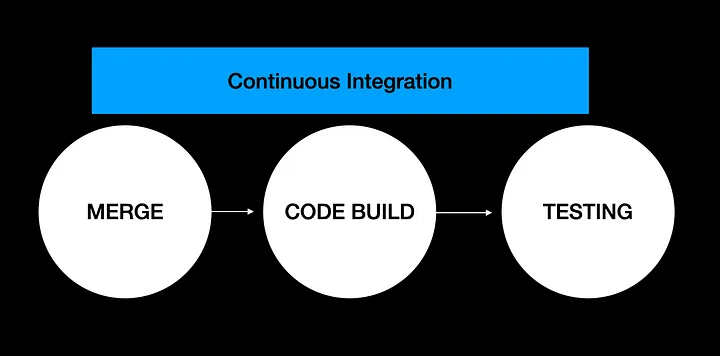
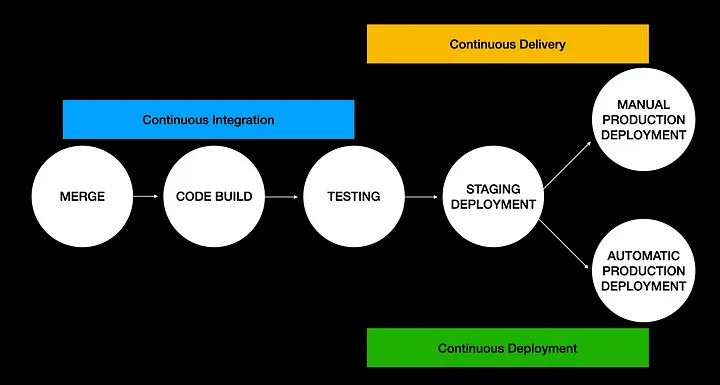

# CI/CD란 무엇인가?

> CI/CD는 지속적인 통합(Continuous Integration) 및 지속적인 배포(Continuous Deployment) 또는 지속적인 배포(Continuous Delivery)를 의미하며, 소프트웨어 개발과 운영의 효율성을 높이기 위한 DevOps의 중요한 구성 요소이다. CI/CD 프로세스는 코드 변경을 자동으로 테스트하고 배포하는 과정을 포함한다.

## CI(지속적인 통합)

> 개발자들이 변경한 코드를 중앙 저장소에 자주(하루에 여러 번) 통합하는 프로세스이다.

### 하는 이유?
코드 변경 사항을 신속하게 통합하여 충돌을 조기에 발견하고 해결할 수 있다.
새로운 기능이나 수정된 코드가 기존 코드와 잘 작동하는지 자동으로 테스트하여 품질을 보장한다.

코드가 통합되고 나서도 기능이 작동하는 것을 검증을 위해서 merge 후에 빌드를 해보고, 테스트 코드 결과를 검증해보고, 배포가 가능한지도 확인해보면 좋다. 그런데 끊임없이 최신 코드들이 통합되는 상황에서 매번 테스트를 하기 어렵다.

여러번 반복되는 일은 자동화하면 좋은데, 자동화된 테스트를 로컬 환경에서도 작동할 수 있다. 하지만 로컬에서 테스트를 실행하면 로컬 환경의 리소스를 점유하게되는 단점이 있다. 그래서 대부분의 개발팀에서는 CI 서버에서 자동으로 테스트를 실행한다.

자동으로 테스트를 실행한다라고 표현했지만 사실 CI 동작이 언제 실행될지는 정하기 나름이다. 어떤 조건을 만족하면 동작을 실행할지(trigger), 선행 조건은 무엇인지(requires), 어떤 환경에서 실행할지(enviornment), 병렬로 실행할지(parallelism) 설정해둘 수 있다. 다양한 조건과 환경으로 테스트를 실행하고 결과를 리포트로 받아볼 수 있다.

## CD(지속적인 배포/전달)

### 지속적인 전달(Continuous Delivery)
 코드 변경이 테스트를 통과한 후, 언제든지 프로덕션 환경에 배포할 수 있도록 준비된 상태를 유지하는 것이다. 그러나 실제 배포는 수동으로 이루어진다. 
버그테스트 -> staging 릴리즈(수동) -> production배포

### 지속적인 배포(Continuous Deployment)
코드 변경이 테스트를 통과하면 자동으로 프로덕션 환경에 배포되는 과정이다.  
버그테스트 -> staging 릴리즈(자동)-> production배포

## 그래서 어떻게함? 

> 여러 CI/CD 도구가 있으며, 각기 다른 기능과 통합 옵션을 제공한다. 

### Jenkins
 오픈 소스 자동화 서버로, 강력한 플러그인 생태계를 가진 CI/CD 도구

### GitLab CI/CD
GitLab 플랫폼에 통합된 CI/CD 기능으로, 코드 저장소와 CI/CD 파이프라인을 함께 관리할 수 있다
