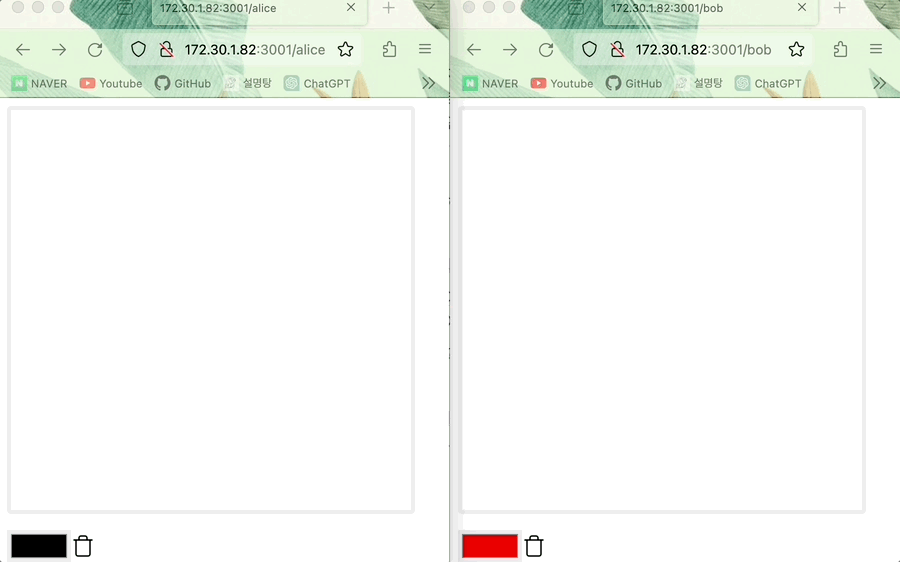
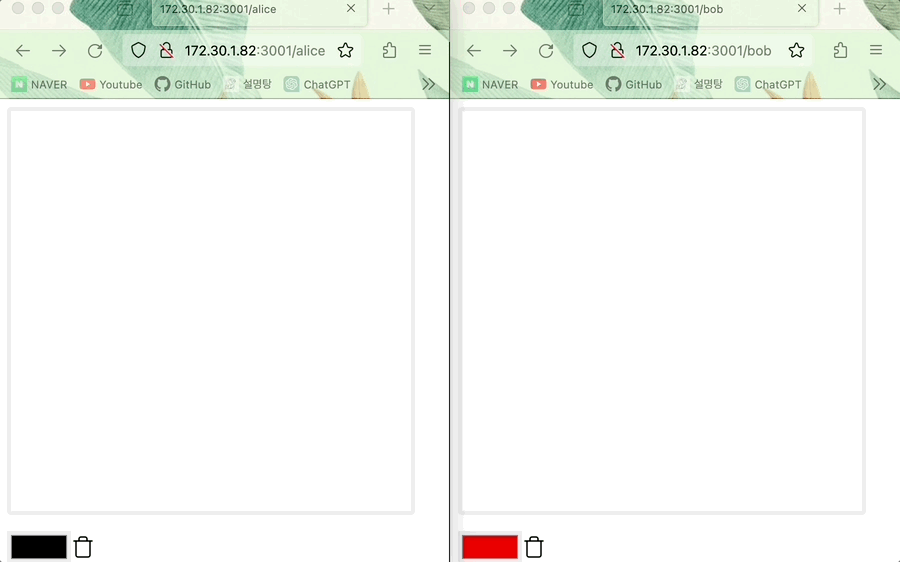

# CRDT(Conflict-free Replicated Data Type)란 무엇인가?

> 분산 시스템에서 데이터 일관성을 유지하면서도 복잡한 동기화 과정을 피하기 위해 설계된 데이터 구조이다. CRDT는 여러 노드가 동시에 데이터를 수정할 수 있는 경우에도 충돌을 방지하며, 이를 통해 항상 일관된 상태를 유지할 수 있도록 한다.

> CRDT는 Conflict-free Replicated Data Type의 약어로 네트워크 상에서 여러 사용자가 충돌없이 데이터를 받을 수 있도록 설계된 자료구조이다.

> 구현 방법에는 여러가지 방법이 있다. (G-Counter , PN-Counter, LWW-Register, OR-Set) 해당 섹션에서는 LWW-Register에 대해서 정리한다.

## LWW-Register

> LWW Register는 Last Write Wins Register의 약어로 여러 값 중 마지막으로 들어온 값을 현재의 값으로 덮어쓰는 로직을 사용한다. LWW Register는 timestamp 값을 가지고 있으며 다른 사용자로부터 받은 timestamp와 자신의 timestamp 값을 비교하여 어떤 값을 state로 업데이트할지 결정한다. LWW Register의 단어 의미에서 유추할 수 있듯이 가장 최신의 timestamp를 가진 state를 다른 사용자들의 state에 덮어쓴다.

### 코드 예시

```typescript

type RGB = [red: number, green: number, blue: number]
type State = [peer: string, timestamp: number];

class LWWRegister<T> {
	value: RGB;

	state: State;

	merge(state: State, value: RGB) {
		const [remotePeer, remoteTimestamp] = state;
		const [localPeer, localTimestamp] = this.state;

		// 수신 받은 timestamp가 local timestamp보다 오래되면 무시한다
		if (localTimestamp > remoteTimestamp) {
			return;
		}

		// Timestamp가 충돌이 날 경우 peer string을 비교하여 state를 업데이트할지 결정한다
		if (localTimestamp === remoteTimestamp && localPeer > remotePeer) {
			return;
		}

		// 수신 받은 timestamp가 local timestamp보다 최신인 경우 state와 value를 업데이트한다
		this.state = state;
		this.value = value;
}

```

## LWW-Register 예시

(오프라인 Alice)인 사람이 그림(Bob의 그림) 위에 덧그리고 (온라인 Alice)으로 전환한 다음 그림을 그리면 state 업데이트 진행되어 그림이 적용된다. (데이터 일관성이 유지된다)

최신의 timestamp가 먼저 적용되는 LWW Register이므로 같은 위치에 Alice와 Bob이 그렸다면 뒤에 그린 Bob 그림이 적용된다.



온라인 전환 후 Bob이 먼저 그림을 그린 경우




온라인 전환 후 Alice이 먼저 그림을 그린 경우