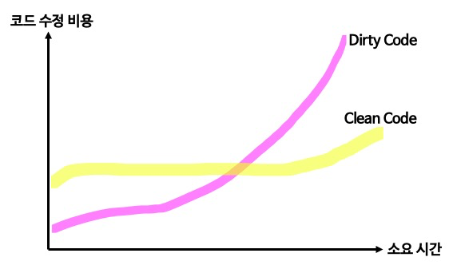

# 클린 코드

## 클린코드란?

> “I like my code to be elegant and efficient. The logic should be straightforward and make it hard for bugs to hide, the dependencies minimal to ease maintenance, error handling complete according to an articulated strategy, and performance close to optimal so as not to tempt people to make the code messy with unprincipled optimizations. Clean code does one thing well. - Bjarne Stroustrup, inventor of C++

 C++의 창시자인 Bjarne Stroustrup은 C에는 객체 개념이 없기 때문에 객체지향 효과를 극대화하기 위해서 C++를 만든 것으로 유명하다.
Bjarne Stroustrup은 위와 같이 클린코드에 대하여 정의했다. 코드가 우아하다는 의미는 군더더기 없이 깔끔하다는 의미이고, 효과적이라는 것은 기능을 수행하는 코드를 최대한 작은 라인으로 구현한다는 의미로 보면 된다. 또한 클린코드는 직접적이고 에러 처리가 잘 되어 있으며 하나의 역할을 수행한다.

즉, 클린코드란

- 우아함(Elegance): 코드는 간결하고 세련되게 작성되어야 한다.

- 효율성(Efficiency): 코드의 성능은 최대한 최적화되어, 불필요한 최적화 시도를 하지 않도록 한다.

- 직관적인 로직(Straightforward Logic): 로직은 명확하고 이해하기 쉬워서 버그가 숨어들기 어렵게 해야 한다.

- 의존성 최소화(Minimal Dependencies): 유지보수를 쉽게 하기 위해 코드의 외부 의존성을 최소화한다.

- 완벽한 오류 처리(Complete Error Handling): 오류 처리는 체계적이고 명확해야 한다.

- 불필요한 최적화 방지(Performance Close to Optimal): 이미 성능이 최적화되어 있을때, 원칙 없는 최적화 시도로 인해 코드가 복잡해지지 않도록 해야 한다.

- 단일 책임 원칙(Do One Thing Well): 코드의 각 구성 요소는 하나의 일만 명확히 수행하며, 여러 가지 일을 한꺼번에 처리하지 않도록 한다.

## 클린코드가 필요한 이유

개발자가 기능추가, 수정 등 코드를 읽고, 짜는 비율을 따져보았을 때

​코드를 읽는 시간 : 코드를 짜는 시간 = 10 : 1 비율이 나온다고 한다.

즉 클린코드는 개발비용을 줄일 수 있는 가장 효과적인 방법이 될 수 있기 때문이다.

\+ 주석을 달아놓는 것은 클린코드의 나쁜 예 중 하나이다.

## 주석

### 주식이 필요 없는 이유

1. 주석을 다는 것이 나쁜 예가 되는 가장 큰 이유는, 코드 자체가 명확하고 읽기 쉬우면 주석이 불필요하다는 점이다. 주석 대신 가독성이 좋은 코드를 작성하는 것이 이상적이다.

2. 코드는 수정되거나 업데이트되지만, 주석은 종종 잊혀지거나 잘못된 정보를 남길 수 있다. 코드와 주석이 일치하지 않으면 주석이 오히려 오해를 불러일으킬 수 있다.

3. 주석이 너무 많다는 것은 코드 자체가 명확하지 않다는 뜻 일 수 있다. 복잡한 코드나 잘못 설계된 코드를 설명하기 위해 주석을 사용하는 것은 **코드 냄새**를 감추려는 시도여서 지양해야한다.

4. 주석은 코드를 설명하는 도구일 뿐, 코드 자체의 문제를 해결하는 도구가 아니다. 주석을 통해 문제를 설명하려 하기보다는, 코드 자체에서 문제를 해결하는 것이 더 효과적이다.

### 그래도 주석이 필요할 때

1. 복잡한 비즈니스 로직이나 외부 시스템과의 연동 등 코드 자체만으로는 설명하기 어려운 상황에서는 주석이 유용할 수 있다.