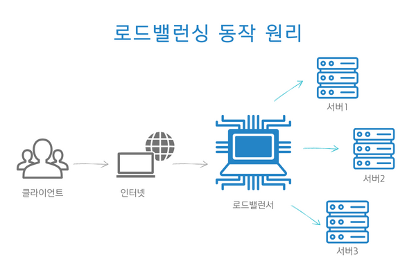

# 로드 밸런싱이란?

> 로드 밸런싱(Load Balancing)은 네트워크 트래픽이나 작업을 여러 서버나 자원에 분산시켜 시스템의 성능, 가용성, 신뢰성을 향상시키는 기술이다. 이를 통해 단일 서버에 과부하가 걸리지 않도록 하고, 각 서버의 부하를 균등하게 분산하여 최적의 성능을 유지할 수 있다.

> 로드 밸런서를 통해 요청을 여러 서버에 분산시키는 역할을 하며, 이를 통해 시스템의 성능과 가용성을 높인다.

## 로드 밸런싱 기법
> 로드 밸런싱 기법은 여러 가지가 있다. 서버의 능력을 고려하여 분배해야 하기 때문에 서버의 상황에 맞춰 적절한 방법을 선택해야 한다.

1. 라운드로빈 방식(Round Robin Method)
 
 서버에 들어온 요청을 순서대로 돌아가며 배정하는 방식이다. 클라이언트의 요청을 순서대로 분배하기 때문에 여러 대의 서버가 동일한 스펙을 갖고 있고, 서버와의 연결(세션)이 오래 지속되지 않는 경우에 활용하기 적합하다.

2. 가중 라운드로빈 방식(Weighted Round Robin Method)

각각의 서버마다 가중치를 매기고 가중치가 높은 서버에 클라이언트 요청을 우선적으로 배분한다. 주로 서버의 트래픽 처리 능력이 상이한 경우 사용되는 부하 분산 방식이다. 예를 들어 A라는 서버가 5라는 가중치를 갖고 B라는 서버가 2라는 가중치를 갖는다면, 로드 밸런서는 라운드로빈 방식으로 A 서버에 5개 B 서버에 2개의 요청을 전달한다.

3. IP 해시 방식(IP Hash Method)

클라이언트의 IP 주소를 특정 서버로 매핑하여 요청을 처리하는 방식이다. 사용자의 IP를 해싱해(Hashing, 임의의 길이를 지닌 데이터를 고정된 길이의 데이터로 매핑하는 것, 또는 그러한 함수) 로드를 분배하기 때문에 사용자가 항상 동일한 서버로 연결되는 것을 보장한다.

4. 최소 연결 방식(Least Connection Method)

요청이 들어온 시점에 가장 적은 연결상태를 보이는 서버에 우선적으로 트래픽을 배분한다. 자주 세션이 길어지거나, 서버에 분배된 트래픽들이 일정하지 않은 경우에 적합한 방식이다.

5. 최소 응답 시간 방식(Least Response Time Method)

서버의 현재 연결 상태와 응답 시간(Response Time, 서버에 요청을 보내고 최초 응답을 받을 때까지 소요되는 시간)을 모두 고려하여 트래픽을 배분한다. 가장 적은 연결 상태와 가장 짧은 응답 시간을 보이는 서버에 우선적으로 로드를 배분하는 방식이다.

## L4 로드 밸런싱과 L7 로드 밸런싱

로드 밸런싱에는 L4 로드 밸런싱과 L7 로드 밸런싱이 가장 많이 활용된다.

L4, L7은 각각 Layer 4(전송 계층) 프로토콜과 Layer 7(응용 계층) 프로토콜의 헤더를 부하 분산에 이용하기 때문에 붙은 접두사이다. 모든 요청을 L4 혹은 L7 로드 밸런서가 받아 서버들에게 적절히 나누어 준다.

L4 로드 밸런서는 네트워크 계층(IP, IPX)이나 전송 계층(TCP, UDP)의 정보(IP주소, 포트번호, MAC주소, 전송 프로토콜)를 바탕으로 분산한다.

L7 로드 밸런서는 애플리케이션 계층(HTTP, FTP, SMTP)에서 로드를 분산하기 때문에 HTTP 헤더, 쿠키 등과 같은 사용자의 요청을 기준으로 특정 서버에 트래픽을 분산하는 것이 가능하다. 쉽게 말해 패킷의 내용을 확인하고 그 내용에 따라 로드를 특정 서버에 분배하는 것이 가능한 것이다. URL에 따라 부하를 분산시키거나, HTTP 헤더의 쿠키 값에 따라 부하를 분산하는 등 클라이언트의 요청을 보다 세분화해 서버에 전달할 수 있다.

또한 L7 로드 밸런서의 경우 특정한 패턴을 지닌 바이러스를 감지해 네트워크를 보호할 수 있으며, DoS/DDoS와 같은 비정상적인 트래픽을 필터링할 수 있어 네트워크 보안 분야에서도 활용되고 있다.