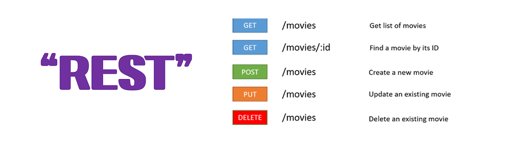

# REST API(Representational State Transfer Application Programming Interface)


> 웹 서비스 아키텍처의 하나로, 클라이언트와 서버 간의 통신을 간편하게 해주는 방식을 정의한다.

> 인터넷과 같이 복잡한 네트워크 통신이 등장함에 따라, 이를 관리하기 위한 지침으로 만들어졌다.

> 즉, 클라이언트와 서버 간의 두 컴퓨터 시스템이 인터넷을 통해 정보를 안전하게 교환하기 위해 사용하는 인터페이스이다.

#### 이곳에서 사용된 인터페이스란?

- "인터페이스"라는 용어는 두 시스템 간의 상호작용을 정의하는 규칙이나 방법을 의미

## REST?

> REST(Representational State Transfer)의 약자

> 아키텍처 스타일, 자원과 상태의 원칙을 정의

1. 자원을 이름으로 구분하여
2. 해당 자원의 상태를 주고받는 모든 것을 의미

## 표현 하는 방법

> 'HTTP URI(Uniform Resource Identifier)'를 통해 자원(Resource)을 명시하고,

> 'HTTP Method(POST, GET, PUT, DELETE, PATCH 등)'를 통해 해당 자원(URI)에 대한 'CRUD Operation'을 적용

#### CRUD Operation이란?
- Create : 데이터 생성(POST)
- Read : 데이터 조회(GET)
- Update : 데이터 수정(PUT, PATCH)
- Delete : 데이터 삭제(DELETE)

### 특징 자원을 이름으로 구분한다.

> 자원 = 문서, 사진, 그림, 데이터 등 소프트웨어가 관리하는 모든 것을 HTTP URI(Uniform Resource Identifier)를 통해 명시

Ex) DB의 영화 정보가 자원일 때, /movies를 자원의 표현으로 정한다.


### 자원의 상태를 주고 받음(요청 -> 응답)
- 클라이언트는 데이터가 요청되어지는 시점에서 자원의 상태를 전달한다.
- Client가 자원의 상태(정보)에 대한 조작을 요청하면 Server는 이에 적절한 응답(Representation)을 보낸다.
    - 전달 방식으로는 JSON 혹은 XML를 통해 데이터를 주고 받는 것이 일반적

## REST api

> REST 원칙을 따르는 실제 구현체, 클라이언트와 서버 간의 통신을 가능하게 하는 인터페이스

### REST api의 특징

- 상태 없음 (Stateless): 각 요청은 독립적이며, 서버는 클라이언트의 상태를 저장하지 않는다. 클라이언트는 모든 필요한 정보를 요청에 포함해야 한다.

- 캐시 가능 (Cacheable): 응답은 캐시 가능하며, 클라이언트는 이를 통해 성능을 향상시킬 수 있다.

- 계층화 (Layered System): 클라이언트는 서버의 특정 구현을 알 필요가 없으며, 여러 계층의 서버를 통해 요청을 처리할 수 있다.

- 일관된 인터페이스 (Uniform Interface): REST API는 리소스와의 상호작용을 단순화하는 일관된 인터페이스를 제공한다.

### REST API 설계 규칙

1. 명사, 소문자 => 동사x
    - 리소스 중심: URI는 리소스를 기반으로 설계되어야 하며, 명사 형태로 표현한다.
2. 명사는 복수형
3. URI 마지막은 / 포함x
4. URI는 언더바x 하이픈 사용 -
5. 파일의 확장자를 표시x

### REST API 사용 예시

```
GET /users              // 모든 사용자 조회
POST /users             // 새로운 사용자 생성
GET /users/1           // ID가 1인 사용자 조회
PUT /users/1           // ID가 1인 사용자 정보 전체 수정
PATCH /users/1         // ID가 1인 사용자 정보 부분 수정
DELETE /users/1        // ID가 1인 사용자 삭제
```

## 4. RESTful

> REST 원리를 따르는 시스템은 RESTful이란 용어로 지칭

> ‘REST API’를 제공하는 웹 서비스를 ‘RESTful’하다고 할 수 있다.


### RESTful의 목적
> 이해하기 쉽고 사용하기 쉬운 REST API를 만드는 것

RESTful한 API를 구현하는 근본적인 목적이 성능 향상에 있는 것이 아니라 '일관적인 컨벤션을 통한 API의 이해도 및 호환성을 높이는 것'이 주 동기이니, 성능이 중요한 상황에서는 굳이 RESTful한 API를 구현할 필요는 없다.

 
 
### RESTful 하지 못하는 경우
> URI 규칙을 올바르게 지키지 않은 API는 REST API의 설계 규칙을 올바르게 지키지 못한 시스템은 REST API를 사용하였지만 RESTful 하지 못한 시스템이라고 할 수 있다.

Ex1) CRUD 기능을 모두 POST로만 처리하는 API

Ex2) route에 resource, id 외의 정보, URI에 행위(method)에 대한 부분이 들어가는 경우(/students/updateName)