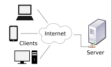

# 서버란?

> 서버는 여러 메소드가 객체지향적으로 설계되어 있으며, 이러한 메소드들이 내부에서 다양한 처리를 통해 비즈니스 로직을 구현할 수 있다. 이는 마치 SDK처럼 하나의 메소드를 통해서 서버를 시작할 수 있게 개발자에게 편의성을 준다.

> 서버는 클라이언트에게 네트워크를 통해 정보나 서비스를 전달하는 컴퓨터 시스템

> 내 컴퓨터에 정보를 올려놓고, 다른 컴퓨터들이 접속해서 정보를 확인 할 수 있다면, 내 컴퓨터가 서버 컴퓨터가 되는 것이다.

