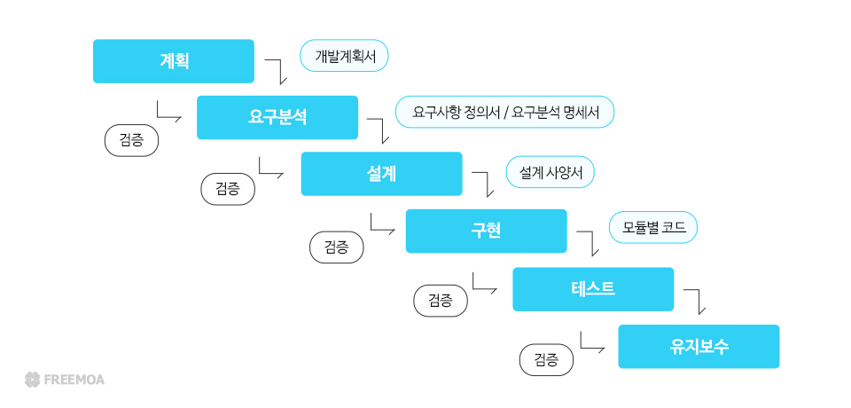

# WaterFall 방식의 소프트웨어 설계 방법론이란?

워터폴(Waterfall) 방식은 전통적인 소프트웨어 개발 방법론으로, 프로젝트를 일련의 순차적인 단계로 나누어 차례대로 진행하는 방식이다. 각 단계가 완료되면 다음 단계로 넘어가며, 각 단계가 완료된 이후에는 다시 이전 단계로 돌아가기 어렵다. 이를 폭포수가 떨어지는 것처럼 순서대로 진행된다고 해서 "워터폴" 방식이라고 부른다.

## 워터폴 방식의 단계
1. 요구사항 분석(Requirements Analysis)

고객이 필요로 하는 기능이나 시스템의 요구사항을 수집하고 명확히 정의하는 단계이다.
이 요구사항은 프로젝트 전반에 걸쳐 유지되며 변경이 거의 불가능하다.

2. 설계(Design)

요구사항을 바탕으로 시스템의 아키텍처, 데이터베이스 구조, 인터페이스 등을 구체적으로 설계하는 단계이다.
소프트웨어의 구조를 결정하며, 개발자가 구현할 수 있도록 상세한 설계를 진행한다.

3. 구현(Implementation)

설계된 구조를 기반으로 코드를 작성하여 실제 기능을 구현하는 단계이다.
워터폴 방식에서는 구현이 시작되면 설계 변경이 어렵기 때문에 설계된 대로 개발을 수행해야 한다.

4. 테스트(Test)

구현이 완료된 시스템을 대상으로 기능과 품질을 검증하는 단계이다.
모든 요구사항이 제대로 구현되었는지 확인하며, 오류가 발견되면 수정하지만, 구조적인 변경은 어렵다.

5. 배포(Deployment)

테스트를 거친 소프트웨어를 실제 환경에 배포하여 고객이 사용할 수 있도록 하는 단계이다.
이후 운영 중 발생하는 버그나 문제점은 패치로 보완하지만, 새로운 기능 추가나 요구사항 변경은 처음 단계부터 다시 시작해야 한다.

6. 유지보수(Maintenance)

운영 중 발생하는 오류 수정, 성능 개선 등을 통해 시스템을 안정적으로 유지하는 단계이다.
워터폴 방식의 특징과 장단점

## 장점
- 모든 요구사항이 초기부터 명확하게 정의되므로 체계적이고 예측 가능하다.
- 각 단계가 문서화되어 명확한 결과물을 남기므로, 유지보수와 인수인계에 용이하다.
## 단점
- 각 단계가 순차적으로 진행되어 변경 대응이 어렵고 유연성이 떨어진다.
- 요구사항 변경 시 전 단계로 돌아가야 하므로 비용과 시간이 많이 든다.
- 고객 피드백을 수집하기 어려워 완성 후 고객의 기대와 다른 결과가 나올 수 있다.
