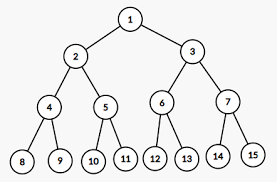
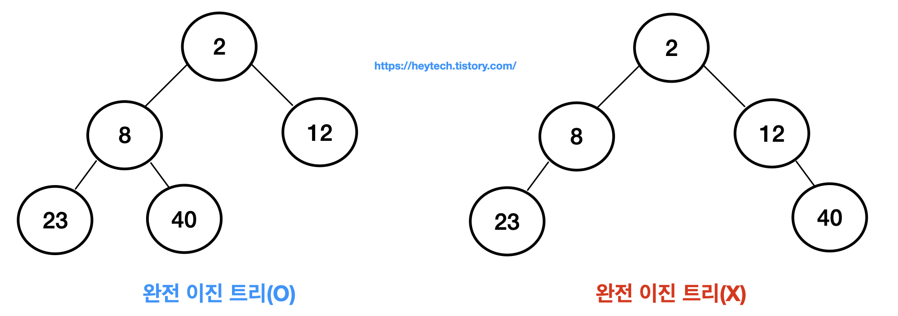

# 우선순위 큐/힙

> https://velog.io/@gunhaa/TS-%EC%9A%B0%EC%84%A0%EC%88%9C%EC%9C%84-%ED%81%90-%ED%9E%99-Priority-Queue-Heap


> 출처 : https://laboputer.github.io/ps/2017/10/06/priorityqueue/

우선순위가 있는 대상을 관리해야 하는 경우가 많다. 예를들어 CPU나 다른 자원을 무겁게 사용하면서 며칠 동안 수행해야할 작업이 있다면 다른 작업들의 동작을 방해할 수 있으므로 우선순위를 대폭 낮추어놓고 작업할 수 있다. 이렇게 해두면 다른 작업이 자원을 필요로 할 때 양보했다가 한가한 시간에 주로 해당 작업을 수행할 수 있다.
우선순위 큐를 구현하는 대표적인 자료구조 중 한개가 힙인데, 힙을 통해서 우선순위 큐를 구현해본다.

## 힙

힙은 대표적인 우선순위 큐이며, 완전 이진 트리(Complete Binary Tree)구조를 사용한다. 트리란 노드들이 위에서 아래로 부모-자식 관계로 매달린 것을 말한다. 부모라고 해서 두 노드를 가지는 것이 아닌, 하나의 노드만을 가진다. 모든 노드가 2개 이하의 자식을 갖는 트리를 이진 트리(Binary Tree)라 한다.

## 포화 이진 트리(Full Binary Tree)



> 출처 : https://sevity.tistory.com/141

포화 이진 트리란 루트로부터 시작해 모든 노드가 정확히 자식 노드를 2개씩 가지면서 꽉 채워진 트리를 말한다.
자식이 하나도 없는 노드를 리프 노드(Leaf Node) 또는 말단 노드(Terminal Node)라고 하는데, 포화 이진 트리에서 리프 노드들은 모두 맨 아래 레벨에 자리하게 된다.즉, 포화 이진 트리가 되려면 노드의 총 수가 1,3,7,15,31 ... 과 같이 무조건 $2^k-1$이 되어야한다.

## 완전 이진 트리(Complete Binary Tree)



> 출처 : https://heytech.tistory.com/105

포화 이진 트리와 달리 노드 수가 맞지 않아 최대한 포화 이진트리에 가깝게 만든 것이 '완전 이진 트리(Complete Binary Tree)' 이다. 루트로 부터 시작해서 모든 노드가 지식을 2개씩 가지면서 내려가는 것은 완전 이진 트리와 포화 이진트리가 동일 하다. 노드의 수가 $2^k-1$개가 되지 못하면 맨 아래 레벨을 모두 채울 수 가 없는데 이 경우 왼쪽부터 차례로 채운 것이 완전 이진 트리이다.

## 힙의 조건

힙은 다음의 두가지 조건을 만족해야 한다.

1. 완전 이진 트리
2. 힙 특성(Heap Property) : 모든 노드는 값을 갖고, 자식 노드 값보다 크거나 같다.
   - (최대 힙일 경우) 부모 노드는 자식 노드보다 작거나 같다.
   - (최소 힙일 경우) 부모 노드는 자식 노드보다 크거나 같다.

## 구현할 우선순위 큐(최소 힙)의 ADT

```
원소를 삽입한다. o
최소 원소를 알려주면서 삭제한다. o
최소 원소를 알려준다.o
우선순위 큐가 비어 있는지 확인한다. o
우선순위 큐를 깨끗이 비운다.
```

## class priorityQueueHeap

```
class priorityQueueMinHeap<T> {

    heap: (T | undefined)[];
    numHeap: number;

    constructor(numHeap: number) {
        this.heap = new Array(numHeap);
        this.numHeap = 0;
    }

    public insert(newItem: T) {
        try {

            if (this.numHeap >= this.heap.length) {
                throw new Error("HeapErr: Overflow!");
            }

            this.heap[this.numHeap] = newItem;
            this.percolateUp(newItem, this.numHeap);
            this.numHeap++;

            // **error객체 사용법 알아보기**
        } catch (error: unknown) {
            if (error instanceof Error) {
                console.log(error.message);
            }
        }
    }

    private percolateUp(newItem: T, node: number) {
        let parentsNode = Math.floor((node - 1) / 2);

        if (parentsNode >= 0 && this.heap[node]! < this.heap[parentsNode]!) {

            // 바꾸기
            let temp = this.heap[parentsNode];
            this.heap[parentsNode] = this.heap[node];
            this.heap[node] = temp;

            this.percolateUp(newItem, parentsNode);

        }

    }

    public print() {
        return (console.log(this.heap.join("-")));
    }

    public deleteMin() {
        //왼쪽 자식의 인덱스 : (부모의 인덱스) * 2 + 1
        //오른쪽 자식의 인덱스 : (부모의 인덱스) * 2 + 2
        let min = this.heap[0];

        this.heap[0] = this.heap[this.numHeap - 1];
        this.heap[this.numHeap - 1] = undefined;

        this.numHeap--;

        this.percolateDown(0);

        return console.log(`삭제된 최소 값 : ${min}`);
    }

    private percolateDown(parentIndex: number) {


        let leftChild = parentIndex * 2 + 1;
        let rightChild = parentIndex * 2 + 2;

        if (leftChild >= this.numHeap-1) return;


        let minChild;

        if (rightChild >= this.numHeap-1) {
            minChild = leftChild;
        } else {
            minChild = this.heap[leftChild]! > this.heap[rightChild]! ? rightChild : leftChild;
        }

        if (this.heap[minChild]! < this.heap[parentIndex]!) {

            let temp = this.heap[parentIndex];
            this.heap[parentIndex] = this.heap[minChild];
            this.heap[minChild] = temp;
            this.percolateDown(minChild);

        }

    }

    public min(){
        console.log(`현재의 최소값은 : ${this.heap[0]}`)
        return this.heap[0];
    }

    public isEmpty(){
        console.log(`empty 상태는 : ${this.heap.filter(node => node!==undefined).length > 0}`)
        return this.heap.filter(node => node!==undefined).length>0;
    }

    public clear(){
        this.heap = new Array(this.numHeap);
    }
}

let heap = new priorityQueueMinHeap<Number>(6);
heap.isEmpty();
heap.insert(4);
heap.insert(1);
heap.insert(3);
heap.insert(6);
heap.insert(5);
heap.insert(2);
heap.deleteMin();
heap.min();
heap.isEmpty();
heap.print();
heap.clear();
heap.print();
// node priorityQueue.js
```

## Recap

- 큐와 비슷하지만, 우선순위가 높은 것부터 나온다
- 완전 이진 트리이기에, bfs의 순서로 insert시 채워진다(들어갈 곳이 정해지고, 이를 통해 거슬러 올라가는 방식으로 insert된다)
- delete() 호출시 root노드를 꺼내며, bfs방식으로 가장 밑의 노드를 root에 넣은 뒤 더 큰 자식과 교환한다,
  트리 구조의 자식 노드 중 더 큰 값과 자리를 바꾸며 밑으로 내려간다
- heap은 트리로 구성되어 있다
  - max heap: 부모 노드가 자식 노드보다 항상 크거나 같은 완전 이진 트리
  - min heap: 부모 노드가 자식 노드보다 항상 작거나 같은 완전 이진 트리
- 주요 메서드
  - insert(우선 순위 삽입, 정보 필요)
  - delete(최상위 우선순위를 반환하며 제거)
  - peek(제거하지 않으며 우선순위 최상위를 반환)
- 프로세스 스케쥴링에서 주로 사용된다

### Heap과 PriorityQueue의 관계

- 우선순위 큐는 "개념"이고, - ADT (priority Queue)
- 힙은 우선순위 큐를 많은 구현 방법 중 "가장 효율적으로 구현하는 방법" 중 하나다. - Data Structure (heap)
- Priority Queue를 구현하는 방식 중, 가장 성능이 좋은 방식이 heap이기 때문에 Priority Queue = Heap이라고 생각을 하는 것이다
