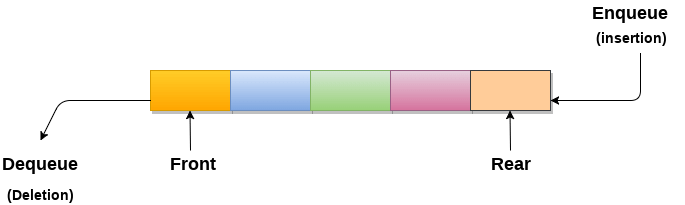

# Queue

> https://velog.io/@gunhaa/TS-Queue

> Typescript로 구현된 Queue

마트에서 계산하기 위해 줄을 서는 모습, 번호표를 뽑고 순서를 기다리는 모습 등은 일상 생활에서 흔히 볼 수 있는 모습이다. Queue는 이런 줄을 의미하는 단어이다.
 데이터에도 큐 방식으로 넣고 빼는 자료 구조가 있는데 이 자료구조를 Queue라고 한다.
#### Queue를 활용한 예제
- 마트에서 계산하기 위해 줄을 서는 것
- 프린터 대기열
- 네트워크 패킷 처리
- 콜 센터 대기

## Queue의 특징



>출처 : https://www.javatpoint.com/data-structure-queue

큐의 맨 앞에 있는 원소(맨 먼저 큐에 들어온 원소)를 front라 하고, 맨 뒤에 있는 원소(맨 나중에 큐에 들어온 원소)를 tail이라 한다

. 큐에서 삽입(enqueue) 할때는 삽입할 원소를 알려주어야 하지만, 삭제(dequeue)할 때는 단순히 삭제하라고 한다. 큐는 삭제할 원소를 명시하지 않는다. 무조건 맨 앞에 있는 것을 삭제하기 때문이다.

## 구현할 Queue의 추상 데이터 타입(ADT)

```
맨 끝에 원소를 추가한다. o
맨 앞의 원소를 삭제하면서 알려준다. o
맨 앞의 원소를 알려준다. o
큐가 비어 있는지 확인한다. o
큐를 깨끗이 비운다. o
```


## class Queue
```
class Queue<T>{

    queue : T[];
    capacity : number;
    numItems : number; // 큐의 총 원소 수
    front : number; // 큐의 맨 앞 원소의 인덱스
    tail : number; // 큐의 맨 뒤 원소의 인덱스

    constructor(capacity : number){

        this.queue = new Array(capacity);
        this.capacity = capacity;
        this.numItems = 0;
        this.front = 0;
        this.tail = 0;
    }

    enqueue(item : T){

        if(this.numItems >= this.capacity){
            this.resize();
        }

        this.queue[this.tail] = item;
        this.numItems++;
        this.tail++;
    }

    resize(){
        let resizeLength = this.capacity*2
        this.queue.length = resizeLength;
        this.capacity = resizeLength;
        console.log(`용량이 부족해서 추가됨`);
    }

    dequeue(){
        if(this.isEmpty()){
            console.log("삭제 할 원소가 없음");
            return;
        }

        console.log(`삭제하는 원소 : ${this.queue[this.front]}`);
        this.numItems--;
        this.front++;
    }


    frontElement(){
        return console.log(this.queue[this.front]);
    }

    isEmpty(){
        console.log(this.queue.filter(item => item !== undefined).length === 0)
        return this.queue.filter(item => item !== undefined).length === 0;
    }

    dequeueAll(){
        let newQueue = new Array(this.capacity);
        this.queue = [...newQueue];
        this.numItems = 0;
        this.front = 0;
        this.tail = 0;
    }

}

let queue = new Queue<Number>(2);
console.log(queue.queue.length);
queue.isEmpty();
queue.enqueue(1);
queue.frontElement();
queue.enqueue(2);
queue.dequeue();
queue.frontElement();
queue.isEmpty();
queue.dequeueAll();
queue.isEmpty();
queue.dequeue();
queue.enqueue(1);
queue.enqueue(2);
queue.enqueue(3);
queue.frontElement();
console.log(queue.queue.length);
queue.enqueue(4);
queue.enqueue(5);
```

## JS의 Array와 undefined

```
        let resizeLength = this.capacity*2
        this.queue.length = resizeLength;
```

 이런 방식으로 JS에서 배열을 확장하게 된다면, 확장된 부분은 undefined로 채워져 있는 상태가 된다.

```
let array = new Array(2); // 초기 배열: [undefined, undefined]
console.log(array.length); // 2

array.length = 4; // 길이를 4로 확장
console.log(array); // [undefined, undefined, undefined, undefined]
console.log(array.length); // 4
 ```
undefined는 없는 것을 표현하지만, length를 차지한다. JS에서 동적 배열이아니고 정적 배열을 사용할땐 주의가 필요하다.
