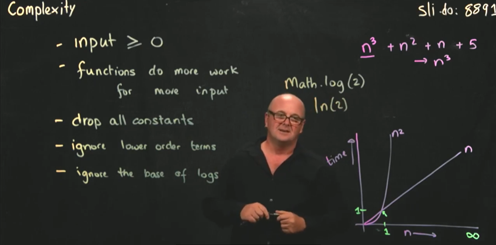
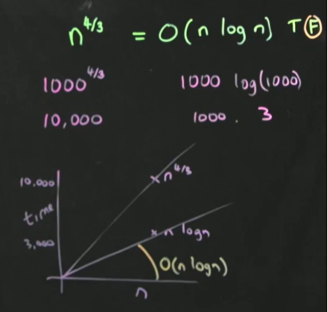
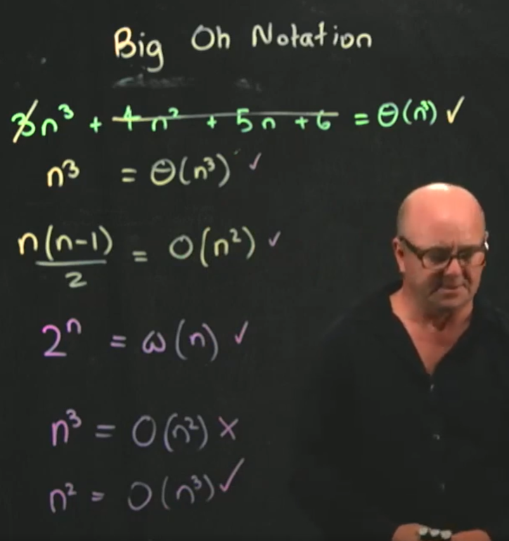

# 시간 복잡도

- 언제나 입력값은 0과 같거나 크다
- input보다 더 많이 실행된다
- 상수항은 제거한다
- 하위 차항은 제거한다
- 로그의 밑은 제거한다
- 시간복잡도가 나타내는 것은 n이 무한대로 갔을때를 표현한다. 1,1 이후를 이야기한다.

## 시간 복잡도 별 예시

- 1,c / 상수
- log n / tree
- n / iterate
- $n^2$ / 비효율적인 정렬(bubble sort), 비교
- n! / 외판원문제

# 빅오 표기법(Big Oh Notation)

> 빅오 표기법은 알고리즘의 시간 복잡도나 공간 복잡도를 분석하기 위한 표기법이다. 주로 입력 크기 `n`이 커질수록 알고리즘의 성능이 어떻게 변화하는지를 나타낸다. 아래는 주요 표기법과 그 설명이다.

---

### **1. O (빅오)**
- 알고리즘이 입력 크기 `n`에 따라 실행 시간이 $O(f(n))$ 이하로 제한된다는 것을 보장한다.
- 즉, **"같거나 더 빠르게 동작할 수 있다"**는 의미를 포함한다.

---

### **2. o (리틀오)**
- 알고리즘의 실행 시간이 특정 함수보다 항상 더 빠르게 동작함을 의미한다.
- 예를 들어, $T(n) = o(f(n))$이면, $T(n)$은 $f(n)$보다 빠르게 증가한다.

---

### **3. Θ (세타)**
- 즉, 입력 크기 `n`에 따라 실행 시간이 정확히 $Θ(f(n))$로 제한된다.
- 상한선(O)과 하한선(Ω)이 같은 경우에 사용한다.

---

### **4. Ω (오메가)**
- 알고리즘이 입력 크기 `n`에 따라 실행 시간이 $Ω(f(n))$ 이상임을 보장한다.
- 즉, **"같거나 더 느리게 동작할 수 있다"**는 의미를 포함한다.

---

### **5. ω (리틀오메가)**
- 알고리즘의 실행 시간이 특정 함수보다 항상 더 느리게 증가함을 의미한다.
- 예를 들어, $T(n) = \omega(f(n))$이면, $T(n)$은 $f(n)$보다 느리게 증가한다.

---

## 빅오 표기법의 예시

- n^4/3 의 지점은 그래프의 위쪽에 그거지고, n logn 의 그래프는 그 아래 그어진다.
- O(n logn)은 그림 처럼 n logn 밑에 있으므로 식의 결과는 False가 된다.
- O(n^2) 는 O(O^3) 보다 가파르지 않아서 ture가 성립한다.