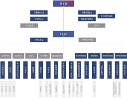
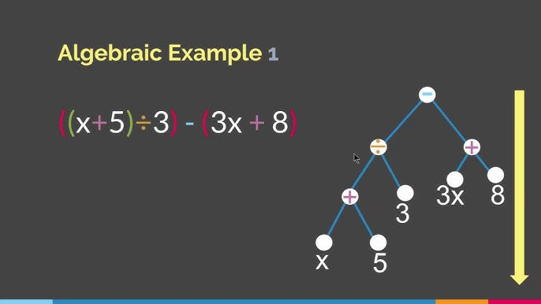

# 트리
> https://www.youtube.com/watch?v=SSLNiP438OA&list=PL0E_1UqNACXD3NsHhF3qUjts4Lkn6KBXR&index=7&pp=iAQB

## 특징

- 선형 구조가 아닌 비선형 구조
- 선형 구조에 비해 훨씬 더 효율적이고 유용하다
- 조직도/계보표가 대표적인 트리 구조이다
  
- root가 존재한다(부모가 없는 최상위 노드)
- subtree가 존재한다
- 순서는 존재하지 않으며, left right.. 이 존재한다

## 주요 용어 Teminology
- Node (vertex): 트리 구조에서 하나의 원소를 나타냄  
- Edge: 노드 간의 연결을 나타내는 선  
- Parent: 현재 노드를 직접 연결하여 포함하는 상위 노드  
- Child: 특정 부모 노드에 연결된 하위 노드  
- Siblings: 같은 부모를 공유하는 노드들  
- Root: 트리의 최상단에 있는 노드 (부모가 없음)  
- Leaf: 자식 노드가 없는 노드 (말단 노드)  
- Ancestor: 현재 노드로부터 위쪽에 위치한 모든 상위 노드들  
- Descendant: 현재 노드로부터 아래에 위치한 모든 하위 노드들  
- Subtree: 트리의 일부로, 특정 노드를 루트로 하는 트리 구조

## 이진 트리
- 비어있거나
- root라는 single node가 존재하며, 2개의 노드가 붙어있는 것을 이진트리라고 부른다 
- algebraic expression을 이진트리로 표현 가능하다
  
- array로도 구현가능하다(매우 비효율적)
- 일반적으로 객체/구조체의 참조로 표현한다
```python
class TreeNode():
    def __init__(self, x):
        self.item = x
        self.left = none
        self.right = none
```

```python
class BinaryTree():
    def __init__(self, node):
        self.root = node
```

- 이진 트리는 구조상 재귀적인 형태를 띠므로, 대부분의 연산은 재귀적으로 구현하기에 적합하다.
    - 탐색/삽입/삭제/순회(order)

## 이진 탐색
- 정렬된 배열 또는 이진 탐색 트리에서 사용되는 탐색 알고리즘이다  
- 배열의 가운데 값을 기준으로 탐색 범위를 절반으로 줄여가며 탐색한다  
- 시간복잡도는 O(log n)이다 (이진 탐색 트리의 경우, 균형 잡혀 있을 때)  
- 이진 탐색을 위해서는 데이터가 반드시 정렬되어 있어야 한다  
- 이진 탐색은 반복문 또는 재귀로 구현할 수 있다  

```python
sorted(arr)

def binary_search(arr, target):
    left, right = 0, len(arr) - 1
    while left <= right:
        mid = (left + right) // 2
        if arr[mid] == target:
            return mid
        elif arr[mid] < target:
            left = mid + 1
        else:
            right = mid - 1
    return -1
```

### 균형 트리

#### RB Tree (Red-Black Tree)
- 이진 탐색 트리의 일종으로, 스스로 균형을 유지하는 구조이다  
- 모든 노드는 red 또는 black 중 하나의 색을 가진다  
- 다음과 같은 성질을 반드시 만족한다
  - 루트 노드는 항상 black이다  
  - 모든 리프(NIL 노드)는 black이다  
  - red 노드의 자식은 반드시 black이다 (즉, red 노드는 연속될 수 없다)  
  - 어떤 노드에서 리프 노드까지 가는 모든 경로에는 같은 수의 black 노드가 존재한다 (black height)  
- 삽입이나 삭제 시 위 조건을 위반하면 회전(rotations)과 색 변경(recoloring)을 통해 트리 균형을 맞춘다  
- 삽입 시간, 삭제 시간, 탐색 시간 모두 O(log n)을 보장한다  
- AVL 트리보다 다소 느슨한 균형 조건을 가지므로, 삽입·삭제 시 리밸런싱이 더 적다  
- Java의 TreeMap, C++의 map/set 등에서 내부적으로 사용된다  

#### AVL Tree (Adelson-Velsky and Landis Tree)
- 최초로 고안된 자기 균형 이진 탐색 트리다  
- 모든 노드는 왼쪽 서브트리와 오른쪽 서브트리의 높이 차가 1 이하임을 보장한다  
- 이 높이 차이를 균형 인수(balance factor)라 하며, 각 노드의 balance factor는 -1, 0, 1 중 하나여야 한다  
- 탐색, 삽입, 삭제 모두 O(log n)의 시간복잡도를 가진다  
- 삽입이나 삭제로 인해 균형이 깨지면 회전(rotations)을 통해 트리를 다시 균형 잡는다  
  - 회전의 종류:
    - LL 회전 (단일 우회전)
    - RR 회전 (단일 좌회전)
    - LR 회전 (좌-우 이중회전)
    - RL 회전 (우-좌 이중회전)
- AVL 트리는 Red-Black Tree보다 더 엄격한 균형 조건을 유지한다  
  - 탐색 속도는 더 빠르지만, 삽입/삭제 시 리밸런싱이 더 자주 발생한다  
- 실시간 검색이나 잦은 조회가 요구되는 시스템에 적합하다