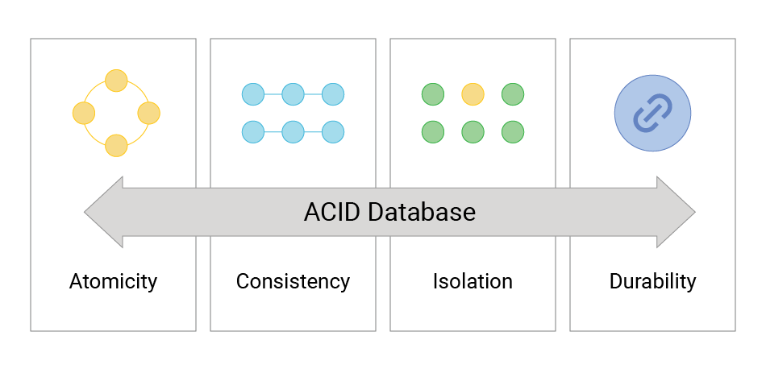

# ACID
> ACID는 데이터베이스 트랜잭션의 네 가지 핵심 속성을 설명하는 약어로, 데이터의 일관성과 무결성을 보장하는 데 중요한 역할을 한다.

> ACID 속성은 데이터베이스의 트랜잭션을 안전하고 신뢰성 있게 처리하기 위해 필요하다. 이를 통해 사용자는 데이터가 정확하고 일관되며, 장애 발생 시에도 안전하게 복구될 수 있다는 신뢰를 가질 수 있다. ACID 원칙은 특히 금융 거래와 같은 중요한 데이터 처리가 필요한 시스템에서 더욱 중요하다.

##  Atomicity (원자성)
> 트랜잭션은 "모두 또는 아무것도"라는 원칙을 따른다. 즉, 트랜잭션 내의 모든 작업이 완료되어야만 데이터베이스에 적용되며, 하나라도 실패하면 모든 작업이 취소된다.

#### 예시
 은행 계좌에서 100원을 A 계좌에서 B 계좌로 이체할 때, 두 계좌의 잔액을 동시에 수정해야 한다. 만약 A 계좌에서 100원을 차감했지만 B 계좌에 추가하지 못한 경우, 모든 작업을 롤백하여 원래 상태로 되돌린다.
## Consistency (일관성)
> 트랜잭션이 완료되면 데이터베이스는 항상 일관된 상태를 유지해야 한다. 데이터의 무결성이 보장되어야 하며, 모든 규칙(예: 제약조건, 트리거 등)을 준수해야 한다.
#### 예시
 사용자 계좌의 잔액이 0보다 작아지지 않도록 하는 제약조건이 있을 경우, 어떤 트랜잭션이 이 제약조건을 위반하면 그 트랜잭션은 실패해야 하며, 데이터는 여전히 일관된 상태를 유지해야 한다.
## Isolation (격리성)
> 동시에 실행되는 트랜잭션들은 서로 독립적으로 실행되어야 하며, 하나의 트랜잭션이 다른 트랜잭션에 영향을 미치지 않아야 한다. 트랜잭션의 격리 수준을 조정하여 데이터의 일관성을 유지한다.
#### 예시
 두 개의 트랜잭션이 동시에 동일한 데이터 행을 수정하려고 할 때, 한 트랜잭션이 완료될 때까지 다른 트랜잭션은 해당 데이터를 읽거나 수정할 수 없다.
## Durability (내구성)
> 트랜잭션이 성공적으로 완료되면 그 결과는 영구적으로 저장되어야 하며, 시스템 장애가 발생하더라도 데이터는 손실되지 않아야 한다.
#### 예시
 트랜잭션이 완료된 후 시스템이 갑자기 꺼지더라도, 데이터베이스에 커밋된 내용은 복구되어야 하며, 데이터는 영구적으로 유지되어야 한다.