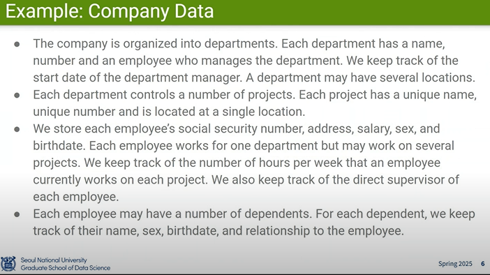
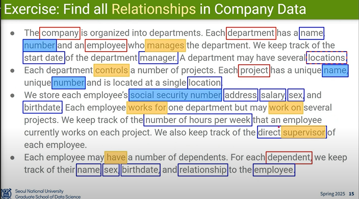
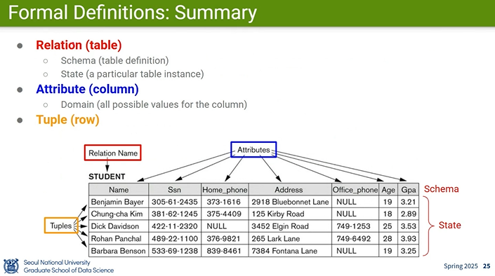
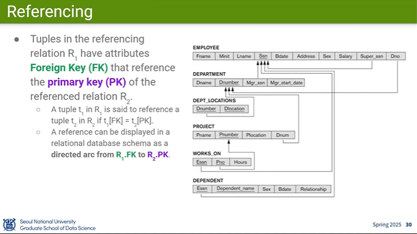

# Database Design Lecture 9, 10 - Joonseok Lee

> https://www.youtube.com/watch?v=kLYiqzU8f4E&list=PL0E_1UqNACXD3NsHhF3qUjts4Lkn6KBXR&index=10

- 현실 세계의 문제나 상황을 체계적으로 다루기 위해 데이터를 구조화할 필요가 있고, 이를 위해 데이터베이스를 만들었다
- 문제를 정의하고, 형식에 맞춘 정리를 위해 entity, attribute, relation 을 정의할 필요가 생긴다

- 빨간네모는 entity 뜻한다
- 파란네모는 attribute를 뜻한다
- 하늘색 밑줄은 Key Attributes를 뜻한다
- 주황 밑줄은 Reliation을 뜻한다
- 현실 세계의 개념을 entity로 추상화하고, 구조화된 방식으로 데이터를 저장하고 검색할 수 있도록 만든 시스템이 데이터베이스다

## Key attributes

- 유니크한 값이 보장되어야하는 값
  - ex) SSN for EMPLOYEE
- 하나 이상을 가질 수 있다
  - ex) SSN, ID for EMPLOYEE

## Relation

- 동사의 형태를 가진다
- 1:1, 1:N, M:N 관계가 있다
  - 1:1 > City 와 Country
  - 1:N > 지도교수와 학생, 팀장과 팀원
  - N:M > 학생과 수업

## Relation 구조

- 대부분의 RDB는 tabular data(표 형태의 데이터, 정형 데이터)를 저장한다.
- Tuple: 하나의 행(row)이며, ordered set of values (값들의 순서 있는 집합)이다.
  - tuple들끼리는 순서가 상관이 없다
  - Relation(테이블)은 수학적 집합(Set)으로 정의되기 때문이다
- attribute: 속성(Column)
  - column끼리는 순서가 존재한다, 튜플에 값을 속성에 연결하기 위해 순서가 필요하기 때문이다
  - the attributes are considered to be ordered
- Relation: 테이블 하나를 의미하며, 테이블 이름 + 속성 리스트로 정의된다.
- 여러 Relation들이 모인 구조를 schema(스키마)라고 한다.
  - Schema는 Attributes들의 속성 값(row 제목)을 의미하기도 한다
    
## Key

### Superkey (슈퍼키)

- 릴레이션(테이블)에서 각 튜플(행)을 유일하게 식별할 수 있는 속성 또는 속성들의 집합

#### 특징
- 유일성(uniqueness)을 만족해야 함
- 하나 이상의 속성으로 구성될 수 있음
- 불필요한 속성(중복 포함 가능) → 최소성은 필요 없음

### Candidate Key (후보키)

- Superkey 중에서 최소성(minimality)을 만족하는 키

#### 특징
- 튜플을 유일하게 식별함 (유일성)
- 더 이상 속성을 제거할 수 없음 (최소성)
- 하나의 테이블에 여러 개의 후보키가 존재할 수 있음
- 이 중 하나를 Primary Key로 지정함

### Primiary key

- 후보키 중 하나를 선택하여 테이블의 대표키로 사용하는 키

### 최소성

- 최소성이란, 어떤 속성 집합이 유일성을 만족하면서, 그 구성 요소 중 어떤 것도 빼면 더 이상 유일성을 만족하지 않는 상태를 말한다.
- 예제 테이블의 상태 → {학번, 이메일, 이름} 
- Superkey(유일함)
    - {학번}
    - {이메일}
    - {학번, 이메일}
    - {학번, 이름}
- 그런데 최소성을 만족하는 경우?
    - {학번} → 유일함 + 더 이상 줄일 수 없음 → 후보키
    - {학번, 이메일} → 학번만으로 유일하므로 불필요한 속성 포함 → 최소성 X

## Referencing

- 다른 Table과 관계가 있어 참조해야할 경우 사용한다
- foreign key는 반드시 다른 테이블의 primary key로 연결이 되어야 한다
    - Unique key랑도 연결이 가능하다
    - 일반적으로는 foreign key는 primary key를 참조하는 것이 “관례”이자 “가장 안전한 기본 선택”이기 때문에 대부분 그렇게 설계하고 문서에서도 그렇게 표현한다.