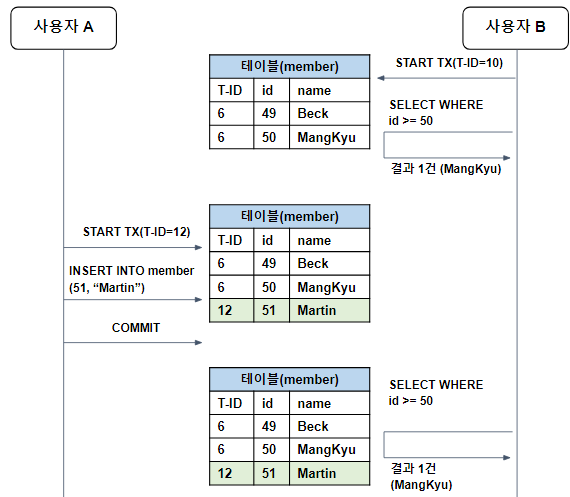
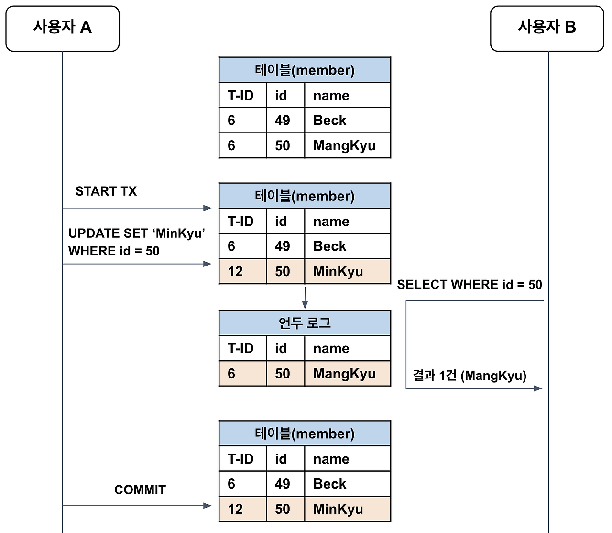

# 트랜잭션의 격리 수준

 

- INNODB는 MVCC의 특성을 가지고 있어서 Repeatable Read 설정이여도 Phantom Read가 일반적으로 발생하지 않는다
  - 하지만 SELECT ... FOR UPDATE 락을 이용한 최악의 경우 Phantom Read가 발생할 수 있다.
    - SELECT … FOR UPDATE 구문은 베타적 잠금(비관적 잠금, 쓰기 잠금)을 건다
    - 잠금을 걸면서, 이전까지의 스냅샷을 무시하고 현재의 레코드를 조회해 스냅샷의 정합성이 깨진다
- 트랜잭션의 격리 수준(Isolation Level)이란 여러 트랜잭션이 동시에 처리될 때, 특정 트랜잭션이 다른 트랜잭션에서 변경하거나 조회하는 데이터를 볼 수 있게 허용할지 여부를 결정하는 것이다. 트랜잭션의 격리 수준은 격리(고립) 수준이 높은 순서대로 SERIALIZABLE, REPEATABLE READ, READ COMMITTED, READ UNCOMMITED가 존재한다. 참고로 아래의 예제들은 모두 자동 커밋(AUTO COMMIT)이 false인 상태에서만 발생한다.
  - SERIALIZABLE
  - REPEATABLE READ
  - READ COMMITTED
  - READ UNCOMMITED
    - Spring의 경우 @Transaction 어노테이션을 사용하지않으면 기본 설정은 autoCommit=true로 사용된다(쿼리 실행시 바로 커밋)
      - 런타임 예외 (unchecked exception, RuntimeException 계열)나 Error가 바깥으로 전파되면 롤백된다.
      - 롤백되는 경우: RuntimeException 또는 그 하위, 그리고 Error 발생 → 롤백 (예: NullPointerException, IllegalArgumentException 등등)
      - 커밋되는 경우: Checked Exception (Exception이지만 RuntimeException이 아닌 것, 예: IOException, SQLException) → 기본 설정에서는 커밋된다.
      - @Transactional에서 rollbackFor를 지정하면 checked exception도 롤백시킬 수 있다
    - @Transaction 어노테이션을 사용하면 autoCommit=false로 바뀌며, 명시적으로 커밋하지 않는한 커밋되지 않는다
      - commit/rollback은 @Transaction 경계에서 알아서 처리한다 

## SERIALIZABLE 
- SERIALIZABLE은 가장 엄격한 격리 수준으로, 이름 그대로 트랜잭션을 순차적으로 진행시킨다. SERIALIZABLE에서 여러 트랜잭션이 동일한 레코드에 동시 접근할 수 없으므로, 어떠한 데이터 부정합 문제도 발생하지 않는다. 하지만 트랜잭션이 순차적으로 처리되어야 하므로 동시 처리 성능이 매우 떨어진다.
- MySQL에서 SELECT FOR SHARE/UPDATE는 대상 레코드에 각각 읽기/쓰기 잠금을 거는 것이다. 하지만 순수한 SELECT 작업은 아무런 레코드 잠금 없이 실행되는데, 잠금 없는 일관된 읽기(Non-locking consistent read)란 순수한 SELECT 문을 통한 잠금 없는 읽기를 의미하는 것이다.
- 하지만 SERIALIZABLE 격리 수준에서는 순수한 SELECT 작업에서도 대상 레코드에 넥스트 키 락을 읽기 잠금(공유락, Shared Lock)으로 건다. 따라서 한 트랜잭션에서 넥스트 키 락이 걸린 레코드를 다른 트랜잭션에서는 절대 추가/수정/삭제할 수 없다. SERIALIZABLE은 가장 안전하지만 가장 성능이 떨어지므로, 극단적으로 안전한 작업이 필요한 경우가 아니라면 사용해서는 안된다.

## REPEATABLE READ

> RR : 트랜잭션 처음 시작할 때 스냅샷을 잡고 계속 그 스냅샷을 본다

> 트랜잭션을 시작할 당시의 일관된 데이터 세상을 보장(스냅샷, 리두로그 이용)

> 트랜잭션 시작할 때의 데이터로 계산하고 있던 비즈니스 로직을 신뢰하고 계속 처리할 수 있도록

- 일반적인 RDBMS는 변경 전의 레코드를 언두 공간에 백업해둔다. 그러면 변경 전/후 데이터가 모두 존재하므로, 동일한 레코드에 대해 여러 버전의 데이터가 존재한다고 하여 이를 MVCC(Multi-Version Concurrency Control, 다중 버전 동시성 제어)라고 부른다. MVCC를 통해 트랜잭션이 롤백된 경우에 데이터를 복원할 수 있을 뿐만 아니라, 서로 다른 트랜잭션 간에 접근할 수 있는 데이터를 세밀하게 제어할 수 있다. 각각의 트랜잭션은 순차 증가하는 고유한 트랜잭션 번호가 존재하며, 백업 레코드에는 어느 트랜잭션에 의해 백업되었는지 트랜잭션 번호를 함께 저장한다. 그리고 해당 데이터가 불필요해진다고 판단하는 시점에 주기적으로 백그라운드 쓰레드를 통해 삭제한다.
- 사용자 B의 트랜잭션은(10) 사용자 A의 트랜잭션(12)이 시작하기 전에 이미 시작된 상태다. 이때 REPEATABLE READ는 트랜잭션 번호를 참고하여 자신보다 먼저 실행된 트랜잭션의 데이터만을 조회한다. 만약 테이블에 자신보다 이후에 실행된 트랜잭션의 데이터가 존재한다면 언두 로그를 참고해서 데이터를 조회한다.
- 따라서 사용자 A의 트랜잭션이 시작되고 커밋까지 되었지만, 해당 트랜잭션(12)는 현재 트랜잭션(10)보다 나중에 실행되었기 때문에 조회 결과로 기존과 동일한 데이터를 얻게 된다. 즉, REPEATABLE READ는 어떤 트랜잭션이 읽은 데이터를 다른 트랜잭션이 수정하더라도 동일한 결과를 반환할 것을 보장해준다.(Repeatable read)

### REPEATABLE READ의 PHANTOM READ

- REPEATABLE READ는 MVCC를 이용해 한 트랜잭션 내에서 동일한 결과를 보장하지만, 새로운 레코드가 추가되는 경우에 부정합이 생길 수 있다.(PHANTOM READ, MySQL은 MVCC때문에 SELECT ... FOR UPDATE의 락이 아니라면 발생하지 않음)
- SELECT로 조회한 경우 트랜잭션이 끝나기 전에 다른 트랜잭션에 의해 추가된 레코드가 발견될 수 있는데, 이를 유령 읽기(Phantom Read)라고 한다. 하지만 MVCC 덕분에 일반적인 조회에서 유령 읽기(Phantom Read)는 발생하지 않는다. 왜냐하면 자신보다 나중에 실행된 트랜잭션이 추가한 레코드는 무시하면 되기 때문이다.
  - 하지만 트랜잭션에서 SELECT … FOR UPDATE을 사용한다면 일반적인 언두로그를 사용하는 MVCC가 사용이 되지 않고, 스냅샷을 무시하고 레코드를 조회함과 동시에 잠금을 건다

## READ COMMITTED 

> RC : 매번 "지금까지 커밋된 데이터 중 최신 버전"을 읽는다

> READ COMMITTED는 커밋된 데이터만 조회할 수 있다. READ COMMITTED는 REPEATABLE READ에서 발생하는 Phantom Read에 더해 Non-Repeatable Read(반복 읽기 불가능) 문제까지 발생한다.

- 사용자 B가 데이터를 조회하려고 하면, READ COMMITTED에서는 커밋된 데이터만 조회할 수 있으므로, REPEATABLE READ와 마찬가지로 언두 로그에서 변경 전의 데이터를 찾아서 반환하게 된다. 최종적으로 사용자 A가 트랜잭션을 커밋하면 그때부터 다른 트랜잭션에서도 새롭게 변경된 값을 참조할 수 있는 것이다.

### Non-Repeatable Read

- READ COMMITTED에서 반복 읽기를 수행하면 다른 트랜잭션의 커밋 여부에 따라 조회 결과가 달라질 수 있다. 따라서 이러한 데이터 부정합 문제를 Non-Repeatable Read(반복 읽기 불가능)라고 한다.
- Non-Repeatable Read는 일반적인 경우에는 크게 문제가 되지 않지만, 하나의 트랜잭션에서 동일한 데이터를 여러 번 읽고 변경하는 작업이 금전적인 처리와 연결되면 문제가 생길 수 있다. 예를 들어 어떤 트랜잭션에서는 오늘 입금된 총 합을 계산하고 있는데, 다른 트랜잭션에서 계속해서 입금 내역을 커밋하는 상황이라고 하자. 그러면 READ COMMITTED에서는 같은 트랜잭션일지라도 조회할 때마다 입금된 내역이 달라지므로 문제가 생길 수 있는 것이다. 따라서 격리 수준이 어떻게 동작하는지, 그리고 격리 수준에 따라 어떠한 결과가 나오는지 예측할 수 있어야 한다.

## READ UNCOMMITTED 

- READ UNCOMMITTED는 커밋하지 않은 데이터 조차도 접근할 수 있는 격리 수준이다. READ UNCOMMITTED에서는 다른 트랜잭션의 작업이 커밋 또는 롤백되지 않아도 즉시 보이게 된다.

## Recap

- MySQL은 RR(Read Repeatable)이 기본 설정이다
- Oracle, MS-SQL은 RC(Read Committed)가 기본설정이다

### RR vs RC

- MySQL은 둘 다 MVCC로 구현
- 언두 로그 유지 등 내부 동작이 거의 비슷
- 일반적인 읽기 성능에서는 성능 차이 거의 없음

#### 차이가 발생하는 상황

| 상황 | 차이점 |
|------|--------|
| 동시에 누군가 INSERT/UPDATE 할 때 | RC는 새로 추가된 데이터를 읽음 (phantom 가능) RR은 안 읽음 |
| 동일 레코드 UPDATE | RC는 업데이트 직전 최신 읽기 가능 RR은 시작 시점 스냅샷 기준 유지 |
| 언두 로그 용량 | RR이 오래 유지될수록 언두 로그가 더 길어짐 (메모리/디스크 부담 가능) |

- 짧은 트랜잭션 → 성능차 거의 없음
- 긴 트랜잭션 or 변경량 많은 시스템 → 언두 로그 부담 → RR이 더 무거울 수 있음

#### 실무에서는?

- 대부분 RC를 디폴트로 선택 (Oracle, SQL Server 등 기본 RC)
- MySQL만 기본이 RR
- 짧고 많은 트랜잭션 → RC 유리
- 긴 조회 + 데이터 일관성 요구 → RR 유리

#### 핵심 요약

- 성능 차이는 거의 없음 → 대부분 업무에서는 맞음  
- 다만 트랜잭션 길이와 동시성 경합이 커질수록 RR의 부작용이 보임