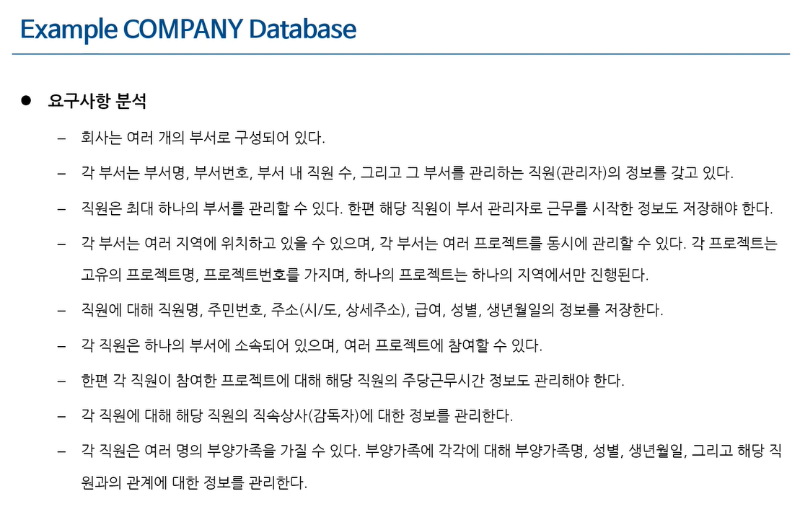
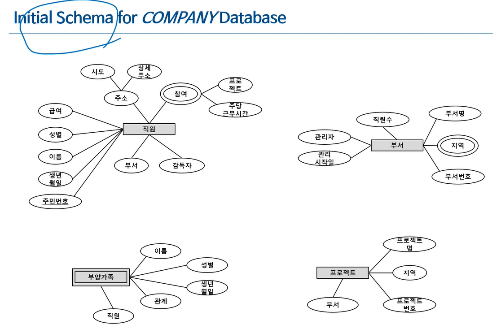
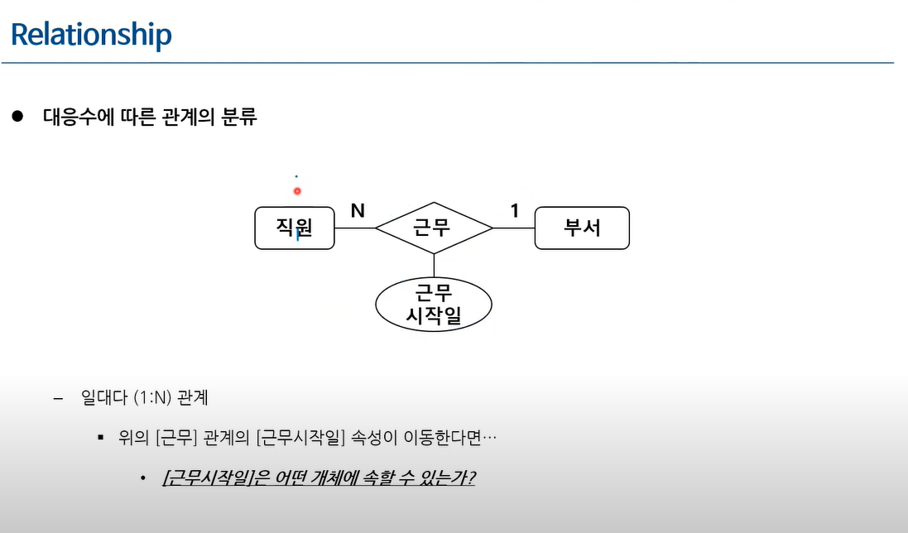
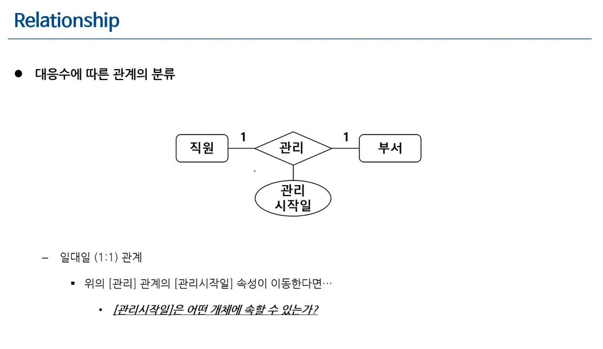
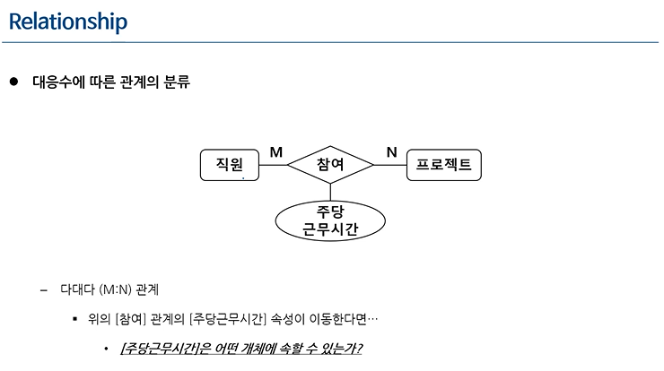
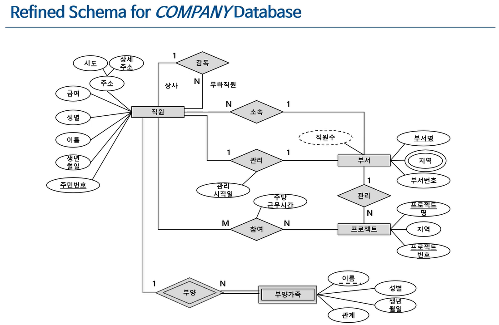
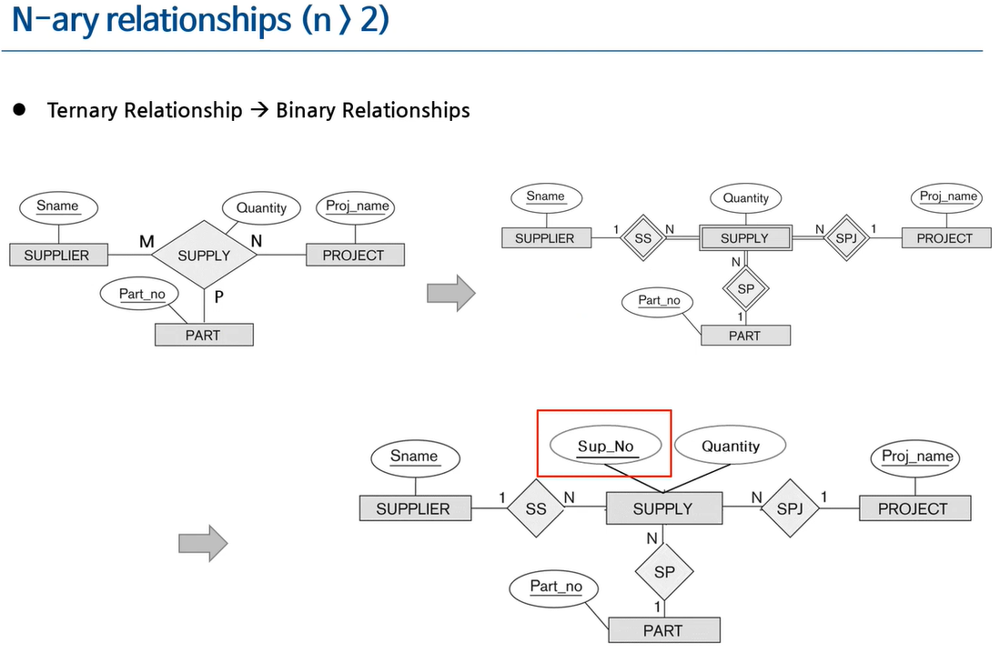
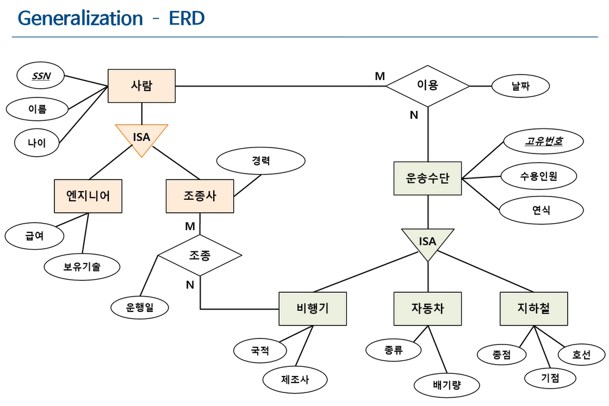

# 개념적 모델링 (Conceptual Data Modeling)

- 업무 기술서의 내용을 개념적으로 표현하는 것(도식화)
  - 가장 많이 사용하는 것: Entity-Relationship Model(개체 관계 모델)
  - 이 모델을 다이어 그램으로 그린 것이 ERD(Entity Relationship Diagram)

## ER Model Concepts

> ER Model은 개체, 관계, 속성으로 구성되어 있다

- 개체(Entity)
  - 실세계에 존재하는 의미있는 하나의 정보 단위
  - 물리적 객체(학생, 자동차, 강의실..) 뿐 아니라 개념적 객체(프로젝트, 직업, 교과목..)도 포함
- 관계(Relation)
  - 개체들 사이의 연관성
    - `학생`과 `교과목` 사이의 `수강`관계
- 개체와 관계는 정말 구분하기 힘들다(ex. 결혼-진행-예식장/ 남자-결혼-여자, 이 경우 두가지 모두 가능하다)
- 속성(Attribute)
  - 개체 또는 관계가 가지는 본질적 성질
  - 학생의 속성(학번, 혈액형)
  - 결국 인스턴스(튜플의 집합)은 속성의 집합이다
  - 학생의 속성(성별, 나이)
  - 교과목의 속성(과목명, 학점)
  - 수강의 속성(평점, 이수구분[학생에 따라서 구분이 다를 수 있기에, 수강이 된다]): 어떤 학생이 어떤 교과목을 수강한 EVENT를 모델링하는 것

### Types of attributes

- Single-valued vs Multi-valued
  - Single-valued(항상 하나의 값만을 가지는 것, 나이)
    - signle-valued가 많다
  - Multi-valued(여러 값을 가질 수 있는 것, 취미)
- Simple vs Composite
  - Simple Attribute: 더 이상 쪼개지지 않는 원자값을 갖는 속성(나이, 학번..)
  - Composite Attribute: 몇 개의 요소로 분해될 수 있는 속성(주소- 시, 군, 구, 번지..)
    - Composite를 쪼갠것이 simple attribute가 된다
    - 예를 들어 이름도 홍/길동으로 쪼갤 수 있다
    - 모든 개체는 규칙을 정하기 나름이다
    - 트리 구조 처럼 뻗어나간다
- Stored vs Derived
  - stored는 저장된 속성, derived는 저장된 것을 이용해 계산이 가능한 속성을 의밓나다
  - 저장된 다른 데이터로부터 유도 가능한 속성
    - 각 과목의 성적 -> 총점
    - 주민등록번호 -> 나이
  - 디스크의 값을 더 소모하는게 낫다고 판단할 경우(계산에 많은 자원이 필요하다면) 나이, 총점 같은 derived 속성도 설계자의 판단하게 stored 속성이 될 수 있다
  - 실무에서는 유도 가능한 속성이더라도 자원 소모를 아끼기 위해 stored로 표현하는 경우가 많다
  - 학술적으로는 derived로 표현한다
- 대부분의 속성은 signled-valued, simple, stored 속성이다

### Entity Types and Key Attributes

> 키 속성은 반드시 유일성과 최소성을 만족해야 한다

- 키 속성(Key Attributes)
  - 어떤 개체에 대해서 항상 유일한 값을 갖는 속성(또는 속성들의 집합)
    - 유니크 속성을 의미한다(유일성)
    - 학생의 학번, 책의 ISBN, 자동차의 차량번호(속성)
    - 축구선수의 key attributes는 팀명 + 등번호가 된다(집합)
  - 특정 snapshot(테이블의 전체 튜플)이 아닌, 해당 개체의 모든 가능한 snapshot의 집합을 고려하여 파악되어야 한다
    - 예를들면 이름은 튜플의 갯수가 적다면 유일할 수 있지만, 튜플의 갯수가 많아진다면 유일하지 않을 확률이 높다

#### 복합 키(Composite key)

- Composite attirubte가 키 속성이 되는 경우
- 복합 키는 최소성을 가져야 한다
  - (팀명, 등번호) O vs (팀명, 등번호, 선수명) X
- 각 개체는 하나 이상의 키를 가질 수 있다
  - 학생: 주민등록, 학번 모두가 가능하다
- 어떤 개체는 키를 갖지 않을 수 있다
  - 약성 개체(Weak Entity)

### Identifier

- Conceptual design에서는 Identifier가 존재한다
  - logical design에서는 Identifier가 primary key라고 불린다
    - Primary키는 반드시 한개가 있어야 한다(0, 다수 불가능)
  - logical design의 primary key는 반드시 한개만 있어야 하지만, Identifier의 경우 여러개가 있거나 없어도 된다

## 예제

> 업무 기술서로부터 개념적 모델링을 구축

- 같은 업무 기술서로부터 다른 개념적 모델링이 나올 수 있다
- Entity -> Relation -> Attribute의 순서로 Conceptual Modeling을 진행해야한다(손으로 작업 추천)

### Initial Schema for Company Database

> 초안, 관계도 틀린 부분이 분명히 존재한다

- Entity 부서: 부서명, 부서번호, 관리자, 관리시작일, 직원수, 지역
  - 관리자: 직원의 다른 이름이다
- Entity 프로젝트: 프로젝트명, 프로젝트번호, 지역, 부서
- Entity 직원: 이름, 주민번호, 성별, 주소, 급여, 생년월일, 부서, 감독자, (프로젝트, 주당근무시간)
  - 감독자(멘토, 멘티): 직원의 다른 이름이다
- Entity 부양가족: 직원, 이름, 성별, 생년월일, 관계

### Relationships

- 관계 설정(Relationship)
  - 한 개체의 속성이 다른 개체를 참조할 때 관계가 형성됨
  - `직원`의 `프로젝트` 속성이 `프로젝트` 개체를 참조함
  - `부서`의 `관리자` 속성은 `직원` 개체를 참조함
- 관계의 차수(Degree)
  - 관계에 참여하는 개체의 수
  - Binary, Ternary, Unary ...
    - 하나의 관계가 A,B의 연결(2차, Binary)
    - 하나의 관계가 A,B,C의 연결(3차, Ternary)
    - 하나의 관계가 A연결(1차, Unary, 자기참조 테이블[category]) 등등..
  - 실무에서는 차수(Degree or Cardinality 두 가지 모두라고 불린다)
- 관계의 대응수(Cardinality)
  - 해당 개체가 해당 관계에서 참여할 수 있는 관계 인스턴스의 최대 수
  - 1:1, 1:N(or N:1), M:N
    - 학생(N)-전공-학과(1)
    - 학생(1)-과대표-학과(1)
    - 학생(M)-수강-학과(N)

#### 대응수(Cardinality/Degree)에 따른 관계의 분류

- 위 그림의 일대다 관계의 경우
  - 실무에서 관계가 속성(근무시작일)을 갖는 것은 허용하지 않는다
  - 어디에 올바른 속성인지, Query로 생각해보면 알기 쉽다
    - 근무시작일은 직원이 가져야 정상적으로 데이터를 사용할 수 있다
    - 기억하는 방법은 1의 반대쪽으로 보내면 된다

- 위 그림의 일대일의 경우
  - 직원, 부서 어느 곳으로 가도 문제가 없다
  - 학계에서는 관계의 속성이지만, 실무에서는 직원/부서 어디에 가도 큰 문제가 없다

- 위 그림의 다대다의 경우
  - 주당 근무시간은 직원/프로젝트 양쪽 모두의 속성이 될 수 없다
  - 참여라는 관계의 속성이 되어야한다(매핑 테이블을 필요로 한다)

- 초안을 어느정도 완성한 ERD
- 부양가족의 경우, unique 속성이 존재하지 않는다
  - 이런 entity를 weak entity라고 부른다
  - 이런 경우 다른 개체의 도움을 받아야한다
    - 직원 테이블- 주민등록번호의 도움을 받을 수 있다(부양 가족 - 이름과 묶어서 사용할 수 있다)

#### Weak Entity(약성 개체)

- 키 속성을 갖고 있지 않은 개체
  - 부분 키(Partial key, 다른 개체의 도움을 받아 key로 사용할 수 있는 속성)를 가진다
  - 약성 개체는 개체를 식별할 수 있는 다른 개체와 식별관계로 맺어져야함
- 약성 개체의 식별자는 다음 속성의 조합으로 구성됨
  - 약성 개체의 부분키 속성 + 식별 개체의 키 속성
  - ex) Building(1, Strong entity, Idenfying Entity) - Contain(Identifying relationship) - Room(N, Weak entity) 
    - 해당 관계의 경우 Building_name + Room_ID를 합쳐(경영관 413호) 부분 키로 사용할 수 있다
- Weak Entity는 최대한 지양하는 것이 좋다

#### N-ary relationships(n>2)

- Ternary Relationship
  - 이론상 더 많을 수 있지만, 잘 없다
  - Tenary(하나의 관계가 A,B,C)가 가끔 나온다
- 부품(다양한 종류)/납품(다양한 곳에서 납픔)/프로젝트(다양한 회사)
  - 시나리오에 따라 N, 1 모두가 될 수 있다
- Binary로 변환하는 것도 방법이다

#### 일반화

- ISA를 사용해 표현한다(IS - A Relationship)
  - 표현 방법
    - 사람은 엔지니어이다
    - 사람은 조종사이다
  - 공통점을 가진 개체를 위로, 특징적인 개체를 아래로
  - 상속과 비슷한 구조
  - 공통 구조가 위에 있기에, ISA구조를 가진 하위 개체는 약성개체가 아니다