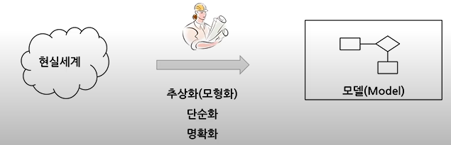
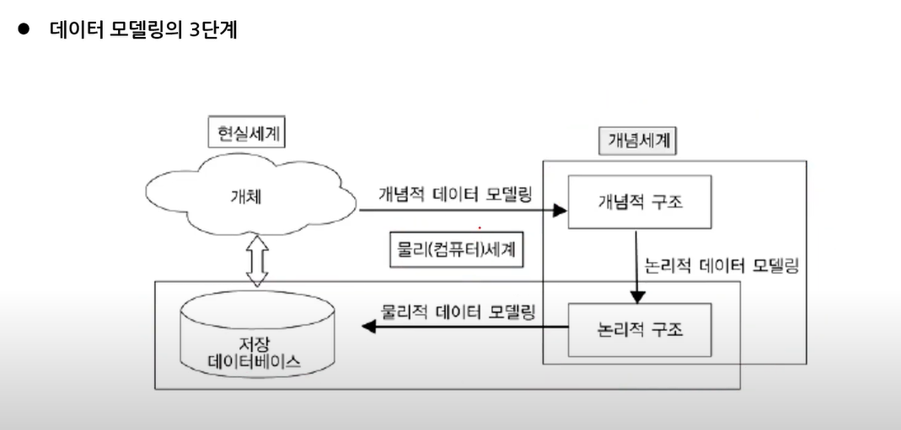
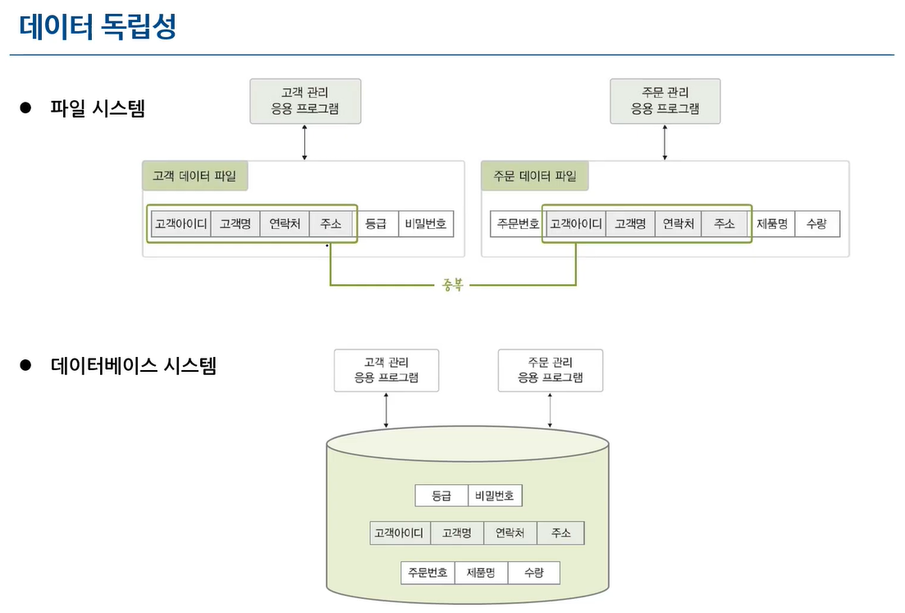
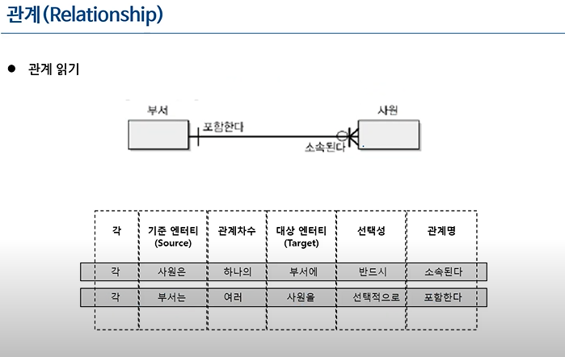
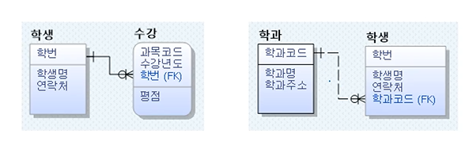
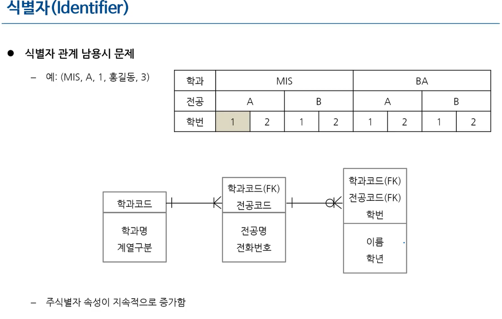
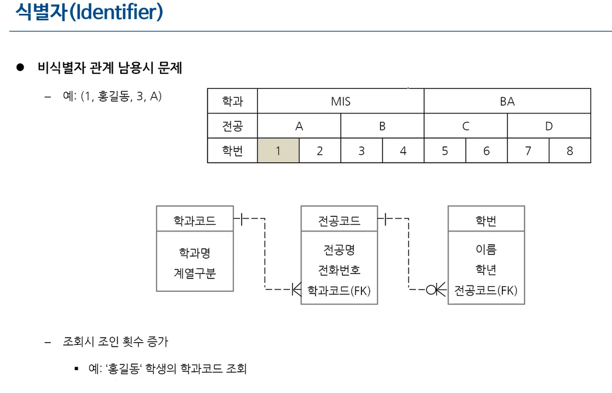
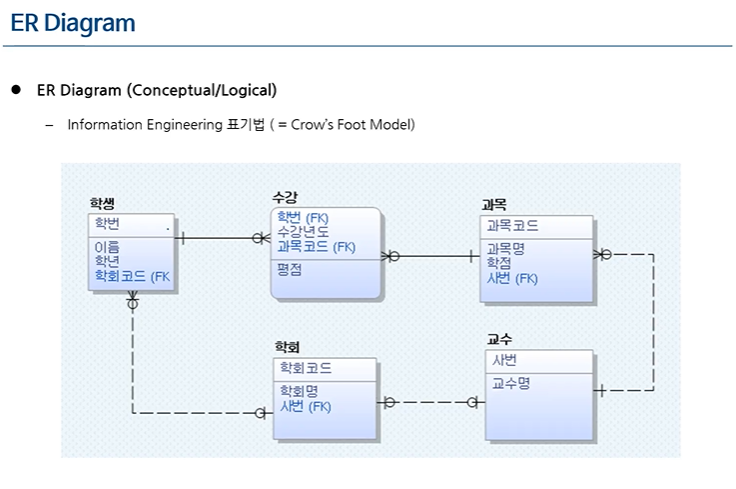

# 데이터 모델링의 이해

- 주요 내용
  - 데이터 모델링의 3단계: 개념적, 논리적, 물리적 모델링
  - 데이터 독립성
  - 데이터 모델의 구성요소
    - 엔터티, 관계/차수, 속성/식별자
  - 다양한 ERD 표기법
    - Peter Chen(실무에서는 거의 사용 안함), IE, Barker 표기법 위주로 사용

## 데이터 모델링 개요

- 모델링이란?
  - 복잡한 현실 세계를 추상화, 단순화하여 일정한 표기법에 의해 명확하게 표현하는 것
  - 추상화, 단순화, 명확화(구체화,복잡화,일반화가 아님)
- 즉, 데이터 모델링이란 현실세계 ─(추상화, 단순화 , 명확화)──►모델 로 바꾸는것
  - 모델: 현실 세계의 추상화된 반영
- 모델링의 관점
  - 데이터 관점(What): 데이터와 데이터 간의 관계, 업무와 데이터 간 관계를 모델링(How/프로세스, Who/누구 와는 상관이 없다)
  - 프로세스 관점(How): 업무가 실제로 하고있는 일 또는 해야할 일을 모델링

## 데이터 모델링의 3단계

- 산업계(실무)
  - 개요: 개념적/논리적 모델링을 동시에 수행, 물리적 모델링에서 테이블 도출
  - 개념적 모델링
    - 핵심 엔터티/관계/속성 중심 ERD 도출
    - 추상화 수준이 높고 업무 중심적인 포괄적 모델링
    - 관계가 자체 속성을 가질 수 없음
    - IE/Crow's Foot 타입의 ERD 사용
  - 논리적 모델링
    - 훨씬 구체적인 수준의 ERD 도출
    - 시스템으로 구축하고자 하는 업무에 대한 식별자, 속성, 관계 등을 명시
    - M:N 관계 해서(여러개의 1:N으로 분해)
  - 테이블 도출(기본키, 외래키, 컬럼 정의)
    - 정규화 및 반정규화 수행
    - 데이터 타입 정의, 인덱스 설계, 뷰 설계

## 데이터 베이스의 장점

### 데이터 독립성

- 파일 시스템의 경우 고객의 연락처와 주소가 바뀐다면, 주문 관리 응용프로그램의 중복값과 값의 불일치가 발생한다
- 데이터 구조가 변경되어도 응용프로그램이 변경될 필요가 없는 것
  - 논리적 독립성 + 물리적 독립성으로 실현됨
- 데이터 독립성이 유지되지 않는다면?
  - 데이터의 중복성 및 복잡도 증가(파일 시스템으로 db를 구현하면 해당 문제가 생긴다)
  - 요구사항 대응 난이도 증가 -> 데이터 유지보수 비용 증가
- 논리적 독립성/물리적 독립성
  - 물리적 독립성
    - 정의: 물리적 저장 구조(저장 위치, 인덱스 구조 등)의 변경이 있어도 논리적 스키마나 응용 프로그램에 영향을 주지 않는 성질이다.
    - 예시: 데이터를 더 빠르게 조회하기 위해 인덱스를 추가하거나, 파일 구조를 바꾼 경우에도 SQL 쿼리나 프로그램 로직은 그대로 동작해야 한다.
  - 논리적 독립성
    - 정의: 논리적 스키마(=개념 스키마)의 변경이 있어도 외부 스키마에 영향을 주지 않는 성질이다.
    - 예시: 기존에는 학생 테이블에 이름, 학번만 있었는데, 전공 속성을 새로 추가했다고 하자. 그런데 사용자가 이름과 학번만 조회하는 프로그램을 쓰고 있다면, 전공이 추가되었더라도 기존 프로그램은 아무 영향 없이 동작해야 한다.

#### 데이터베이스의 3단계 구조

- 외부 스키마
  - 내 급여는 얼마인가? (A,B,C 필요)
  - 부서간의 평균 급여의 차이는? (B,C,D 필요)
  - 입사한지 10년이 넘은 사원 리스트는? (D,E,F 필요)
  - 각 사용자또는 응용프로그램이 바라보는 스키마
- 개념 스키마
  - 외부 스키마에서 필요한 모든 속성(A,B,C,D,E,F)
  - 모든 사용자의 관점을 통합한 스키마
  - DB에 저장되는 데이터와 그들 관계를 표현
- 내부 스키마
  - 개념 스키마를 실제로 저장하는 구조(A,B,C,D / E,F)
  - DB가 물리적으로 저장된 형식

## 데이터 모델링의 요소

- 데이터 모델링의 3가지 구성요소
  - Entity: 업무와 관련된 어떤 것
  - Attribute: 어떤 것이 갖는 성격
  - Relationship: 어떤 것 간의 관계

## 데이터 베이스 스키마

- 데이터 모델링의 대상
- 데이터 베이스 구조, 데이터 타입, 제약조건에 대한 명세
- 데이터 베이스 설계 단계에서 명시되며, 자주 변경되지않음
- Schema 예제

  - STUDENT

  | Name | Student_number | Class | Major |
  | ---- | -------------- | ----- | ----- |

  - COURSE

  | Course_name | Course_number | Credit_hours | Department |
  | ----------- | ------------- | ------------ | ---------- |

  - PREREQUISITE

  | Course_number | Prerequisite_number |
  | ------------- | ------------------- |

  - SECTION

  | Section_identifier | Course_number | Semester | Year | Instructor |
  | ------------------ | ------------- | -------- | ---- | ---------- |

  - GRADE_REPORT

  | Student_number | Section_identifier | Grade |
  | -------------- | ------------------ | ----- |

## 데이터 베이스 인스턴스

- 특정 시점에 데이터베이스에 실제로 저장되어 있는 데이터 값
- 예시

| Section_identifier | Course_number | Semester | Year | Instructor |
| ------------------ | ------------- | -------- | ---- | ---------- |
| 85                 | MATH2410      | Fall     | 04   | King       |
| 92                 | CS1310        | Fall     | 04   | Anderson   |
| 102                | CS3320        | Spring   | 05   | Knuth      |
| 112                | MATH2410      | Fall     | 05   | Chang      |
| 119                | CS1310        | Fall     | 05   | Anderson   |
| 135                | CS3380        | Fall     | 05   | Stone      |

## ERD 작성 순서

- 엔터티를 그린 후 적절하게 배치
  - 가급적 선이 꼬이지 않게 배치
  - 왼쪽 -> 오른쪽, 위-> 아래 순으로 읽어나가기 편하도록 배치
- 엔터티간 관계 설정
  - 식별자 관계를 우선 설정함
    - 식별자 관계: 부모로부터 상속받은 FK가 자식의 PK의 일부가 되는 관계
  - 가급적 Cycle 관계도 발생하지 않아야함
- 관계명 기술
  - 현재형 사용, 지나치게 포괄적인 단어는 지양
  - 실제 프로젝트에서는 크게 고려하지 않음
- 관계 차수(1:1, 1:N)와 필수성(필수 참여, 혹은 자율 참여) 표시
  - cardinality(대응수)
  - degree(차수)
  - 1:1, 1:N 을 이야기하며, Degree/Cardinality 두 가지 모두로 불린다

## 엔터티(Entity)

- 업무에 필요한 정보를 저장하고 관리하기 위한 집합적인 것(Thing)
  - 테이블/릴레이션으로 구현된다
- 엔터티와 인스턴스

  - 엔터티는 인스턴스의 집합

  | 엔터티 | 인스턴스                           |
  | ------ | ---------------------------------- |
  | 과목   | 데이터베이스 입문, 3학점, 전공필수 |
  |        | 데이터베이스 실무, 3학점, 전공선택 |
  | 강사   | 홍길동, 남, 정교수                 |
  |        | 강감찬, 여, 부교수                 |
  | 사건   | 12-345-00, 도난, 해결              |
  |        | 12-543-11, 실종, 미해결            |

### 엔터티의 특징

- 해당 업무에서 필요하고 관리하고자 하는 정보를 포함해야함
  - 관심 영역에 따라 달라짐
- 유일한 식별자에 의해 식별이 가능해야함(PK, 조건)
- 영속적으로 존재하는(둘 이상) 인스턴스의 집합이어야 함
  - 국민대학교 수강신청 시스템을 만들 경우
    - 학교(엔터티) - 국민 대학교(인스턴스)는 올바른 엔터티가 아니다
    - 하나 이상의 인스턴스가 있어야 엔터티가 될 수 있다
  - 성북구 대학관리 시스템
    - 학교(엔터티) - 고려대학교, 국민대학교, 상명대학교가 될 수 있어 올바른 엔터티이다
- 업무 프로세스에 의해 이용되어야 함

  - 업무 프로세스에 의해 CRUD가 발생해야함
  - CRUD가 발생하지 않는다면 부적절한 엔티티 도출, 업무 누락이다
  - ex) CRUD Matrix

  | Operation                          | Titles | Copies of Books | Check Out Requests | Reservation Requests | Branch Library Transfers | Borrowers | Librarians | Curators | Branch Libraries |
  | ---------------------------------- | ------ | --------------- | ------------------ | -------------------- | ------------------------ | --------- | ---------- | -------- | ---------------- |
  | Add Books to Library Database      | R, C   | C               |                    | U                    |                          |           |            | R        |                  |
  | Remove Books from Library Database | R      | R, D            | R, D               | R                    | R, D                     |           |            |          |                  |
  | Do Book Search                     | R      | R               | R                  | R                    | R                        | R         | R          | R        |                  |
  | Lend Books                         | R      | R               | R, C               | R,U                  | R                        | R         | R          |          |                  |
  | Return Books                       | R      | R               | R, U               | R,U                  |                          | R         | R          |          |                  |
  | Reserve Books                      | R      | R               | R                  | C                    |                          | R         | R          | R        |                  |
  | Cancel Book Reservations           | R      | R               |                    | U                    |                          | R         | R          | R        |                  |
  | Manage Book Transfers              | R      | R               | R                  | R                    | R, C, U                  |           |            | R        | R                |
  | DON'T CARE                         | U, D   | U               |                    | D                    |                          | C, U, D   | C, U, D    | C, U, D  | C,U,D            |

- 반드시 속성을 가져야한다
  - 속성 없이 엔터티의 이름만 존재할 수 없음
- 주식별자만 존재하고 일반속성은 없는 경우도 바람직 하지않음
  - 연관 엔터티는 주식별자 속성만 갖고 있어도 인정
- 엔터티의 명명
  - 엔터티 생성 의미대로, 실제 업무에서 사용하는 용어를 사용한다
  - 약어를 사용하지 않는다
  - 단수 명사를 사용한다
  - 이름이 동일한 엔터티가 중복으로 존재할 수 없다
- 다른 엔터티와 최소 한 개 이상의 관계를 가져야 함
  - 고립 엔터티: 부적절한 엔터티 도출, 또는 관계 누락
  - 하지만 통계성 엔터티/코드성 엔터티/시스템 처리용 내부 엔터티의 경우 고립 엔터티를 인정한다

### 엔터티의 분류

- 유형 엔터티
  - 물리적인 형태가 있고 안정적이며 지속적으로 활용됨
  - 교수, 강의실, 학생 등
- 개념 엔터티
  - 물리적인 형태는 존재하지 않으나 관리해야할 개념적 정보
  - 수업, 보험상품 등
- 사건(EVENT) 엔터티
  - 업무 수행 과정에서 발생하며 비교적 발생량이 많음(각종 통계 자료에 이용됨)
  - 수강신청, 주문, 입금 등

## 관계

- 엔터티간 논리적 연관성
- 페어링
  - 엔터티 내 인스턴스 간의 개별적 연관성
  - 페어링의 집합 -> 관계
  - 엔터티는 인스턴스의 집합을 논리적으로 표현한 것이다
- 관계의 분류
  - 존재에 의한 관계(부서, 사원) vs 행위에 의한 관계(고객, 주문)
- 관계의 표기법
  - 관계명
    - 각 관계는 두 방향의 관계명을 가짐
  - 명명 규칙
    - 애매한 동사를 피한다
    - 현재형으로 포함한다
      - ex) 부서(포함한다) - 사원(소속된다)
  - 관계 차수
    - 각 관계에 참여할 수 있는 인스턴스의 수
    - 1:N, 1:1, M:N등이 존재함
  - 학계에서의 대응수(Cardinality)에 해당하는 개념
    - 학계에서 차수(Degree)는 unary, binary, ternary, N-ary를 의미함
- 관계 선택성(Optionality)
  - 필수 참여(Mandatory Membership)
  - 선택 참여(Optional Membership)
    - erd에서 o로 표기한다
    - 관계 양쪽이 Optional이라면, 해당 관계는 잘못 설정되었을 가능성이 크다
      

## 속성

- 사물(엔터티)의 특징 또는 본질적인 성질
  - 속성이 없다면 실체를 생각할 수 없음
- 인스턴스에 대해 의미가 더 이상 분리되지 않는 최소의 데이터 단위
  - 학생 - 신상정보는 불가능하다, 더 나누어질 수 있어서/ 학생 - 나이 의 경우는 가능하다
- 엔터티에 속한 인스턴스들의 성격을 구체적으로 나타냄
  - 인스턴스 각각을 구분할 수 있는 기준 파악 -> 이름 부여 -> 속성화
- 엔터티, 인스턴스, 속성, 속성값
  - 각 엔터티는 둘 이상의 인스턴스를 가짐
  - 각 엔터티는 둘 이상의 속성을 가짐
  - 각 속성은 하나의 속성 값을 가짐
    - 나이같은 경우 20, 37 두개를 가질 수 없다

### 속성의 특징

- 해당 업무에서 필요하고 관리해야 하는 정보
- 모든 속성은 주식별자에 함수적으로 종속 되어야 함
  - 주식별자는 PK를 의미한다
  - 학번에 의해 다른 값들이 정해진다(학번에 함수적으로 종속되어있다)
- 하나의 속성은 한 개의 값만을 가져야 함
  - 속성이 다중값을 가질 경우 해당 속성을 별도의 엔터티로 분리함

### 속성의 명명

- 현업에서 사용하는 이름을 부여
- 약어 사용 금지
- 서술식 금지, 명사형 사용
- 수식어와 소유격을 피함
- 속성의 이름은 가급적 전체 모델에서 유일하게 정의(가급적 따라야한다)

### 속성의 표기

- 엔터티 내에 이름을 기재

  사건(엔터티)

| 사건(PK, 주속성)    |
| ------------------- |
| 발생장소(일반속성1) |
| 발생일시(일반속성2) |

### 도메인(영역, 범위)

- 각 속성의 가질 수 있는 값의 범위(값들의 집합)
  - 학점: 0.0~4.5 사이의 실수
  - 주소: 길이가 20자리 이내인 문자열
- 속성에 대한 데이터 타입과 크기 그리고 제약사항을 지정하는 개념

### 속성의 분류

- 속성의 특성에 따른 분류
  - 기본 속성
    - 가장 일반적인 속성으로, 원래의 업무로부터 유래한 속성
    - 제품이름, 제조년월, 제조원가
  - 설계 속성
    - 구분이 애매함
    - 데이터 모델링을 위해 새로 만든 속성(주로 코드)
    - 데이터를 구분할 수 있도록 일련번호를 만드는 것(ID, 학번)
    - 약품 용기코드(001-식품용기, 002- 약품용기, 003- 기타용기)
  - 파생 속성
    - 다른 속성으로부터 유도된 속성
      - 데이터의 중복이 생긴다
    - 가급적 적게 정의
      - 전체 용기의 수(개별 용기의 합)
      - 용기의 총 금액(단가의 합)
- PK 속성(Primary key)
  - 엔터티의 인스턴스를 구별할 수 있는 속성
- FK 속성(Foreign key)
  - 타 엔터티의 PK를 참조하는 속성
  - 관계를 표현하기 위해 필요한 엔터티의 PK 값을 자신의 속성으로 포함한다
- 일반 속성
  - 그 외 속성
- 분리 가능성에 따른 분류
  - 복합 속성
  - 단순 속성
- 속성값의 수에 따른 분류
  - 다중 값 속성
    - 취미: 축구, 야구, 배구..
  - 단일 값 속성
    - 혈액형

### 식별자

#### 식별자의 분류

| 분류    | 식별자     | 설명                                                                                                                  |
| ------- | ---------- | --------------------------------------------------------------------------------------------------------------------- |
| 대표성  | 주식별자   | 엔터티 내에서 각 인스턴스를 구분할 수 있음 타 엔터티와 참조관계를 연결할 수 있음 (Primary Key에 해당)              |
|         | 보조식별자 | 엔터티 내에서 각 인스턴스를 구분할 수 있음 대표성을 갖지 못해 참조관계 연결에 사용되지 않음 (Candidate Key에 해당) |
| 목적    | 내부식별자 | 엔터티 내부에서 스스로 만들어지는 식별자                                                                              |
|         | 외부식별자 | 관계를 통해 유입되는 타 엔터티의 식별자 (Foreign Key에 해당) 주식별자 속성 또는 일반 속성으로 포함될 수 있음       |
| 속성 수 | 단일식별자 | 하나의 속성으로 구성된 식별자                                                                                         |
|         | 복합식별자 | 둘 이상의 속성으로 구성된 식별자                                                                                      |
| 본질    | 본질식별자 | 업무에 의해 만들어지는 식별자(email)                                                                                  |
|         | 인조식별자 | 원조식별자가 복잡한 구성을 가지고 있기 때문에 인위적으로 만든 식별자 (ID)                                             |

#### 식별자의 특징

| 특징   | 내용                                                                        | 예시                                                              |
| ------ | --------------------------------------------------------------------------- | ----------------------------------------------------------------- |
| 유일성 | 주식별자에 의해 엔터티 내의 각 인스턴스를 모두 유일하게 구분할 수 있어야 함 | 각 회원들에 대해 ID가 개인별로 고유하게 부여됨                    |
| 최소성 | 주식별자를 구성하는 속성의 수는 유일성을 만족하는 최소의 수가 되어야 함     | ID만으로도 유일성이 만족되면, (ID, 이름)은 주식별자가 아님        |
| 불변성 | 주식별자가 지정되면, 그 식별자의 값은 변하지 않아야 함                      | ID의 값이 변한다는 의미는 이전 기록이 말소되고 새로운 기록이 생김 |
| 존재성 | 주식별자의 값은 Null이 될 수 없음                                           | ID가 없는 회원은 있을 수 없음                                     |

- 유일하게 식별할 수 있으며, 반드시 존재해야한다(Unique, Not Null)

#### 주식별자 도출 기준

- 유일성을 갖는 속성 중 해당 업무에서 자주 이용되는 속성을 지정
  - ex) 사원 번호
- 명칭,내역과 같이 이름으로 기술되는 것은 가능하면 주식별자로 지정하지 않음
  - 명칭은 유일성을 갖는 것 같지만, 많이 겹친다(ex 회사이름)
  - 가급적 코드, id가 주식별자가 되는 것이 좋다
- 복합식별자를 구성할 경우 너무 많은 속성이 포함되지 않아야함
  - 접수 테이블의 주식별자가 (접수일자, 관할부서, 입력자사번, 접수방법코드, 신청인 구분코드, 신청인구분코드, 신청자 주민번호, 신청회수)가 되면 많은 문제가 생긴다
    - 해당 경우는 인조식별자(접수번호, ID)를 통해 식별하는 것이 좋다

### 식별자 관계와 비식별자 관계

- 부모 엔터티가 식별자 A를 자식 엔터티의 외부식별자A(FK)로 포함할 때
  - A(FK)가 주식별자에 포함된 경우 - 식별자 관계
  - A(FK)가 비식별자 속성으로 포함된 경우 - 비식별자 관계

- 해당 그림의 경우, 학생과 수강은 식별자 관계이다
  - 과목코드 A001만 가지고는 특정 불가능하다
  - (과목코드, 수강년도, 학번) 을 모두 가지고 있어야 특정 가능하다(식별자 관계)
- 학과와 학생의 경우 비식별자 관계이다
  - (학과코드) 로는 아무것도 특정할 수 없다(비식별자 관계)
  - 비식별자들의 집합으로는 튜플/레코드/인스턴스를 특정 불가능하다

#### 식별자 관계

- 부모의 주식별자가 자식엔터티의 주식별자로 상속
- 반드시 부모엔터티가 생성되어야 자식 엔터티가 생성될 수 있음
  - 해당 속성의 NN이므로 weak entity에 해당됨
  - 부모 엔터티에 의존하므로 weak entity가 됨
- 자식 엔터티의 주식별자가 해당 속성만으로 구성되는 경우 - 1:1 관계
  - 사원 - 임시직사원(사원번호FK)
- 자식 엔터티의 주식별자가 해당 속성 +@로 구성되는 경우 - 1:N 관계
  - 사원- 발령(사원번호FK, 발령일자)

#### 비식별자 관계

- 부모의 주식별자가 자식 엔터티의 비식별자 속성으로 상속
- 다음의 경우 비식별자 관계가 생성됨
  - 부모 엔터티와 자식 엔터티의 관계가 약한 경우
    - 부모 엔터티 없이 자식 엔터티가 생성 가능
  - 자식 엔터티의 주식별자로 사용해도 되지만(식별자 관계로도 사용 가능), 일반 속성으로 두는 것이 유리할 때
    - 자식 엔터티의 독립적인 주식별자 설정이 필요한 경우 등

#### 식별자 관계 남용시 문제

- 식별을 위한 데이터가 많아져 컬럼이 많아져 성능저하가 생기게 된다

#### 비식별자 관계 남용시 문제

- 쿼리가 길어진다(조인시 조인 횟수 증가)

#### 비식별자 관계를 고려해야하는 경우

- 부모 엔터티와 자식 엔터티의 관계의 강도가 약한 경우
- 자식 엔터티의 독립적인 주식별자 설정이 필요한 경우
- PK 속성의 단순화가 필요한 경우
  - SQL 복잡도 증가로 인해 개발 생산성이 저하되는 현상 방지

  
| 항목         | 식별자 관계                                | 비식별자 관계                                |
|--------------|---------------------------------------------|----------------------------------------------|
| 관계 강도    | 강한 연결관계 표현                          | 약한 연결관계 표현                           |
| 상속 위치    | 자식 엔터티의 주식별자에 포함됨            | 자식 엔터티의 비식별자 속성에 포함됨        |
| 표기법       | 실선 표현                                   | 점선 표현                                    |
| 연결 고려사항 | - 부모 엔터티에 종속됨 - 상속받은 주식별자 속성을 타 엔터티에 전달할 필요가 있는 경우 | - 자식 주식별자를 독립적으로 구성함 - 상속받은 주식별자 속성을 타 엔터티에서 차단할 필요가 있는 경우 |

## ER Diagram(Conceptual/Logical)
> Information Engineering 표기법(= Crow's Foot Model)

