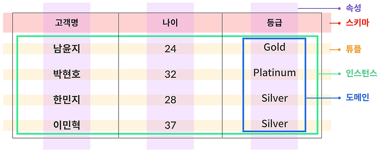
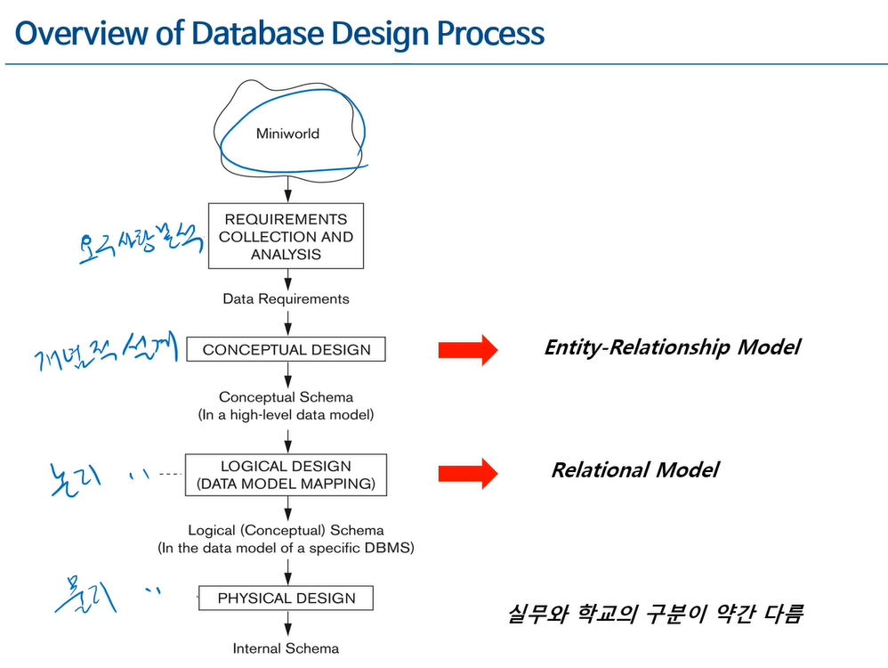

# 데이터 베이스란?

- 현재는 거의 모든 전기가 들어가는 시스템에 데이터 베이스가 사용된다
- 데이터가 많을 때 효율적으로 관리하기 위한 것이 Database 이다

## 데이터 베이스가 필요한 경우

> 입금, 출금 등 은행거래(O) 
> 호텔 객실의 예약(O) 
> 신호등의 램프제어(X) 
> 온라인 쇼핑몰에서의 물품 구매(O) 
> 전자식 개폐 장치의 비밀번호 관리(X)

- 최초 적재(Loading) 후 이벤트 발생에 따른 잦은 변경(Interaction)
- 대용량의 데이터를 다룰 때
  - 사용자가 원하는 순간 데이터에 접근하기 위해서는?
    - 대용량 데이터가 체계적으로 조직화 되어 있어야 함 < DB의 필요성이자 특성
- 데이터를 '잘' 관리해야 하는 상황에 필요하다

## 데이터 베이스 시스템

- 데이터베이스는 `데이터` + `데이터간 관계`를 저장하고 있다
  - 데이터뿐만 아니라 데이터간 관계도 저장하고 있다는걸 기억할 필요가 있다
  - 데이터베이스(DB)는 데이터를 저장하는 구조적 공간, 그릇이다
- 데이터베이스를 안정적이고 효율적으로 운용하기 위해선 접근 제어, 트랜잭션 관리, 동시성 제어, 장애 복구 등 여러 기능이 필요하다.
  - 이 기능들을 통합적으로 제공하는 소프트웨어가 바로 DBMS다.
- Query(SQL)을 입력해 DBMS에 요청을 보내면, Stored Database Definition(Meta Data)를 이용해 데이터의 구조를 파악한 후, Stored Database에 접근해 데이터를 가져온다
- 사용자는 SQL이라는 선언적 언어로 원하는 데이터를 요청하고, DBMS는 내부적으로 실행 계획을 수립하여 최적화된 방식으로 데이터를 검색하고 반환한다

## Database Schema vs Instance

- Column name의 집합: Schema
- Tuple의 집합: Instance

### Database Schema

- 데이터베이스의 구조, 데이터 타입, 그리고 제약조건에 대한 명세
- 데이터 베이스 설계 단계에서 명시되며, 자주 변경되지 않음
- 스키마를 만드는 것이 데이터 모델링/디자인 이라고 불린다
- 스키마를 기술하기 위해 사용되며, DB 사용자가 사용하는 SQL이 DDL(Data Definition Language/CREATE, ALTER.. etc)이다

### Database Instance

- 특정 시점에 데이터 베이스에 실제로 저장되어있는 데이터
- Database instance = Occurrence = Snapshot
- 데이터를 조작(CRUD)하는데 사용되는 것이 DML(Data Manipulation Language)이다

## 데이터 베이스 디자인 과정

- miniworld는 실제세계를 압축, 요약 해놓은 것이다
- 요구사항 분석단계(REQUIREMENTS COLLECTION AND ANALYSIS)에서는 miniworld를 요약하여 업무 기술서를 작성한다
- 업무 기술서를 통해 개념적 설계(CONCEPTUAL DESIGN)를 한다
  - 업무 기술서의 내용을 개념적으로 표현하는 것(도식화)
  - 도식화 방법에는 여러가지가 있다
    - 가장 많이 사용하는 것: Entity-Relationship Model(개체 관계 모델)
    - 이 모델을 다이어 그램으로 그린 것이 ERD(Entity Relationship Diagram)
- 개념적 모델링으로 작성한 ERD를 이용해 컴퓨터 안에 넣는 것이 논리적 설계(LOGICAL DESIGN)이다
  - Data model mapping이라고도 불리며, 관계형 모델(Relation Model)이라고 불린다
  - 테이블을 정의하는 것이다(논리적으로 정의 하는 것, DB DDL X)
- 물리적 디자인(PHYSICAL DESIGN)
  - 실제 DB 저장 방법 설계
  - index, transaction, 보안 등의 설계

## Relationship vs Relational

- Relationship: database에서 관계를 필요할때는 해당 단어를 사용한다
  - 엔티티간의 관계 등 다양한 관계를 나타낸다
- Relational: database에서 테이블을 의미할때는 릴레이션 이라고 사용한다
  - Table을 의미한다
