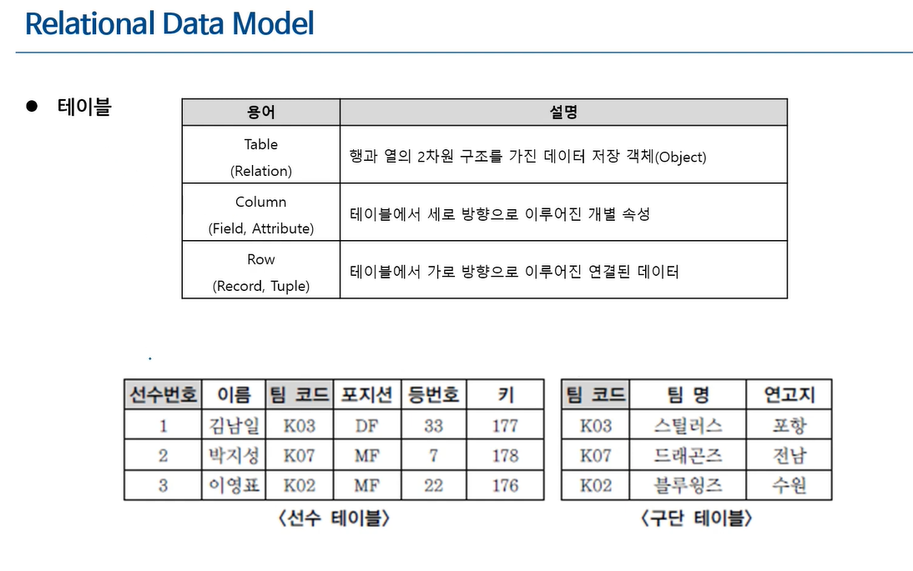
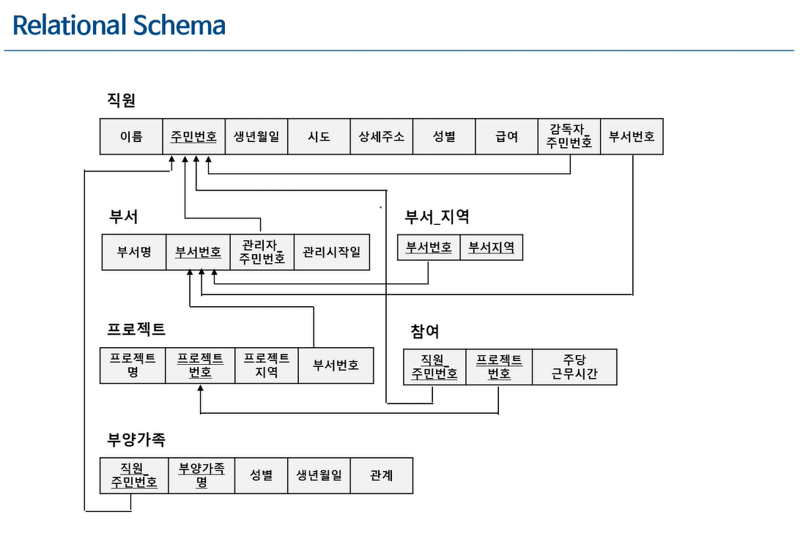
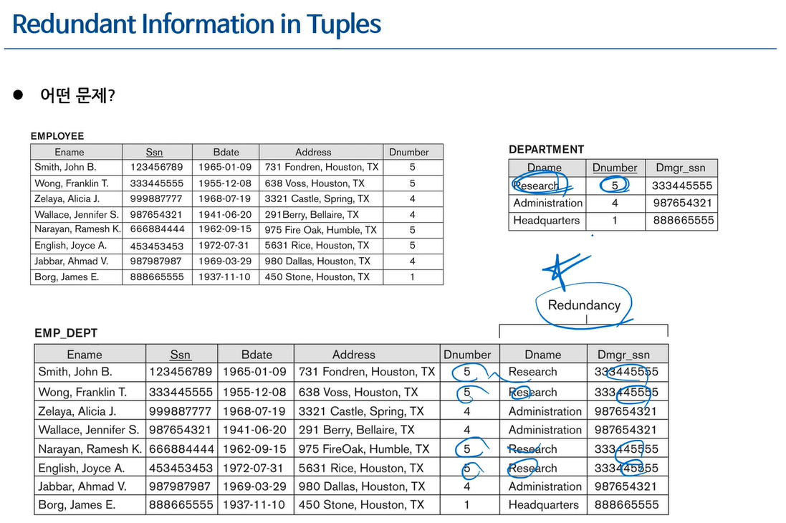

# 논리적 모델링 (Logical Data Modeling)

- 개념적 모델링으로 작성한 ERD를 이용해 컴퓨터 안에 넣는 것이 논리적 설계(LOGICAL DESIGN)이다
  - Data model mapping이라고도 불리며, 관계형 모델(Relation Model)이라고 불린다
  - 테이블을 정의하는 것이다(논리적으로 정의 하는 것, DB DDL X)

## Relation Data Model

- 데이터베이스에서는 Table을 Relation이라고 표현한다
  - 속성들이 관계를 가지고 맺어져 있는 집합을 Relation이라고 표현하는 것이다
  - DB자체가 수학적으로 구성되어 있어서 Table을 Relation이라고 표현하는 것이다
- Column(세로)을 표현하는 방법은 Field, Attribute가 있다
  - Attribute(속성)이라는 표현을 많이 사용한다
- Row(가로)를 표현하는 방법은 Record, Tuple이 있다
  - Record라는 표현을 많이 사용한다

## Relation Model Constraint

> Database가 Database이기 위해 반드시 지켜야 하는 제약이다

### 도메인 제약(Domain Constraints)

- 속성에 대한 제약
  - 속성값은 원자성을 가지며, 도메인에서 정의된 값이어야 함
  - Composite Attribute와 Multivalued Attribute는 허용되지 않음
    - cf) 주소= 시군구+상세주소
  - Null 값은 허용됨(NN이 아닌 경우)
- 예시 테이블 (도메인 제약 위반 사례)

| 학번 | 이름   | 나이 | 차량번호 | 취미             |
| ---- | ------ | ---- | -------- | ---------------- |
| 1234 | 홍길동 | 21   | 01가1234 | 체조             |
| 5678 | 강감찬 | 고려 | NULL     | 축구, 농구, 배구 |

- `나이`에 숫자가 아닌 값 `고려` 입력 → 도메인 위반
- `취미`에 복수 값 입력 → 원자성 위반
- `차량번호`에 Null 허용 → 도메인 제약 위반 아님

### 키 제약(key Constraints)

- 릴레이션에 대한 제약
  - 릴레이션의 모든 튜플/레코드는 식별 가능해야 한다
- 예시 테이블 (키 제약 위반/모범 사례)

| 이름   | 나이 | 혈액형 | 전공       |
| ------ | ---- | ------ | ---------- |
| 홍길동 | 21   | A      | 경영정보   |
| 강감찬 | 22   | B      | 정보시스템 |

- 위 테이블은 키 제약을 위반했다(식별이 불가능함)
- 키 제약 조건 위반
- 키를 못 잡는 상태

| 이름   | 나이 | 학번 | 주민번호 |
| ------ | ---- | ---- | -------- |
| 홍길동 | 21   | 1234 | 111-2222 |
| 강감찬 | 22   | 5678 | 333-4444 |

- 위 테이블은 키 제약을 만족시켰다(주민번호,학번을 통한 식별)
  - 위 테이블의 주민번호, 학번은 학술적으로 Candidate key(후보키)라고 불린다
  - 설계자는 Candidate key중 하나를 정해 Primary Key(프라이머리키, 기본키, PK로 불린다)로 정한다
  - Super key는 Candidate key에 속성이 추가 된 것이다(ex, 나이+학번), 잘 쓰이지 않는다

### 개체 무결성 제약(Entity Integrity Constaints)

- 기본키(Primary Key)에 대한 제약
  - 기본키(Primary Key)는 Unique & Not Null 이어야 한다
- 개체 무결성 제약 위반 예시 테이블

| 학번 | 이름   | 나이 | 차량정보  |
| ---- | ------ | ---- | --------- |
| 1234 | 홍길동 | 21   |           |
| 5678 | 강감찬 | 22   |           |
|      | 김유신 | 23   |           |
| 1234 | 유관순 |      | 02나 3456 |

- 학번(Primary key) 유니크 위반
- 학번 Not Null 위반

### 참조 무결성 제약(Refrential Integirty Constaints)

- 외래키(Foreign Key)에 대한 제약
  - 릴레이션 R1이 릴레이션 R2를 참조하는 경우 R1의 FK는 반드시 Null 이거나 Null이 아닌경우 R2에 실제로 존재하는 값으로 구성되어야 한다
- 릴레이션 R1이 릴레이션 R2를 참조하는 경우, R2의 기본키(Primary key)는 R1에서 외래키로 사용됨
- FK는 자기 자신이 속한 릴레이션을 참조할 수도 있음
- 외래키 예시 테이블
- 학생 Relation

| 학번(PK) | 이름   | 나이 | 소속 | 멘토 |
| -------- | ------ | ---- | ---- | ---- |
| 1234     | 홍길동 | 21   | MIS  |      |
| 2345     | 강감찬 | 22   | MIS  | 1234 |
| 3456     | 김유신 | 23   | 경영 |      |
| 4567     | 유관순 | 24   | 컴공 | 2345 |

- 학과 Relation

| 학과명(PK) | 정원 | 위치   |
| ---------- | ---- | ------ |
| MIS        | 100  | 경상관 |
| 경영       | 200  | 경상관 |
| 컴공       | 100  | 공학관 |
| 수학       | 50   | 자연관 |

- 학생 Relation은 학과 Relation의 Primary key인 학과명을 참조한다(연결이 되어있다)
  - 다른 테이블의 Primary key를 참조하는 것이 외래키이다
- 멘토는 자기 자신의 릴레이션을 참조한다
  - 자기 자신의 학번을 참조한다
- 즉, 학생 Relation에서는 PK는 학번이며, FK는 소속(학과의 PK), 멘토(학생의 PK)를 외래키로 삼는다

- 외래키 참조 무결성 제약을 위반하는 예시 테이블

| 학번(PK) | 이름   | 나이 | 소속   | 멘토 |
| -------- | ------ | ---- | ------ | ---- |
| 1234     | 홍길동 | 21   | MIS    |      |
| 2345     | 강감찬 | 22   | MIS    | 1234 |
| 3456     | 김유신 | 23   |        | 5678 |
| 4567     | 유관순 | 24   | 자동차 | 2345 |

- 학과 Relation

| 학과명(PK) | 정원 | 위치   |
| ---------- | ---- | ------ |
| MIS        | 100  | 경상관 |
| 경영       | 200  | 경상관 |
| 컴공       | 100  | 공학관 |
| 수학       | 50   | 자연관 |

- 김유신은 멘토에서 참조무결성 위반(없는 학번을 참조)
- 유관순은 소속에서 참조무결성 위반(없는 소속을 참조)

## ER-to-Relational Model 변환 규칙

- 개념적 모델링에서 만든 ER(ERD)을 Relational Model(Table/Relation)으로 바꾸는 순서

1. Mapping of Strong Entity Types
2. Mapping of Weak Entity Types

- 1,2의 경우 Entity를 테이블로 만듬
- Composite attribute는 해당 과정에서 처리한다

3. Mapping of Binary 1:N Relationship Types
4. Mapping of Binary 1:1 Relationship Types

- 3,4의 경우 관계를 빼고 관계로 만들어낸다(Foreign key로 관계를 만들어낸다)

5. Mapping of Binary M:N Relationship Types
6. Mapping of N-ary Relationship Types

- 5,6은 테이블로 만들어낸다

7. Mapping of Multivalued attributes

- 테이블로 multivalue를 빼냄
- multi value의 값들이 합쳐져서 key이며, 별도의 테이블로 분리한다

## ERD(개념적 모델링의 결과)를 통해 만들어내는 Relation Schema(논리적 모델링의 목표)

- 개념적 모델링의 결과

- 논리적 모델링의 결과

## Normaliztion 

- ERD를 작성 후, Table을 만들었을때 놓친 부분을 검사히기 위한 방법을 normalization(정규화)라고 한다.
  - 정규화의 핵심은 functional dependency이다
- 3차 정규형(3NF)까지만 하는 것을 일반적(실무적)으로 추천한다
- Primary key는 나머지 속성 값을 결정하는 역할을 한다
  - 학번은 성별을 결정할 수 있다(dependent)
  - 학번과 성별 사이에 functional dependency가 존재한다
    - 잘 짜여진 DB라면 primary key에서 다른 곳으로 뻗어 갈 수 있다
  - 이렇게 다른 속성의 값을 결정할 수 있는 값끼리 분리하는 것이 제3 정규형(3NF)이다
    - 현재 내가 만든 relation의 attribute가 EMP_DEPT(Ename, Ssn, Address, Department_number, Department_name)이라면
    - Ssn을 기반으로하는 EMP 테이블과
    - Department 테이블은 함수적 종속에 기반해 테이블을 분리해야 한다는 것이다
  - 잘 설계된 DB는 함수적 종속에 기반해 테이블을 분리하며, 이는 정규화의 핵심이다

- 같은 정보로도 위 그림처럼 여러가지 방법으로 DB를 만들 수 있다
- 아래 테이블과 같이도 정보를 표현할 수 있고, 아래 테이블의 경우 많은 redundancy(중복)가 생기게 된다
  - 요즘은 하드웨어 값이 비싸지 않아 이런 문제 정도는 괜찮지 않나? 라는 생각을 충분히 할 수 있다
  - 하지만 문제는 이렇게 단순하지 않다
    - 밑의 테이블의 경우 Update Anomaly(cf, insert anomaly/delete anomaly)문제가 생기게 된다
    - Dnumber = 5인 부서의 부서명을 "research"에서 "marketing"으로 바꾸는 쿼리가 위 테이블이라면 하나의 레코드만 바뀌지만, 밑의 중복 테이블은 중복된 만큼 바뀌게 된다