# Part3. 데이터 모델과 성능

## 성능 데이터 모델링 개요

- 데이터베이스 성능을 고려하여 데이터 모델링을 수행하는 것
- 정규화, 반정규화, 테이블 통합 및 분할, 조인 구조, PK/FK 설정 등
- 수행 시점
  - 빠를수록 좋음
    - 분석/설계 단계에서 성능 모델링 수행-> 재업무 비용 최소화
  - 일반적인 경우(이렇게하면 안된다)
    - 대충 설계 -> 성능 저하 -> 해당 부분만 SQL 튜닝(가격에 관한 쿼리가 느린 경우, 당장 이 문제만 해결한다)

### 성능 데이터 모델링 진행 순서

- 정규화를 정확하게 수행
  - 주요 관심사 별로 테이블을 분산시킴
- 데이터베이스 용량산정 수행
  - 각 엔터티에 어느 정도의 트랜잭션이 들어오는지 파악
  - 예를들어 한달에 1-2건밖에 안들어오는 것에는 크게 관심을 두지 않는다
- 데이터베이스에 발생되는 트랜잭션의 유형 파악
  - CRUD매트릭스 사용(insert, delete, select, update 확인)
- 용량과 트랜잭션의 유형에 따라 반정규화(정규화의 반대방향) 수행
  - 테이블, 속성, 관계 변경
- 이력모델의 조정, 인덱스를 고려한 PK/FK의 순서 조정, 슈퍼타입/서브타입 조정 등 수행
  - 성능 관점에서 데이터 모델 최종 검증

## Relation Data Model

### 관계형 데이터베이스의 발전

- 1960년대
  - 파일 구조를 통해 데이터를 저장하고 관리
- 1970년대
  - 계층형(Hierarchical), 망형(Network) 데이터베이스 제품 상용화
- 1980년대
  - 관계형(Relational) 데이터베이스 상용화
  - Oracle, Sybase, DB2 등의 제품 사용
- 1990년대
  - Oracle, Sybase, Informix, DB2, Teradata, SQL Server 외 많은 제품 출현
  - 객체 관계형 데이터베이스 발전

### 관계형 DB

- 1970 영국의 수학자인 E.F.Codd박사의 논문에서 제안
- 기업의 핵심 데이터는 대부분 관계형 데이터베이스로 저장되어 있음
- 관계형 데이터베이스는 SQL문장에 의해 관리됨
- RDBMS(서버)
  - 클라이언트가 요청한 데이터(SQL 이용)를 데이터베이스에서 추출 후 전달해줌

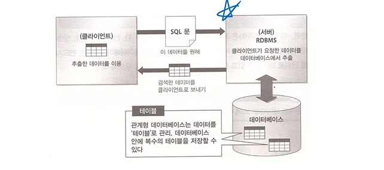

### 테이블

- 테이블
  - 행과 열의 2차원 구조를 가진 데이터 저장 객체(Object)
  - 관계형 데이터 테이블의 기본 단위
  - 동의어: 릴레이션
- 칼럼/열(Column)
  - 테이블에서 세로 방향으로 이루어진 개별 속성
  - 더 이상 나눌 수 없음
  - 동의어: 속성, 필드
  - 도메인: 컬럼이 가질수 있는 값들의 집합
- 로우/행(Row)
  - 테이블에서 가로 방향으로 이루어진 데이터
  - 실무에서 레코드라고 많이 표현
  - 동의어: 튜플, 레코드, 인스턴스

### Relation Model Constraints

#### 도메인 제약(Domain Constaints)

- 속성에 대한 제약
- 속성 값은 원자성을 가지며, 도메인에서 정의된 값이어야 한다
- Composite Attribute, Multivalued Attribute는 허용되지 않음
- Null 값은 허용됨(NN이 아닌 경우)
- 위반 예시(나이[도메인에서 정의되지 않은 값], 취미[여러 속성은 허용되지 않는다])

| 학번 | 이름   | 나이 | 차량번호  | 취미             |
| ---- | ------ | ---- | --------- | ---------------- |
| 1234 | 홍길동 | 21   | 017가1234 | 체조             |
| 5678 | 강강찬 | 고려 | (Null)    | 축구, 농구, 배구 |

#### 키 제약(Key Constraints)

- 릴레이션의 모든 튜플은 서로 식별 가능해야한다
- 인조 식별자를 만들어내는 방식으로 해결할 수 있다
- 다음 두 테이블 중 위 테이블은 키 제약을 위반하고 있다(튜플끼리 식별 불가능, 아래 테이블은 주민번호로 식별 가능)

| 이름   | 나이 | 혈액형 | 전공       |
| ------ | ---- | ------ | ---------- |
| 홍길동 | 21   | A      | 경영정보   |
| 강강찬 | 22   | O      | 정보시스템 |

| 이름   | 나이 | 학번 | 주민번호 |
| ------ | ---- | ---- | -------- |
| 홍길동 | 21   | 1234 | 111-2222 |
| 강강찬 | 22   | 5678 | 333-4444 |

- key의 종류
  - 2번 테이블의 경우 Candidate key(후보키)를 갖는다(학번, 주민번호)
  - 대표성을 갖는 것을 설계자가 선택한 것을 Primary key라고 한다(학번, 주민번호 중 선택한 것 한가지)
  - (나이, 학번) 으로도 식별이 가능하고, 이를 Super key라고 한다(최소성을 만족시키지 못하는 키, 후보키+@)
  - Superkey -(최소성)-> Candidate key -(대표성)-> Primary key

#### 개체 무결성 제약(Entity Integrity Constraints)

- 기본키(PK)에 대한 제약
  - PK는 Unique이며 NN이어야 한다

#### 참조 무결성 제약(Referential Integrity Constaints)

- 외래키(FK)에 대한 제약
- FK(foreign key)란?
  - 릴레이션 R1이 릴레이션 R2를 참조하는 경우, R2의 기본키는 R1의 외래키로 사용됨
  - FK는 자기 자신이 속한 릴레이션을 참조할 수 있다(학번- 멘토)
- 릴레이션 R1이 릴레이션 R2를 참조하는 경우 R1의 FK는
  - Null
  - Null이 아닌 경우 R2에 실제 존재하는 값으로 구성되어야 함

| 학번 | 이름   | 나이 | 소속   | 멘토 |
| ---- | ------ | ---- | ------ | ---- |
| 1234 | 홍길동 | 21   | MIS    |      |
| 2345 | 강강찬 | 22   | MIS    | 1234 |
| 3456 | 김유신 | 23   | (빈칸) | 5678 |
| 4567 | 유관순 | 22   | 자동차 | 2345 |

| 학과명 | 정원 | 위치   |
| ------ | ---- | ------ |
| MIS    | 100  | 경상관 |
| 경영   | 200  | 경상관 |
| 컴공   | 100  | 공학관 |
| 수학   | 50   | 자연관 |

- 해당 예제에서는 소속[자동차]는 존재하지 않는다
- 해당 예제에서 김유신의 멘토 5678은 존재하지 않는다

### Constraint Violations 예제

> 직원

| 이름   | 주민번호 | 감독자주민번호 | 부서번호 |
| ------ | -------- | -------------- | -------- |
| 강강찬 | 111      | 222            | 5        |
| 김유신 | 222      | 888            | 5        |
| 이성계 | 333      | 444            | 4        |
| 이순신 | 444      | 888            | 4        |
| 정몽주 | 555      | 222            | 5        |
| 최무선 | 666      | 222            | 5        |
| 최지원 | 777      | 444            | 4        |
| 홍길동 | 888      | NULL           | 1        |

> 부서

| 부서명 | 부서번호 | 관리자주민번호 |
| ------ | -------- | -------------- |
| 개발팀 | 5        | 222            |
| 인사팀 | 4        | 444            |
| 기획팀 | 1        | 666            |

- 새 직원 ('유관순', '555', Null, 4) 삽입
  - 개체 무결성 제약 위배(PK Unique 위반)
- 새 직원 ('이방원', '123', '456', 5) 삽입
  - 참조 무결성 제약 위배('456'을 먼저 넣던지 해야함)
- SSN='666'인 직원 삭제
  - 참조 무결성 제약 위배(부서의 관리자 주민번호가 문제가 된다, Option으로 관리 가능하다)

### 이상 현상 (Anomaly)

> DB 설계를 잘못해서 생기는 문제 

> 과목코드, 학번이 PK로 사용되는 상태

| 과목코드 | 과목명 | 학번 | 이름   | 연락처        |
| -------- | ------ | ---- | ------ | ------------- |
| C01      | DB개론 | 1101 | 홍길동 | 010-1111-2222 |
| C02      | DB실무 | 1101 | 홍길동 | 010-1111-2222 |
| A01      | 마이닝 | 1102 | 강강찬 | 010-2222-3333 |
| B01      | 통계   | 1101 | 홍길동 | 010-1111-2222 |
| C01      | DB개론 | 1103 | 김유신 | 010-3333-4444 |

- 삭제 이상
  - '1102' 학생이 'A01'을 수강한 기록을 삭제할 때
    - A01이라는 과목에 대한 정보가 사라진다(억지임)
    - 1102가 강감찬이라는 정보가 사라진다
      - 아래 행동에서 삭제이상이 발생한다
- 삽입 이상
  - (1104, 유관순, 010-4444-5555)를 추가하고자 할 때
    - (과목코드, 학번)이 복합 PK이기에, PK가 없어서 삽입이상이 발생한다
- 갱신 이상
  - '1101' 학생의 연락처가 변경된 경우
    - 하나의 레코드가 아닌 여러개가 바뀌어야하는 갱신 이상이 발생한다

## 정규화와 성능

- 목적: 삽입/삭제/갱신 이상현상 방지
- 함수적 종속성(FD, Functional Dependency)에 기반
- 종류
  - 1NF(Normal form): 모든 값이 원자값을 가짐
  - 2NF: 부분 함수 종속 제거
  - 3NF: 이행함수 종속 제거
    - 식별자가 아닌 속성(주식별자의 일부 또는 일반속성)이 결정자 역할을 하는 함수 종속 제거-> 3NF
  - 1차 정규화 => 제1 정규형 => 2차 정규화 => 제2차 정규형
    - 정규화의 결과 = 정규형
- 효과
  - 데이터 중복 감소 -> 성능 향상
  - 데이터가 관심사별로 묶임 -> 성능 향상
  - 조회 질의에서 조인이 많이 발생 -> 성능 저하
  - 정규화를 통해 일반적으로 성능이 향상되나, 조회의 경우 처리 조건에 따라 성능이 향상되거나 저하됨(조인연산에서 지연 될 가능성이 있다)
    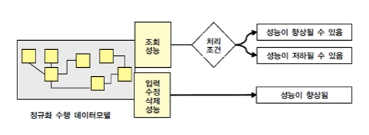

### 함수

- 함수의 정의: 어떤 값 하나를 넣었을 때, 대응 되는 값이 단 하나가 존재해야 함수이다
  - x값 한개에 y값이 한개가 있어야 한다
- 예시
  - 학번과 혈액형
    - 혈액형은 학번을 함수적으로 결정하지 못한다(O)
    - 학번은 혈액형에게 함수적으로 종속되어 있지 않다(O)
    - 혈액형은 학번을 함수적으로 결정할 수 있다(X)
    - 학번은 혈액형에게 함수적으로 종속되어 있다(X)
- 함수적 종속
  - A → B
    - A의 값이 정해지면, 항상 유일하게 B의 값이 결정된다는 뜻이다.
    - 즉, A가 결정자(determinant)이고, B는 종속자(dependent)이다.

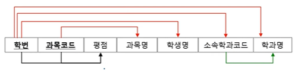

- 2NF: 부분 함수 종속 제거(빨간,파랑색 제거)

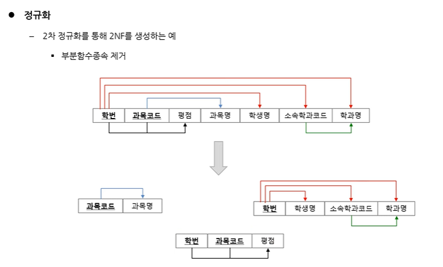

- 3NF: 이행 함수 종속 제거(초록색 제거)
  - 접근 가능한 곳에 대한 연결을 제거
  - 식별자가 아닌 속성(주식별자의 일부 또는 일반속성)이 결정자 역할을 하는 함수 종속 제거-> 3NF

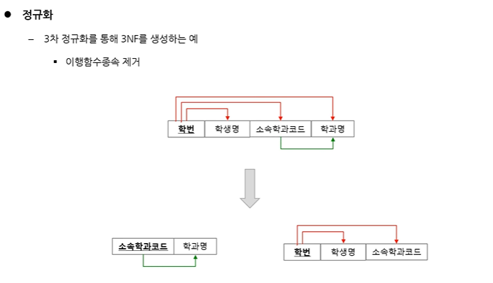

### 정규화를 통한 성능 개선의 예

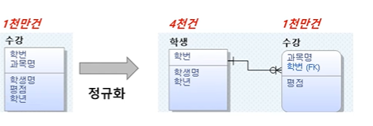

- 특정 학생의 학년 변경시
  - 정규화 전: 해당 학생이 수강 테이블에서 나타나는 수만큼 변경
  - 정규화 후: 해당 학생의 학년 한 건만 변경
- 3학년 학생의 학번, 이름 조회시
  - 정규화 전: 수강 이력이 누적된 수만큼 인스턴스 조회
  - 정규화 후: 학생 수만큼 인스턴스 조회(성능 향상)
- 학번, 학생명, 과목명, 평점 조회시
  - 정규화 전: 하나의 테이블에서 모두 조회
  - 정규화 후: 조인 필요(약간의 성능 저하)

## 반정규화와 성능

- 정규화의 반대 개념
  - 정규화를 수행하지 않는 것은 비정규화이다
  - 정규화 후, 성능 문제로 다시 돌아오는 것이 반정규화
- 정규화된 엔터티, 속성, 관계에 대해 성능 향상을 목적으로 중복, 통합, 분리를 수행하는 데이터 모델링 기법
- 정규화 된 데이터 모델을 성능 향상을 위해 테이블/컬럼/관계를 중복시키고 조회 성능 향상을 노려서 수행

### 특징

- 테이블, 컬럼, 관계의 반정규화를 종합적으로 고려해야함
  - 일반적으로 속성(컬럼)의 중복을 시도함
- 과도한 반정규화-> 데이터 무결성을 침해하게 됨

### 반정규화의 사전 절차

1. 반정규화 대상 조사

- 범위 처리 빈도수 조사
- 대량의 범위 처리 조사
- 통계성 프로세스 조사
- 테이블 조인 개수 조사

2. 다른 방법유도 검토

- VIEW 테이블
  - 뷰 자체가 성능 향상을 가져오지 않음, 신중하게 설계된 뷰를 재사용할때 성능 향상(잘 만들어야함)
- 클러스터링 적용
  - 자주 사용되는 테이블의 데이터를 디스크의 같은 블록에 저장
- 인덱스의 조정
  - 인덱스 추가, 삭제 및 순서 조정
- 응용 어플리케이션
  - 데이터 처리를 위한 로직 변경

3. 반정규화 적용

- 테이블 반정규화
- 속성의 반정규화
- 관계의 반정규화

### 반 정규화 기법

#### 컬럼 반 정규화

- 중복 컬럼 추가
  - 조인 횟수를 감소시키기 위해, 다른 테이블의 컬럼을 중복으로 저장함
    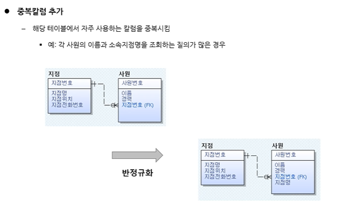
  - 3정규형에서 2정규형으로 반정규화
- 파생 컬럼 추가

  - 값의 계산으로 인한 시간 지연을 줄이기 위해, 예상되는 값을 미리 계산하여 중복으로 저장함
  - 컬럼에 의한 파생

    - 질의가 예상되는 값을 미리 계산하여 저장함
      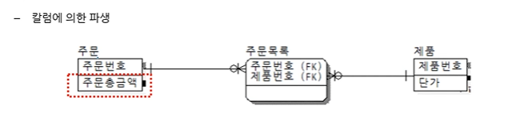
    - 주문 목록은 연관 엔터티이다

  - 로우에 의한 파생
    - 특정 로우가 변경되면 모든 로우값 다시 계산 -> 가급적 사용하지 않아야함

- 이력테이블컬럼 추가
  - 대량 이력 데이터 처리의 성능 향상을 위해 종료 여부, 최근값 여부 등의 컬럼을 추가로 저장함
    - ex) 직원이 가장 최근 등록한 차량을 조회하는 경우(차 번호는 한개만 등록할 수 있을때의 예시)
      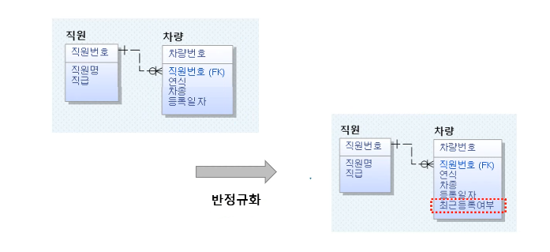
- PK의 의미적 분리를 위한 컬럼 추가
  - PK가 복합의미를 갖는 경우 구성 요소 값의 조회 성능 향상을 위해 일반 속성을 추가함
    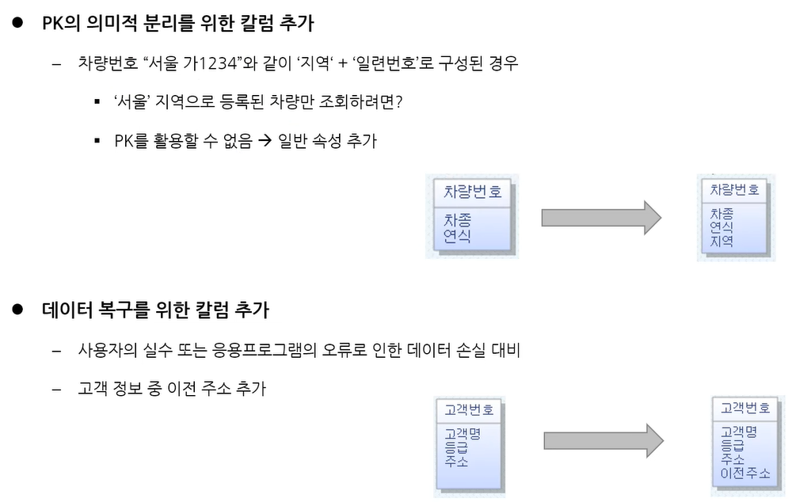
- 데이터 복구를 위한 컬럼 추가
  - 사용자의 실수 또는 응용프로그램 오류로 인해 데이터가 잘못 처리된 경우, 원래 값으로의 복구를 위해 이전 데이터를 임시적으로 중복저장
  - recovery용

#### 테이블 반정규화

> 테이블 병합, 테이블 분할, 테이블 추가

| 분류        | 기법               | 내용                                                                                                                                  |
| ----------- | ------------------ | ------------------------------------------------------------------------------------------------------------------------------------- |
| 테이블 병합 | 관계 병합          | 1:1 또는 1:M 관계를 병합함 (두 테이블의 동시 조회가 많은 경우)                                                                        |
|             | 슈퍼/서브타입 병합 | 슈퍼/서브타입 관계를 병합함 (one to one type → single type / plus type)                                                            |
| 테이블 분할 | 수직 분할          | 디스크 I/O의 분산을 위해 테이블을 **칼럼(Column)** 단위로 분리함                                                                      |
|             | 수평 분할          | 디스크 I/O의 분산을 위해 테이블을 **로우(Row)** 단위로 분리함                                                                         |
| 테이블 추가 | 중복 테이블 추가   | 원격 조인(다른 업무 또는 다른 서버 간 조인)을 제거하기 위해 동일한 테이블 구조를 중복시킴 (분산 DB 참고)                              |
|             | 통계 테이블 추가   | SUM, AVG 등의 통계값을 미리 계산하여 저장 (분산 DB 참고)                                                                              |
|             | 이력 테이블 추가   | 이력 테이블 중 일부 레코드를 마스터 테이블에서 중복 관리                                                                              |
|             | 부분 테이블 추가   | 하나의 테이블에서 집중적으로 이용되는 칼럼들만 추출하여 별도 테이블로 생성 (수직 분할과 유사하나, 원본 테이블을 유지하면서 추가함) |

- 테이블 병합

  - 관계 병합

    - 두 테이블의 동시 조회가 많은 경우

    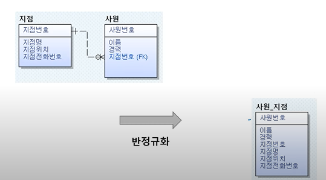

    - 3정규형에서 2정규형이 됨

  - 슈퍼/서브타입 병합
    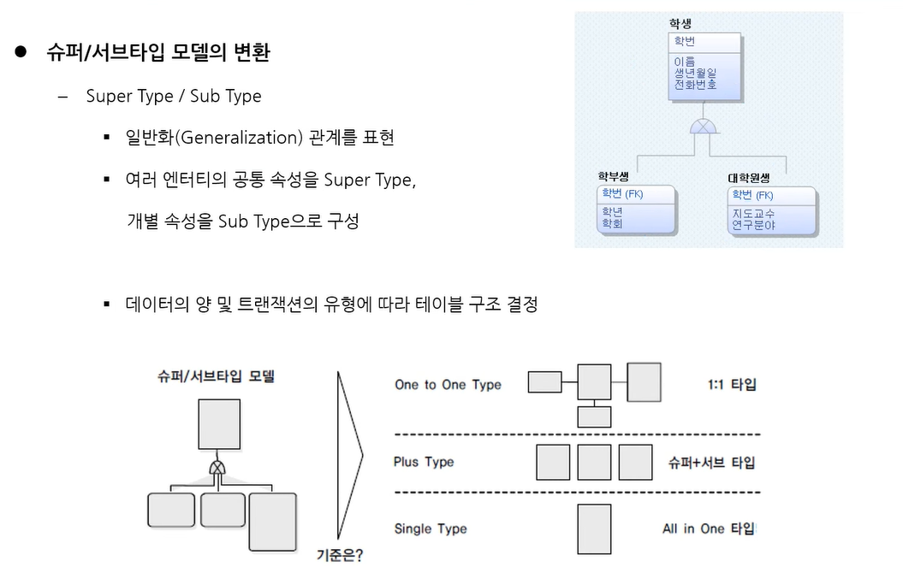

- 테이블 분할
  - 데이터 모델링 수행
  - 데이터 베이스 용량 산정
  - 대량 데이터가 처리되는 테이블에 대해 트랜잭션 처리 패턴 분석
  - 트랜잭션 컬럼 단위로 집중되는 경우 수직 분할, 로우 단위로 집중되는 경우 수평 분할 수행
  - 테이블 수평 분할
    - 테이블이 많은 데이터를 가질 것으로 예상되는 경우 -> Partitioning
      - Range Partition: 범위로 분할(고객번호 1~1000, 1001~2000 ..)
      - List Partition: 값으로 분할(지역: 서울, 대구, 부산 등)
      - Hash Partition: 해쉬 함수로 분할
        - 임의의 길이의 데이터를 짧은 길이의 데이터로 매핑하는 함수
        - ex) 123456 -(hash함수 사용)-> 16, 첫글자와 끝글자를 사용, 다양한 방법이 있다
- 테이블 추가
  - 이력테이블 추가
    - 공급자 번호 1001~1005의 최근 전화번호, 메일주소, 위치 조회
    - 가장 최근값을 중복으로 기록한 테이블 생성(이력테이블은 별도테이블에 저장하고, 하나의 테이블에 가장 최신 정보를 저장한다)
  - 부분테이블 추가
    - 집중적으로 자주 사용되는 특정 속성들을 추출하여 별도 테이블 구성(ex 차량 번호에 대한 차량사진 조회 질의가 많은 경우)
    - 테이블 수직 분할과 유사하지만 원본 테이블이 그대로 유지됨
    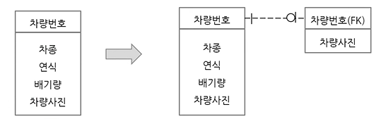

#### 관계 반정규화

- 중복 관계 추가
  - 조인을 통해 정보 조회가 가능하지만, 조인 경로 단축을 위해 중복관계를 추가함
  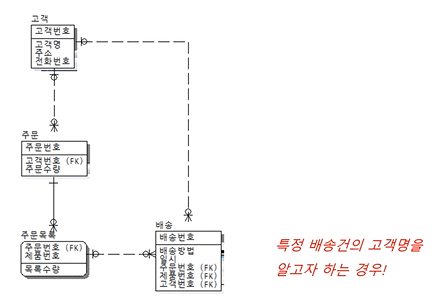

## 인덱스

- `select * from student where id>3000 and id < 5000`;
  - full data scan
- db에서 레코드들이 저장된 순서는 랜덤이라고 가정한다
  - 그래서 인덱스가 필요하다

### 인덱스란?

- 검색 속도의 향상을 위한 기술
  - 실제 테이블을 full sacne하지 않고 인덱스 테이블을 검색
- 지나치게 많은 인덱스 생성시 시간 및 공간 낭비
- 인덱스된 필드 업데이트시 시간 증가
- 자동생성(PK 또는 Unique 조건에 모두 생성됨) / 수동 생성(Create Index 구문)
- 자료구조를 이용해서 빠른 검색을 한다(B+ tree, gt/lt 검색에 강하다)
- 인덱스 테이블을 관리하는 것이 시간/공간 낭비가 된다
  - 이런 낭비를 해도, 더 빨라질때 인덱스를 사용한다

### 인덱스 스캔 구조

- PK인덱스는 PK의 손성 순서대로 인덱스가 정렬된다
  - 생성시 (주문 번호, 주문 일자, 주문 목록 코드)로 생성하면 생성 순서의 인덱스가 자동생성된다
    - 목표 쿼리에 따라서 인덱스의 **순서도 중요하다
  - `select 주문단가 from 주문목록 where 주문번호='1002'`
    - 주문 번호를 조건으로 검색하면 인덱스를 일부만 스캔한다
  - `select 주문단가 from 주문목록 where 주문일자= '2008.1.1'`
    - 하지만 주문 일자로 검색하게 되면 인덱스 풀 스캔을 해야한다

### 인덱스를 고려한 PK 순서 설정

- `select count(수험번호) from 입시 where 년도='2008'`
  - PK(수험번호, 년도) 
    - Full Table Scan
  - PK(년도, 수험번호)
    - Index Scan

### FK 인덱스 설정을 통한 성능 향상

> 수동으로 인덱스를 생성할때 가장 먼저 생각해야 하는 곳이 FK이다

- ex) 고객 번호가 '1234'인 고객의 대여기록 조회
  - 고객 테이블에 4천건, 대여테이블에 1000만건이 존재하는 경우

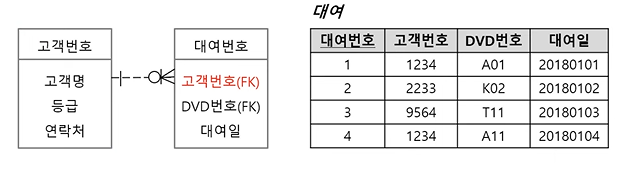

- 대여 테이블의 고객번호에 인덱스를 설정함으로써 성능 향상 가능