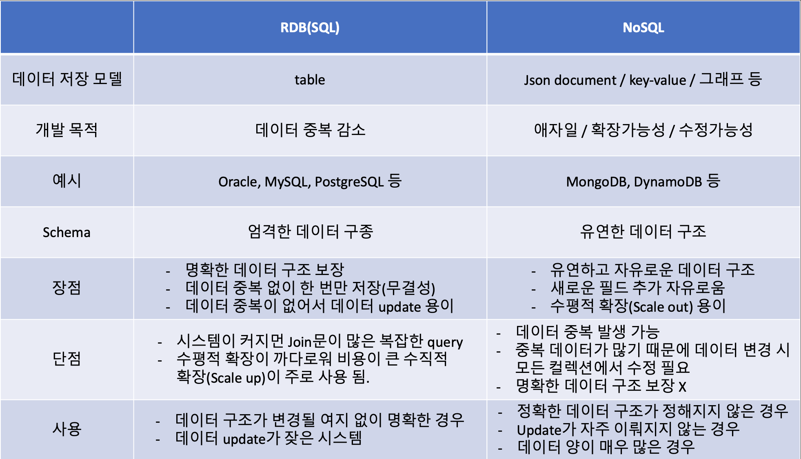

# SQL vs NoSQL

> SQL이란 데이터를 쿼리하고 관리하는 데 사용되는 도메인 고유의 언어이다. 사용자가 관계형 데이터베이스에서 레코드를 쿼리, 삽입, 삭제 및 업데이트할 수 있도록 하는 방식으로 작동한다. 또한 SQL을 사용하면 트랜잭션과 저장 함수 또는 뷰와 같은 내장 프로시저를 사용하여 복잡한 로직을 적용할 수 있다.

> NoSQL이란 Not only SQL의 약자이다. 문서, 그래프 데이터베이스, 키-값 저장소와 같은 비관계형 데이터 구조를 사용하여 데이터를 저장하고 검색하는 데이터베이스의 한 유형이다. NoSQL 시스템은 기존의 관계형 데이터베이스보다 유연하게 설계되어 사용량이나 부하 변화에 따라 쉽게 확장 또는 축소할 수 있다.

## 차이점

### 데이터 저장(Storage)
- SQL : 관계형 데이터베이스로 SQL 언어를 이용해서 데이터를 테이블에 저장한다. 미리 작성된 스키마를 기반으로 정해진 형식에 맞게 데이터를 저장해야 한다.
 
- NoSQL : key-value, document, wide-column, graph 등의 방식으로 데이터를 저장한다.
 
### 스키마(Schema)
- SQL : SQL을 사용하려면 고정된 형식의 스키마가 필요하다. 처리하려는 데이터 속성별로 열(column)에 대한 정보를 미리 정해야 한다. 스키마는 나중에 변경할 수 있지만, 데이터베이스 전체를 수정하거나 오프라인으로 전환해야 할 수도 있다.
 
- NoSQL : 관계형 데이터베이스에 비해 동적으로 스키마의 형태를 관리할 수 있다. 행을 추가할 때 즉시 새로운 열을 추가할 수 있고, 개별 속성에 대해서 모든 열에 대한 데이터를 반드시 입력하지 않아도 된다.
 
### 쿼리(Query)
- SQL : 관계형 데이터베이스는 테이블의 형식과 테이블 간의 관계에 맞춰 데이터를 요청해야 한다. SQL 언어와 같이 구조화된 쿼리 언어를 사용하는 이유이기도 하다.
 
- NoSQL : 비관계형 데이터베이스의 쿼리는 데이터 그룹 자체를 조회하는 것에 초점을 두고 있다. 따라서 구조화되지 않은 쿼리 언어로도 데이터 요청이 가능하다. 이를 UnQL이라고도 한다.
 
### 확장성(Scalability)
- SQL : SQL 기반의 관계형 데이터베이스는 수직적으로 확장한다. 이를 높은 메모리, CPU를 사용하는 확장이라고도 한다. 데이터베이스가 구축된 하드웨어의 성능을 많이 이용하기 때문에 비용이 많이 든다. 여러 개의 서버에 걸쳐서 데이터베이스의 관계를 정의할 수 있지만, 매우 복잡하고 시간이 많이 소모된다.
 
- NoSQL : NoSQL로 구성된 데이터베이스는 수평적으로 확장한다. 보다 저렴한 비용으로 서버를 증설할 수 있으며, 클라우드 서비스를 이용하는 확장이라고도 한다. NoSQL 데이터베이스를 위한 서버를 추가적으로 구축하면, 많은 트래픽을 보다 편리하게 처리할 수 있다. 저렴한 범용 하드웨어나 클라우드 기반의 인스턴스에 NoSQL 데이터베이스를 호스팅 할 수 있어 상대적으로 비용이 저렴하다.

## 그래서 뭘 써야함?

### SQL과 NoSQL 중에서 어떤 것을 사용해야 할까?
데이터베이스를 구축하는 방법에 완벽한 솔루션은 없다. 
따라서 사용자의 요구를 충족하기 위해 관계형, 비관계형 데이터베이스를 모두 사용하여 서비스에 맞게 설계하고 있다. 
 NoSQL 기반의 비관계형 데이터베이스가 확장성이나 속도면에서 더 뛰어나지만, 고차원적으로 구조화된 SQL 기반의 데이터베이스가 더 좋은 성능을 보여주는 서비스도 있다. 
따라서 여러 사용 사례를 살펴보고 적절한 데이터베이스를 사용하는 것이 중요하다.
 
### SQL 기반의 관계형 데이터베이스를 사용하는 케이스
#### 데이터베이스의 ACID 성질을 준수해야 하는 경우
ACID는 Atomicity(원자성), Consistency(일관성), Isolation(격리성), Durability(지속성)을 의미한다.
데이터베이스에서 트랜잭션이 실행되는 과정에서 안정성을 보장하기 위해 필요한 성질이다. 
SQL을 사용하면 데이터베이스와 상호 작용하는 방식을 정확하게 규정할 수 있기 때문에, 데이터베이스에서 데이터를 처리할 때 발생할 수 있는 예외적인 상황을 줄이고, 데이터베이스의 무결성을 보호할 수 있다. 
전자 상거래, 금융 서비스 등의 소프트웨어 개발에서는 반드시 데이터베이스의 ACID 성질을 준수해야 한다. 이러한 경우 일반적으로 SQL을 이용한 관계형 데이터베이스를 사용한다.
 
#### 소프트웨어에 사용되는 데이터가 구조적이고 일관적인 경우
소프트웨어(프로젝트)의 규모가 많은 서버를 필요로 하지 않고, 일관된 데이터를 사용하는 경우 관계형 데이터베이스를 사용하는 사례가 많다. 
다양한 데이터 유형과 높은 트래픽을 지원하도록 설계된 NoSQL 데이터베이스를 사용해야만 하는 이유가 없기 때문이다. 

### NoSQL 기반의 비관계형 데이터베이스를 사용하는 케이스
#### 데이터의 구조가 거의 없거나 전혀 없는 대용량의 데이터를 저장하는 경우
대부분의 NoSQL 데이터베이스는 저장할 수 있는 데이터의 유형에 제한이 없다. 필요에 따라 언제든지 데이터의 새 유형을 추가할 수 있으며 소프트웨어 개발에 정형화되지 않은 많은 양의 데이터가 필요할 경우 NoSQL을 적용하는 것이 효율적일 수 있다.
 
#### 클라우드 컴퓨팅 및 저장공간을 최대한 활용하는 경우
클라우드 기반으로 데이터베이스를 구축하면 저렴한 비용으로 솔루션을 제공받을 수 있다. 소프트웨어에 데이터베이스의 확장성이 중요하다면 NoSQL 데이터베이스를 사용하는 것이 좋다.
 
#### 빠르게 서비스를 구축하는 과정에서 데이터 구조를 자주 수정하는 경우
NoSQL 데이터베이스의 경우 스키마를 미리 준비할 필요가 없기 때문에 빠르게 개발하는 과정에 매우 유리하다. 따라서 시장에 프로토타입을 빨리 출시해야 하는 경우에 NoSQL이 적합하다. 
또한, 소프트웨어 버전 별로 많은 다운타임 없이 데이터 구조를 자주 업데이트해야 하는 경우, 스키마를 매번 수정해야 하는 관계형 데이터베이스보다 NoSQL 기반의 비관계형 데이터베이스를 사용하는 게 적합하다.
    