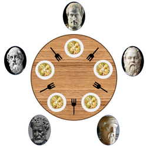

# Transaction 

> 트랜잭션(Transaction)은 데이터베이스에서 하나의 작업 단위를 의미하며, 데이터베이스의 일관성과 무결성을 유지하는 데 중요한 역할을 한다. 트랜잭션은 여러 데이터 조작 작업(예: INSERT, UPDATE, DELETE)을 포함할 수 있으며, 이러한 작업들은 모두 성공적으로 완료되거나, 실패할 경우 모두 롤백(취소)되어야 한다.

> 하나의 트랜잭션이 여러 작업을 포함할 수 있다. 예를 들어, 은행 이체와 같은 작업을 생각해보자. 이 경우, 하나의 트랜잭션 안에 여러 데이터베이스 작업이 포함될 수 있다

## 트랜잭션 중 생길 수 있는 문제와 해결방법

### 데드락 (Deadlock)

> 데드락은 두 개 이상의 트랜잭션이 서로의 자원을 기다리면서 무한 대기 상태에 빠지는 상황이다. 이로 인해 어떤 트랜잭션도 진행되지 않게 된다.

#### 예시 - 식사하는 철학자 문제

> 데드락 발생 예시로 많이 언급되는 식사하는 철학자 문제

> 식사하는 철학자 문제에서는 식사를 하는게 목적이며, 아래와 같은 과정을 거쳐서 식사를 하게 된다.

> 왼쪽 포크를 사용할 수 있을 때까지 대기하며, 사용 가능해질 시 왼쪽 포크를 집어든다.
오른쪽 포크를 사용할 수 있을 때까지 대기하며, 사용 가능해질 시 오른쪽 포크를 집어든다.
양쪽 포크를 모두 잡으면 일정 시간 식사를 한다.
오른쪽 포크를 내려놓는다
왼쪽 포크를 내려놓는다.

이때 모두가 동시에 왼쪽 포크를 잡는다면 누구도 오른쪽 포크를 잡지 못하는 상황이라 아무도 식사를 할 수 없다. 이것이 바로 데드락 상황이다. 
1. 상호 배제

식사하는 철학자 문제에서 포크는 다른 사람과 같이 사용할 수 없는 배타적인 자원이다. 데드락은 배타적인 자원을 여러 프로세스가 사용하려 할 때 발생한다고 했다. 이처럼 포크를 여러 명이 사용하려다 보니 데드락 조건 하나가 만족된 것이다.

2. 비선점

철학자들이 서로 포크를 빼앗을 수 있다면 데드락이 발생하지 않았을 것이다. 비선점 요소 역시 데드락이 걸릴 조건 중 하나가 됨을 알 수 있다.

3. 점유와 대기

 모두가 포크를 한 개 든 상황은 자신이 든 포크를 점유하고 남이 놓기만을 대기하는 상황, 즉 서로의 식사를 방해하는 상황이다. 이런 상황이 충족되어야 데드락의 조건 중 하나가 만족된다. 

4. 원형 대기

식사하는 철학자들은 둥근 식탁에서 식사를 한다. 서로서로가 자신의 오른쪽 사람이 포크를 놓기를 기다리며, 그 끝을 따라가다 보면 자신의 왼쪽 포크를 놓기를 원하는 사람이 존재하게 되는 것이다. 이러한 원형 대기 상황이 데드락을 유발한다.

#### 해결 방법
- 자원 할당 순서 설정: 모든 트랜잭션이 자원을 요청할 때 일정한 순서를 정해 데드락을 예방할 수 있다.
- 타임아웃 설정: 특정 시간 내에 자원을 획득하지 못하면 트랜잭션을 중단하고 롤백하도록 설정한다.
- 데드락 탐지: 주기적으로 시스템을 검사하여 데드락을 탐지하고, 한 트랜잭션을 롤백하여 다른 트랜잭션이 진행될 수 있도록 한다.

### 경합 상태 (Race Condition)

> 경합 상태는 두 개 이상의 트랜잭션이 동시에 실행될 때 데이터의 일관성이 깨지는 상황이다. 트랜잭션 간의 순서에 따라 결과가 달라질 수 있다.

#### 예시
 트랜잭션 A가 게시글 A의 조회 수를 1 증가시키고, 트랜잭션 B도 동시에 같은 게시글 A의 조회 수를 증가시키려 한다.  두 트랜잭션이 서로 다른 시간에 조회 수를 읽고 수정하게 되면, 최종적으로 게시글 A의 조회 수가 정확하지 않게 업데이트될 수 있다.

#### 해결 방법
- 트랜잭션 격리 수준 설정: 트랜잭션의 격리 수준을 조정하여 데이터 일관성을 유지한다. 예를 들어, Serializable 격리 수준을 사용하여 경합 상태를 방지할 수 있다.

> Serializable (직렬화 가능): 트랜잭션이 순차적으로 실행되는 것처럼 동작한다. 
> 장점: 데이터의 일관성을 가장 잘 유지할 수 있다. 
> 단점: 성능 저하가 크고, 데드락이 발생할 수 있다.

### 잃어버린 갱신 (Lost Update)
> 잃어버린 갱신은 두 개 이상의 트랜잭션이 동일한 데이터를 수정할 때, 나중에 수행된 트랜잭션의 변경 사항이 이전 트랜잭션의 변경 사항을 덮어쓰는 상황이다.

#### 예시
트랜잭션 A가 게시글 A의 내용을 수정한 후 데이터베이스에 저장한다.
동시에 트랜잭션 B도 게시글 A의 내용을 수정한 후 데이터베이스에 저장한다.
트랜잭션 B의 작업이 완료되면 트랜잭션 A의 작업이 사라지게 되고, 게시글 A는 트랜잭션 B의 내용만 남게 된다.

#### 해결 방법
- Optimistic Concurrency Control: 트랜잭션이 커밋할 때 다른 트랜잭션이 해당 데이터를 수정했는지 확인하고, 수정이 있었다면 롤백한다.
-  행 잠금: 데이터베이스에서 각 데이터 행을 잠금으로 처리하여 동시 업데이트를 방지한다.

### 불완전한 조회 (Inconsistent Read)

> 불완전한 조회는 한 트랜잭션이 데이터를 읽는 동안 다른 트랜잭션이 해당 데이터를 수정하여 읽은 결과가 일관성 없게 되는 상황이다.

#### 예시
트랜잭션 A가 게시글 B의 내용을 읽으려 할 때, 트랜잭션 B가 게시글 B를 삭제하거나 수정하고 있다.
결과적으로 트랜잭션 A가 읽은 게시글 B의 내용은 올바르지 않거나, 존재하지 않는 상태가 될 수 있다.

#### 해결 방법
- 트랜잭션 격리 수준 설정: READ COMMITTED 또는 REPEATABLE READ와 같은 격리 수준을 사용하여 불완전한 조회를 방지한다.
- 읽기 전용 트랜잭션 사용: 트랜잭션이 데이터를 읽는 동안 다른 트랜잭션이 데이터를 수정하지 못하도록 잠금을 사용한다.
### 복구 실패 (Recovery Failure)

> 복구 실패는 시스템 오류 발생 시 트랜잭션이 정상적으로 롤백되지 않거나, 데이터베이스가 일관성을 잃고 복구되지 않는 상황이다.

#### 예시
트랜잭션 A가 게시글 A를 수정하고 있는 도중 시스템이 크래시된다.
이때, 트랜잭션 A의 변경 사항이 데이터베이스에 저장되지 않거나, 데이터베이스가 이전 상태로 복구되지 않는 경우, 데이터의 무결성이 깨질 수 있다.
#### 해결 방법
- 로그 기반 복구 시스템: 트랜잭션의 모든 변경 사항을 로그에 기록하여 시스템이 크래시된 경우 로그를 사용하여 데이터를 복구할 수 있도록 한다.
- 정기적인 백업: 데이터베이스의 정기적인 백업을 통해 복구 가능성을 높인다.