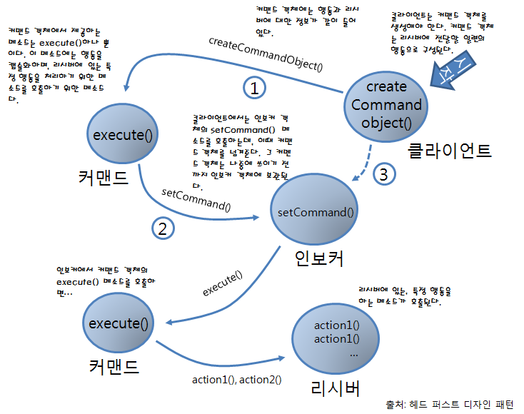
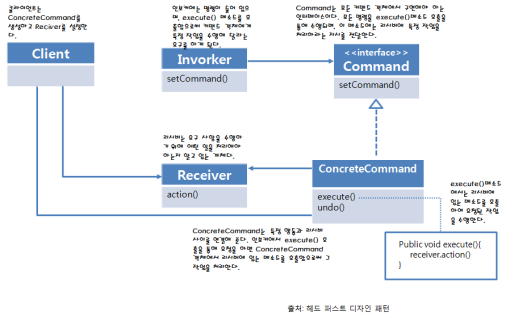

# 커맨드 패턴 (Command Pattern)

> 요청을 객체로 캡슐화하여 요청을 매개변수화하고, 요청을 큐에 저장하거나 로깅하고 실행을 지연시킨다.




## 사용하는 이유

> 요청을 객체로 캡슐화하여, 요청의 실행을 큐에 저장하거나 실행 취소 기능을 쉽게 구현할 수 있다.

> 클라이언트가 요청을 보낼 때, 어떤 작업이 수행될지 미리 알 필요 없이 유연하게 요청을 처리할 수 있다.

## 사용 예시(데이터베이스 트랜잭션 관리)

> 고객이 은행 계좌에서 금액을 인출하거나 입금하는 작업을 각각 커맨드 패턴으로 구현하고, 이를 취소할 수 있는 기능을 제공한다.


### Command 인터페이스 정의
```java

// Command 인터페이스 정의
public interface TransactionCommand {
    void execute(); // 트랜잭션 수행
    void undo();    // 트랜잭션 취소
}

```

### Command 구현 클래스 작성

> WithdrawCommand와 DepositCommand라는 구체적인 명령 클래스를 통해 인출 및 입금 기능을 구현한다.

```java

public class WithdrawCommand implements TransactionCommand {
    private BankAccount account;
    private double amount;

    public WithdrawCommand(BankAccount account, double amount) {
        this.account = account;
        this.amount = amount;
    }

    @Override
    public void execute() {
        account.withdraw(amount); // 계좌에서 금액 인출
    }

    @Override
    public void undo() {
        account.deposit(amount); // 인출 취소를 위해 동일 금액 입금
    }
}

public class DepositCommand implements TransactionCommand {
    private BankAccount account;
    private double amount;

    public DepositCommand(BankAccount account, double amount) {
        this.account = account;
        this.amount = amount;
    }

    @Override
    public void execute() {
        account.deposit(amount); // 계좌에 금액 입금
    }

    @Override
    public void undo() {
        account.withdraw(amount); // 입금 취소를 위해 동일 금액 인출
    }
}

```

### Invoker 역할 클래스 정의
> TransactionManager는 각각의 트랜잭션 명령을 실행하고 취소할 수 있도록 명령을 기록한다.

```java

import java.util.Stack;

public class TransactionManager {
    private Stack<TransactionCommand> history = new Stack<>();

    public void executeCommand(TransactionCommand command) {
        command.execute();
        history.push(command); // 트랜잭션 기록을 스택에 저장
    }

    public void undo() {
        if (!history.isEmpty()) {
            TransactionCommand command = history.pop();
            command.undo(); // 최근 트랜잭션 취소
        }
    }
}

```

### BankAccount 클래스와 Controller 설정

> 은행 계좌를 관리하는 BankAccount 클래스에서는 인출과 입금 작업을 담당한다.

```java
public class BankAccount {
    private double balance = 0.0;

    public void deposit(double amount) {
        balance += amount;
        System.out.println("Deposited: " + amount + ", New Balance: " + balance);
    }

    public void withdraw(double amount) {
        if (balance >= amount) {
            balance -= amount;
            System.out.println("Withdrew: " + amount + ", New Balance: " + balance);
        } else {
            System.out.println("Insufficient funds for withdrawal.");
        }
    }
}

```

### Controller에서 커맨드 패턴 사용하기

> 웹 애플리케이션의 컨트롤러에서 고객의 트랜잭션 요청을 처리한다.


```java

public class TransactionController {
    private TransactionManager transactionManager = new TransactionManager();
    private BankAccount account = new BankAccount();

    // 사용자가 입금 요청을 할 때 호출
    public void deposit(double amount) {
        TransactionCommand depositCommand = new DepositCommand(account, amount);
        transactionManager.executeCommand(depositCommand);
    }

    // 사용자가 인출 요청을 할 때 호출
    public void withdraw(double amount) {
        TransactionCommand withdrawCommand = new WithdrawCommand(account, amount);
        transactionManager.executeCommand(withdrawCommand);
    }

    // 사용자가 최근 트랜잭션을 취소할 때 호출
    public void undoTransaction() {
        transactionManager.undo();
    }
}
```

### 사용 예제 

```java

public class Main {
    public static void main(String[] args) {
        TransactionController controller = new TransactionController();

        // 사용자가 100을 입금 요청
        controller.deposit(100);
        // 사용자가 50을 인출 요청
        controller.withdraw(50);
        // 사용자가 30을 인출 요청
        controller.withdraw(30);
        
        // 트랜잭션 상태 확인
        // 출력:
        // Deposited: 100.0, New Balance: 100.0
        // Withdrew: 50.0, New Balance: 50.0
        // Withdrew: 30.0, New Balance: 20.0

        // 최근 트랜잭션(30 인출)을 취소
        controller.undoTransaction();
        // 최근 트랜잭션(50 인출)을 취소
        controller.undoTransaction();
        
        // 트랜잭션 상태 확인
        // 출력:
        // Unliked post. Total likes:
    }
}

```

> 외부에서 account객체를 만든 후 주입받아야 한다. 안에서 만드는 방법은 잘못된 방법
