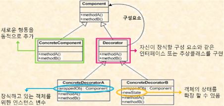
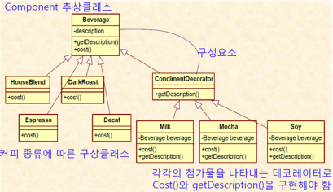

# 데코레이터 패턴(Decorator Pattern)

> 객체에 동적으로 새로운 기능을 추가하여 객체를 확장하는 패턴이다. 상속 대신 객체를 구성하여 기능을 조합할 수 있다.

> 데코레이터 패턴(Decorator Pattern)은 대상 객체에 대한 기능 확장이나 변경이 필요할때 객체의 결합을 통해 서브클래싱 대신 쓸수 있는 유연한 대안 구조 패턴이다





## 사용하는 이유

> 기존 객체에 기능을 추가할 때, 서브클래스를 만드는 대신 기존 객체를 감싸는 데코레이터를 사용하여 더 많은 유연성을 제공한다.
다양한 조합의 기능을 쉽게 만들 수 있다.
런타임 시에 기능을 추가할 수 있어, 애플리케이션의 유연성을 높인다.

## 사용 예시


``` java

// Component interface
interface Beverage {
    String getDescription();
    double cost();
}

// Concrete component
class Espresso implements Beverage {
    @Override
    public String getDescription() {
        return "Espresso";
    }

    @Override
    public double cost() {
        return 1.99;
    }
}

// Decorator class
abstract class CondimentDecorator implements Beverage {
    protected Beverage beverage;

    public CondimentDecorator(Beverage beverage) {
        this.beverage = beverage;
    }

    public abstract String getDescription();
}

// Concrete decorators
class Whip extends CondimentDecorator {
    public Whip(Beverage beverage) {
        super(beverage);
    }

    @Override
    public String getDescription() {
        return beverage.getDescription() + ", Whip";
    }

    @Override
    public double cost() {
        return 0.10 + beverage.cost();
    }
}

class Mocha extends CondimentDecorator {
    public Mocha(Beverage beverage) {
        super(beverage);
    }

    @Override
    public String getDescription() {
        return beverage.getDescription() + ", Mocha";
    }

    @Override
    public double cost() {
        return 0.20 + beverage.cost();
    }
}

public class Main {
    public static void main(String[] args) {
        Beverage beverage = new Espresso();
        beverage = new Whip(beverage);
        beverage = new Mocha(beverage);

        System.out.println(beverage.getDescription() + " $" + beverage.cost());
        // Output: Espresso, Whip, Mocha $2.29
    }
}

```