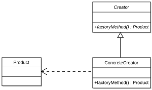

# 팩토리 메소드 패턴(Factory Method Pattern)

> 객체 생성을 위한 인터페이스를 정의하고, 서브클래스에서 어떤 클래스의 인스턴스를 생성할지 결정하는 디자인 패턴

> 객체 생성의 과정을 캡슐화하여 클라이언트 코드가 구체적인 클래스를 직접 호출하지 않고도 객체를 생성할 수 있다.

> 팩토리 메소드 패턴은 객체를 만들어내는 공장(Factory 객체)을 만드는 패턴이다. 어떤 클래스의 인스턴스를 만들지는 미리 정의한 공장 서브 클래스에서 결정한다.



## 사용하는 이유

1. 객체 생성의 캡슐화 

팩토리 메서드 패턴은 객체 생성의 과정을 캡슐화하여 클라이언트 코드가 구체적인 클래스에 의존하지 않도록 한다. 이를 통해 코드의 결합도를 낮출 수 있다.

2. 유연성 및 확장성

새로운 제품을 추가할 때, 기존 코드를 변경할 필요 없이 새로운 팩토리 클래스를 작성하여 추가할 수 있다. 이는 확장성을 높이고, 유지보수를 용이하게 한다.

3. 코드의 재사용성

여러 클래스가 공통 인터페이스를 통해 객체를 생성할 수 있도록 하여 코드 재사용성을 높인다. 이는 중복된 코드 작성을 줄이고, 더 깔끔한 구조를 제공한다.

4. 서브클래스에 객체 생성의 책임 부여

객체 생성의 책임을 서브클래스에게 부여함으로써, 각 서브클래스가 필요에 맞는 제품을 생성할 수 있다. 이는 보다 구체적이고 맞춤화된 객체 생성을 가능하게 한다.

5. 개발 초기 단계에서의 유용성

프로젝트 초기 단계에서 다양한 구현을 고려해야 할 경우, 팩토리 메서드 패턴을 사용하면 나중에 요구 사항이 변경될 경우 유연하게 대처할 수 있다. 인터페이스와 구현의 분리로 인해, 구현을 변경하더라도 클라이언트 코드는 영향을 받지 않는다.

6. 디자인 원칙 준수

팩토리 메서드 패턴은 SOLID 원칙 중 **OCP(개방-폐쇄 원칙)**를 지원한다. 이는 기존 코드를 변경하지 않고 새로운 기능을 추가할 수 있음을 의미한다.

7. 다양한 제품 생성 가능

같은 인터페이스를 구현하는 다양한 제품 객체를 생성할 수 있다. 이로 인해 클라이언트 코드는 객체의 구체적인 클래스를 알 필요 없이 인터페이스를 통해 작업할 수 있다.


## 사용 예시

> JAVA 

```java

public abstract class Pizza
{
    public abstract decimal GetPrice();

    public enum PizzaType
    {
        HamMushroom, Deluxe, Seafood
    }
    public static Pizza PizzaFactory(PizzaType pizzaType)
    {
        switch (pizzaType)
        {
            case PizzaType.HamMushroom:
                return new HamAndMushroomPizza();

            case PizzaType.Deluxe:
                return new DeluxePizza();

            case PizzaType.Seafood:
                return new SeafoodPizza();

        }

        throw new System.NotSupportedException("The pizza type " + pizzaType.ToString() + " is not recognized.");
    }
}

                                // = extends Pizza
public class HamAndMushroomPizza : Pizza
{
    private decimal price = 8.5M;
    public override decimal GetPrice() { return price; }
}

public class DeluxePizza : Pizza
{
    private decimal price = 10.5M;
    public override decimal GetPrice() { return price; }
}

public class SeafoodPizza : Pizza
{
    private decimal price = 11.5M;
    public override decimal GetPrice() { return price; }
}

// Somewhere in the code
...
  Console.WriteLine( Pizza.PizzaFactory(Pizza.PizzaType.Seafood).GetPrice().ToString("C2") ); // $11.50
...

```

> js의 예시

```javascript

//Our pizzas
function HamAndMushroomPizza(){
  var price = 8.50;
  this.getPrice = function(){
    return price;
  }
}

function DeluxePizza(){
  var price = 10.50;
  this.getPrice = function(){
    return price;
  }
}

function SeafoodPizza(){
  var price = 11.50;
  this.getPrice = function(){
    return price;
  }
}

//Pizza Factory
function PizzaFactory(){
  this.createPizza = function(type){
     switch(type){
      case "Ham and Mushroom":
        return new HamAndMushroomPizza();
      case "DeluxePizza":
        return new DeluxePizza();
      case "Seafood Pizza":
        return new SeafoodPizza();
      default:
          return new DeluxePizza();
     }
  }
}

//Usage
var pizzaPrice = new PizzaFactory().createPizza("Ham and Mushroom").getPrice();
alert(pizzaPrice);

```