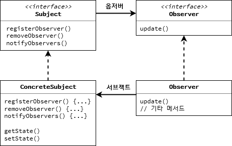

# 옵저버 패턴(Observer Pattern)

> 객체 간의 일대다 종속 관계를 정의하여 한 객체의 상태 변경이 다른 객체들에게 알려지도록 하는 패턴이다.



## 사용하는 이유
> 상태 변화가 발생할 때, 해당 상태에 의존하는 모든 객체에게 자동으로 통지할 수 있다. <br>느슨한 결합을 유지하면서 객체 간의 상호작용을 관리할 수 있다.

## 사용 예시

> 주식 가격을 관찰하는 여러 투자자에게 주식 가격 변동을 자동으로 통지하는 시스템에서 활용할 수 있다.

> java

```java

import java.util.ArrayList;
import java.util.List;

// Subject interface
interface Subject {
    void attach(Observer observer);
    void detach(Observer observer);
    void notifyObservers();
}

// Concrete Subject
class Stock implements Subject {
    private List<Observer> observers = new ArrayList<>();
    private double price;

    public void setPrice(double price) {
        this.price = price;
        notifyObservers();
    }

    @Override
    public void attach(Observer observer) {
        observers.add(observer);
    }

    @Override
    public void detach(Observer observer) {
        observers.remove(observer);
    }

    @Override
    public void notifyObservers() {
        for (Observer observer : observers) {
            observer.update(price);
        }
    }
}

// Observer interface
interface Observer {
    void update(double price);
}

// Concrete Observer
class Investor implements Observer {
    private String name;

    public Investor(String name) {
        this.name = name;
    }

    @Override
    public void update(double price) {
        System.out.println(name + " received price update: " + price);
    }
}

// Client code
public class Main {
    public static void main(String[] args) {
        Stock stock = new Stock();
        Investor investor1 = new Investor("Investor A");
        Investor investor2 = new Investor("Investor B");

        stock.attach(investor1);
        stock.attach(investor2);

        stock.setPrice(100.0);
        stock.setPrice(105.5);
    }
}

```

> javascript

```javascript

// Subject class
class Stock {
    constructor() {
        this.observers = [];
        this.price = 0;
    }

    attach(observer) {
        this.observers.push(observer);
    }

    detach(observer) {
        this.observers = this.observers.filter(obs => obs !== observer);
    }

    notifyObservers() {
        this.observers.forEach(observer => observer.update(this.price));
    }

    setPrice(price) {
        this.price = price;
        this.notifyObservers();
    }
}

// Observer class
class Investor {
    constructor(name) {
        this.name = name;
    }

    update(price) {
        console.log(`${this.name} received price update: ${price}`);
    }
}

// Client code
const stock = new Stock();
const investor1 = new Investor("Investor A");
const investor2 = new Investor("Investor B");

stock.attach(investor1);
stock.attach(investor2);

stock.setPrice(100.0);
stock.setPrice(105.5);

```