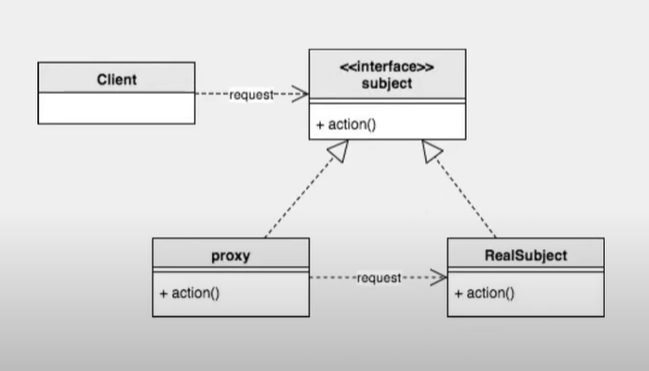

# Design Pattern - Proxy



> Spring에서 런타임시 객체가 만들어지는 대부분의 경우, Proxy 디자인 패턴을 사용한다.

> 프록시 패턴(Proxy Pattern)은 대상 원본 객체를 대리하여 대신 처리하게 함으로써 로직의 흐름을 제어하는 행동 패턴이다.

## 사용하는 이유

> 원본 객체를 수정할수 없는 상황일 때를 극복하기 위해서 사용한다.

- 보안(Security) : 프록시는 클라이언트가 작업을 수행할 수 있는 권한이 있는지 확인하고 검사 결과가 긍정적인 경우에만 요청을 대상으로 전달한다.
- 캐싱(Caching) : 프록시가 내부 캐시를 유지하여 데이터가 캐시에 아직 존재하지 않는 경우에만 대상에서 작업이 실행되도록 한다.
- 데이터 유효성 검사(Data validation) : 프록시가 입력을 대상으로 전달하기 전에 유효성을 검사한다.
- 지연 초기화(Lazy initialization) : 대상의 생성 비용이 비싸다면 프록시는 그것을 필요로 할때까지 연기할 수 있다.
- 로깅(Logging) : 프록시는 메소드 호출과 상대 매개 변수를 인터셉트하고 이를 기록한다.
- 원격 객체(Remote objects) : 프록시는 원격 위치에 있는 객체를 가져와서 로컬처럼 보이게 할 수 있다.

## 사용 예제(Lazy initialization)
- 롤 화면 로딩
- 이미지 로딩
- 카카오톡 친구 목록 로딩

## 단점
- 복잡성 증가 : 프록시 객체를 추가함으로써 클래스와 객체 간의 관계가 더 복잡해진다.
- 성능 저하 : 프록시는 요청을 실제 객체로 전달하거나 중간 처리를 하기 때문에, 호출이 직접 객체에 전달되는 경우보다 더 많은 오버헤드가 발생한다.

## 예제코드(이미지 로딩/lazy initialization)

```java
// 고해상도 이미지 적재
class HighResolutionImage {
    String img;

    HighResolutionImage(String path) {
        loadImage(path);
    }

    private void loadImage(String path) {
        // 이미지를 디스크에서 불러와 메모리에 적재 (작업 자체가 무겁고 많은 자원을 필요로함)
        try {
            Thread.sleep(1000);
            img = path;
        } catch (InterruptedException e) {
            e.printStackTrace();
        }
        System.out.printf("%s에 있는 이미지 로딩 완료\n", path);
    }

    @Override
    public void showImage() {
        // 이미지를 화면에 렌더링
        System.out.printf("%s 이미지 출력\n", img);
    }
}
```

### 고해상도 이미지 적재 실행코드

```java
class ImageViewer {
    public static void main(String[] args) {
        HighResolutionImage highResolutionImage1 = new HighResolutionImage("./img/고해상도이미지_1");
        HighResolutionImage highResolutionImage2 = new HighResolutionImage("./img/고해상도이미지_2");
        HighResolutionImage highResolutionImage3 = new HighResolutionImage("./img/고해상도이미지_3");

        highResolutionImage2.showImage();
        // 3개의 로딩이 일어나고 난 후에야, 이미지가 출력된다
    }
}
```

### Proxy Design Pattern을 통한 해결


```java
// 대상 객체와 프록시 객체를 묶는 인터페이스 (다형성)
interface IImage {
    void showImage(); // 이미지를 렌더링하기 위해 구현체가 구현해야 하는 추상메소드
}
```

```java
// 대상 객체 (RealSubject)
class HighResolutionImage implements IImage {
    String img;

    HighResolutionImage(String path) {
        loadImage(path);
    }

    private void loadImage(String path) {
        // 이미지를 디스크에서 불러와 메모리에 적재 (작업 자체가 무겁고 많은 자원을 필요로함)
        try {
            Thread.sleep(1000);
            img = path;
        } catch (InterruptedException e) {
            e.printStackTrace();
        }
        System.out.printf("%s에 있는 이미지 로딩 완료\n", path);
    }

    @Override
    public void showImage() {
        // 이미지를 화면에 렌더링
        System.out.printf("%s 이미지 출력\n", img);
    }
}
```

```java
// 프록시 객체 (Proxy)
class ImageProxy implements IImage {
    private IImage proxyImage;
    private String path;

    ImageProxy(String path) {
        this.path = path;
    }

    @Override
    public void showImage() {
        // 고해상도 이미지 로딩하기
        proxyImage = new HighResolutionImage(path);
        proxyImage.showImage();
    }
}
```

```java
class ImageViewer {
    public static void main(String[] args) {
        IImage highResolutionImage1 = new ImageProxy("./img/고해상도이미지_1");
        IImage highResolutionImage2 = new ImageProxy("./img/고해상도이미지_2");
        IImage highResolutionImage3 = new ImageProxy("./img/고해상도이미지_3");

        highResolutionImage2.showImage();
        // 그 결과, 필요한 자원만 로딩이되어 이미지가 출력된다
    }
}
```

