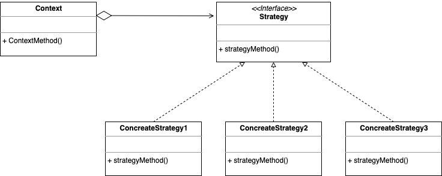

# 전략 패턴(Strategy Pattern)

> 알고리즘을 정의하고, 실행 중에 선택할 수 있게 하는 패턴이다.



## 사용하는 이유
> 알고리즘을 캡슐화하여 클라이언트가 사용할 알고리즘을 쉽게 교체할 수 있다.
조건문을 줄이고, 각 알고리즘을 별도의 클래스로 분리하여 유지 보수를 용이하게 한다.

## 사용 예시
> 다양한 정렬 알고리즘을 사용하는 프로그램에서 알고리즘을 쉽게 교체할 수 있도록 활용할 수 있다.

> java

```java

// Strategy interface
interface SortingStrategy {
    void sort(int[] array);
}

// Concrete Strategies
class BubbleSort implements SortingStrategy {
    public void sort(int[] array) {
        System.out.println("Using Bubble Sort");
        // Sorting logic...
    }
}

class QuickSort implements SortingStrategy {
    public void sort(int[] array) {
        System.out.println("Using Quick Sort");
        // Sorting logic...
    }
}

// Context class
class Sorter {
    private SortingStrategy strategy;

    public Sorter(SortingStrategy strategy) {
        this.strategy = strategy;
    }

    public void setStrategy(SortingStrategy strategy) {
        this.strategy = strategy;
    }

    public void sort(int[] array) {
        strategy.sort(array);
    }
}

// Client code
public class Main {
    public static void main(String[] args) {
        Sorter sorter = new Sorter(new BubbleSort());
        sorter.sort(new int[]{5, 3, 8, 1});
        
        sorter.setStrategy(new QuickSort());
        sorter.sort(new int[]{5, 3, 8, 1});
    }
}
```

### JAVA 코드 추가 설명

 위 예제에서 Sorter 클래스는 SortingStrategy 인터페이스 타입을 필드 strategy로 사용하고 있다. 이 **strategy 필드에는 BubbleSort나 QuickSort와 같은 SortingStrategy 인터페이스를 구현한 구체 클래스의 인스턴스를 할당**할 수 있다.

따라서 Sorter는 SortingStrategy의 구체적인 구현을 몰라도 sort 메서드를 호출할 수 있으며, 런타임에 setStrategy 메서드를 통해 동적으로 전략을 변경할 수도 있다.

 인터페이스 필드의 다형성 원리로, 인터페이스를 필드로 선언해 구체적인 구현과 분리된 형태로 기능을 수행하게 한다.


> javascript

```javascript

// Strategy interface
class SortingStrategy {
    sort(array) {}
}

// Concrete Strategies
class BubbleSort extends SortingStrategy {
    sort(array) {
        console.log("Using Bubble Sort");
        // Sorting logic...
    }
}

class QuickSort extends SortingStrategy {
    sort(array) {
        console.log("Using Quick Sort");
        // Sorting logic...
    }
}

// Context class
class Sorter {
    constructor(strategy) {
        this.strategy = strategy;
    }

    setStrategy(strategy) {
        this.strategy = strategy;
    }

    sort(array) {
        this.strategy.sort(array);
    }
}

// Client code
const sorter = new Sorter(new BubbleSort());
sorter.sort([5, 3, 8, 1]);

sorter.setStrategy(new QuickSort());
sorter.sort([5, 3, 8, 1]);

```