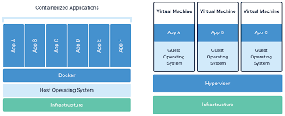
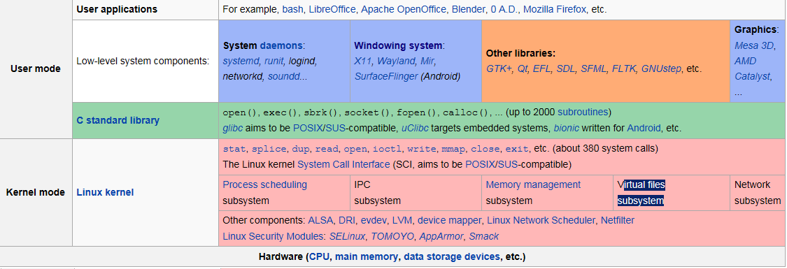

# 컨테이너

## VM VS Container

> Docker는 커널을 Host 한개만 사용하고, VM은 각자 하나의 커널을 가진다.

> Docker는 컨테이너 내부의 독립적인 파일시스템을 위해 이미지에 리눅스의 파일 시스템이 첨가되어야 한다.

1. Guest Operating System (VM의 특징)
- VM의 구조
    - VM은 하이퍼바이저(hypervisor) 위에서 실행되며, 하드웨어를 가상화한다.
    - 각 VM은 자체 Guest OS를 실행하며, 이 OS는 완전한 운영 체제이다.
    - Guest OS는 커널과 user space를 모두 포함한다.
- 동작 방식
    - Guest OS는 VM 내부에서 독립적으로 동작하며, Host OS와는 완전히 분리된 커널을 실행한다.
    - Guest OS는 실제 하드웨어가 아닌, 하이퍼바이저가 제공하는 가상 하드웨어를 사용한다.
    - 애플리케이션은 Guest OS의 user space에서 실행된다.
- 특징
    - 무겁다: 각 VM은 독립된 OS(커널 포함)를 실행하기 때문에 많은 리소스를 소비한다.
    - 완전한 격리: VM 간 리소스와 운영 환경이 완전히 분리된다.
    - 운영 체제 중복: 여러 VM에서 동일한 OS가 실행되므로 비효율적일 수 있다.
2. Docker 컨테이너 (컨테이너의 특징)
- Docker 컨테이너의 구조
    - Docker는 **리눅스 커널의 기능(Namespace, Cgroups)** 을 사용해 프로세스를 격리한다.
    - 컨테이너는 커널을 공유하며, Guest OS가 아닌 **독립적인 파일 시스템(user space)** 만을 가진다.
    - 리눅스 배포판(예: Ubuntu, Alpine 등)의 파일 시스템을 포함하지만, 커널은 없다.
- 동작 방식
    - 컨테이너는 호스트 OS의 커널 위에서 직접 실행되며, 가상화 계층이 없다.
    - 애플리케이션은 컨테이너 내부의 독립된 파일 시스템(user space)에서 동작하지만, 커널 호출은 호스트 OS의 커널로 전달된다.
- 특징
    - 가볍다: 컨테이너는 커널을 공유하므로 Guest OS가 필요 없고, 리소스 사용량이 적다.
    - 빠르다: 커널을 공유하므로 부팅 시간이 거의 없다.
    - 유연성: 애플리케이션 실행에 필요한 최소한의 환경만 포함할 수 있다

## 컨테이너의 기본 개념

> usermode에 하나의 파일시스템을 가진 콘테이너를 올린다는게 docker의 기본 개념이다.(image를 이용)

1. usermode에서 동작
- Docker 컨테이너는 리눅스 커널의 usermode에서 실행되며, 호스트 커널을 공유한다.
- 이는 컨테이너가 가상 머신처럼 별도의 커널을 실행하지 않기 때문에 가볍고 빠르다.
- 커널 자원을 공유하면서도, Namespace와 Cgroups를 통해 독립성과 자원 격리를 보장한다.
2. 하나의 파일 시스템을 가진다
- 컨테이너는 **이미지(image)**에서 생성된 **하나의 루트 파일 시스템(root file system)**을 사용한다.    - 이 파일 시스템은 / 디렉토리 구조로, 컨테이너 내부에서 동작하는 애플리케이션이 필요한 모든 파일과 라이브러리를 포함한다.
- Docker 이미지에 따라 다양한 리눅스 배포판(예: Ubuntu, Alpine) 기반의 파일 시스템을 가질 수 있다.
3. 이미지(image)의 역할
- Docker 이미지는 컨테이너의 파일 시스템의 템플릿 역할을 한다.
이미지는 계층화된 파일 시스템으로 구성되어, 기본 OS 환경(base image)과 추가 구성(application layer)을 포함한다.
- 예를 들어, Node.js 애플리케이션을 실행하는 컨테이너의 이미지는 다음을 포함할 수 있다:
    - Base Layer: Alpine Linux (가볍고 빠른 리눅스 배포판)
    - Application Layer: Node.js 실행 환경과 필요한 애플리케이션 파일
4. 컨테이너 생성 과정
- Docker 이미지를 기반으로 쓰기 가능한 레이어를 추가한다.
- 해당 레이어에 컨테이너가 실행되며, 애플리케이션이 동작한다.
- 컨테이너는 호스트 파일 시스템과 독립된 자체 파일 시스템에서 동작한다.

## 이미지에 리눅스 시스템이 들어가는 이유

> 이미지를 빌드할때 리눅스 시스템을 선택해서 넣어야하고, 그 이유는 다음 과 같다

- 컨테이너는 프로세스가 실행될 독립적인 환경(user space)을 제공한다. 이 환경은 다음과 같은 요소로 구성된다
    - 애플리케이션 실행에 필요한 라이브러리와 실행 파일
    - 파일 시스템 구조(/bin, /usr, /etc 등)
    - 독립된 네트워크 스택, 프로세스 네임스페이스 등
- User Space가 필요한 이유
    - 애플리케이션 독립성: 컨테이너 내부의 애플리케이션은 호스트의 설정이나 환경에 의존하지 않고 동일하게 실행되어야 한다.
    - 종속성 충돌 방지: 호스트와 컨테이너의 라이브러리 버전이 다를 경우 충돌을 피하기 위해, 컨테이너는 독립적으로 동작한다.

2. 호스트 자원의 공유 가능성과 한계
> 컨테이너는 리눅스 커널의 Namespace와 Cgroups를 활용해 호스트 자원을 일부 공유하지만, user space는 독립적으로 유지한다.

- 공유 가능한 자원
    - 리눅스 커널: 컨테이너는 호스트 OS 커널을 공유하며, 별도의 커널을 실행하지 않는다.
    - 예: 시스템 호출(syscall), 메모리 관리, 프로세스 관리 등.
    - 네트워크: 호스트 네트워크를 공유하거나, 컨테이너 간 네트워크를 분리할 수 있다.
- 공유 불가능한 자원 (독립성 유지 필요)
    - 파일 시스템: 컨테이너는 자체적으로 제공하는 파일 시스템을 사용하며, 호스트의 파일 시스템과 직접적으로 연결되지 않는다.
    - 이유: 호스트 파일 시스템에 대한 직접 접근은 컨테이너 간 간섭을 유발할 수 있다.
    - 단, Volume을 통해 특정 디렉토리를 공유할 수 있다.
    - 라이브러리: 애플리케이션은 종종 특정 버전의 라이브러리나 실행 파일을 요구하기 때문에, 컨테이너는 이를 별도로 제공해야 한다.
    - 환경 변수 및 설정 파일: 호스트의 환경과 독립적인 설정이 필요하다.
3. User Space를 독립적으로 만드는 이유
    - 안정성: 호스트와의 종속성을 최소화해 다른 환경에서도 동일하게 동작하도록 한다.
    - 보안: 컨테이너가 호스트 자원에 직접적으로 접근하면, 악의적인 프로세스가 호스트를 침해할 수 있다.
-    일관성: 개발 환경과 배포 환경이 동일하도록 보장하기 위해 user space를 독립적으로 구성한다.
4. User Space 없이 호스트 자원만 사용하는 경우
    - 컨테이너가 user space 없이 호스트 자원을 그대로 사용하는 것은 문제가 있다

        - 의존성 문제: 호스트에 설치된 라이브러리나 설정에 따라 컨테이너 동작이 달라질 수 있다.
        - 버전 충돌: 호스트와 컨테이너가 동일한 버전의 라이브러리를 사용한다고 보장할 수 없다.
        - 환경 오염: 컨테이너가 호스트 환경을 직접 수정하거나, 호스트가 컨테이너 환경을 오염시킬 수 있다.
5. 결론

컨테이너가 user space를 만드는 이유는 애플리케이션의 독립적 실행과 환경 일관성을 보장하기 위함이다. 호스트 자원을 일부 공유할 수는 있지만, 컨테이너의 핵심 설계 철학은 독립된 실행 환경을 제공하는 데 있다. 따라서, 컨테이너는 필요한 라이브러리와 파일 시스템을 포함한 독립적인 user space를 구성해야 한다.\

## cf. kernel을 공유하는 것의 단점

- Docker 컨테이너는 docker 호스트의 kernel을 공유하기 때문에 kernel에 의존적일 수밖에 없다. 이 말의 의미는 docker 호스트에 어떠한 kernel 레벨의 작업을 하게 될 경우 모든 container들이 영향을 받을 수 있다는 것이다. 예를 들어, kernel을 업그레이드한다면 이 작업 자체가 모든 컨테이너에 영향을 준다. 또한 kernel 3.8 버전부터 도커를 지원하기 때문에 컨테이너의 배포판(user space)도 kernel 3.8 이후를 지원하는 것만 사용할 수 있다.