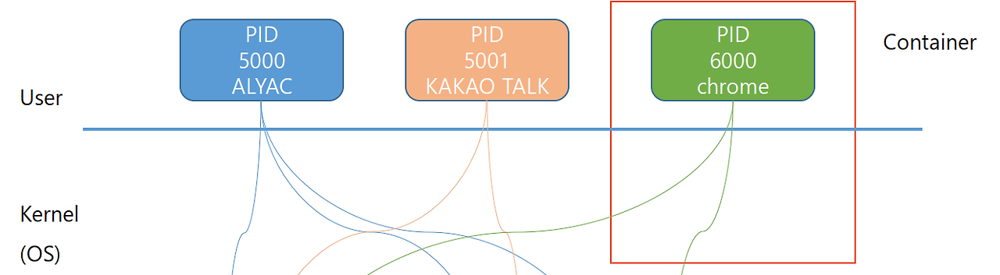
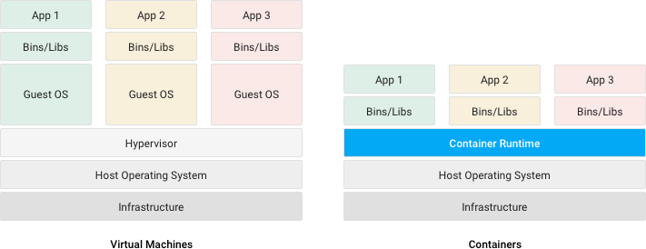

# Docker

- 도커는 컨테이너 기술이다.
    - 컨테이너를 생성하고 관리하기 위한 도구
    - 소프트웨어 개발에서의 컨테이너란?
        - 표준화된 소프트웨어 유닛
        - A package of code and dependencies to run that code
        - e.g. nodejs code + the nodejs runtime
        - ** 여기서의 runtime : 프로그램이 실행될 수 있는 환경을 제공하는 것

## 도커는 왜 필요한가?
- 소프트웨어 개발에서 독립적인 표준화된 어플리케이션 패키지를 원하는 이유는?
    - 언제나 같은 실행을 보장하기 위해서
    - 개발 환경과 프로덕션 환경의 동일성을 보장하기 위해서
    - 팀이나 회사에서 프로젝트의 크기가 커졌을때 프로그램의 버전을 서로 맞추기 어려우며, 같은 코드 기반에서 작업을 하기위해 많은 소모값이 있다.
        - 특히나 종속성이 많은 라이브러리들에서 문제가 생길 확률이 높다.
    - 혼자 작업할때도 유용하다. 작업하는 프로젝트가 여러 개인 경우 충돌하는 버전이 있을 수도 있기 때문이다.
        - python2 와 최신 버전이 충돌하는 경우가 있을 수 있다.
        - 작업을 전환할때마다 버전을 삭제하고, 설치하기는 너무 번거롭다.

```javascript

// 예시코드
import express from 'express';

import connectToDatabase from './helpers.mjs'

const app = express();

app.get('/', (req, res) => {
    res.send('hello docker!');
})

// node 14버전 이상부터 await을 사용 가능하다.
// 배포 환경이 12, 8 같은 버전의 node라면 해당 코드는 에러를 일으킨다
// 이 문제를 찾는데 시간이 많이 걸릴 수 있다.
// 개발 환경과 실제 프로덕션 환경이 다를 가능성이 존재하고, 
// 이를 해결하기 위해 Container를 이용해 정확한 버전을 실행시킬 수 있다.
await connectToDatabase();

app.listen(8080);
```

```docker
# FROM 인스터럭션
# 도커 이미지(운영체제)를 선택
# 컨테이너의 원형(틀) 역할을 한다.
# 도커 이미지의 바탕이 될 베이스이미지를 지정하며, 받아오는 도커 이미지는 도커허브라는
# 레지스트리에 공개 된 것이다.
# 도커는 FROM에서 지정한 이미지를 기본적으로 도커 허브 레지스트리에서 참조한다.
# 각 도커 이미지는 고유의 해시 값을 가지며, 태그를 통해서 파악하기 쉽게한다.
# 언어 버전을 따서 태그를 붙이는 경우가 일반적이다.
# Node.js 18 버전과 Alpine 이미지를 베이스로 사용
FROM node:18-alpine

# 작업 디렉토리 설정
WORKDIR /usr/src/app

# package.json과 package-lock.json을 복사
COPY package*.json ./

# 의존성 패키지 설치
# 컨테이너 안에서의 명령 수행
RUN npm install

# 애플리케이션 소스 코드 복사
# COPY .(현재 로컬 디렉토리) .(컨테이너의 현재 작업 디렉토리) 명령은 로컬 디렉토리에서 컨테이너의 현재 작업 디렉토리로 파일을 복사한다.
# 이때 파일들은 컨테이너 내에서 WORKDIR로 지정된 폴더에 모이게 된다.
COPY . .

# 도커 컨테이너가 실행하기 전 먼저 실행할 명령을 정의한다.
# CMD에 지정한 명령을 지정한 인자로 오버라이딩 할 수 있다.
# 공백으로 나눈 배열로 나타낸다.
CMD ["node", "index.js"]

```

## 도커 이미지

> 도커 컨테이너를 구성하는 파일 시스템과 실행할 어플리케이션 설정을 하나로 합친 것으로, 컨테이너를 생성하는 템플릿 역할을 한다.

- 도커 이미지 하나로 여러 개의 컨테이너를 생성할 수 있다.
- Dockerfile 작성 후, `docker image build -t <이미지명[:태그명]> <Dockerfile의_경로>` 명령으로 도커 이미지를 빌드한다.
   - 예제 : `docker images build -t example:latest .`
   - `-t` 옵션은 이미지명을 지정하는 태그다. 거의 필수적으로 사용된다.
   - 태그명은 생략할수 있으며, 생략시 latest 태그가 붙는다.
- **도커 허브를 안쓰고 ECR을 사용하는 이유??

## 도커 컨테이너
> 도커 이미지를 기반으로 생성되며, 파일 시스템과 어플리케이션이 구체화되어 실행되는 상태

- `docker container run <이미지명[:태그명]>` 으로 컨테이너를 실행 할 수 있다.
   - 해당 커맨드로 이전 예제에서 만든 이미지를 실행 후, `curl http://localhost:8080` 을 보내면
   `hello docker!` 가 반환되어야 할 것 같지만 반환되지 않는다.
   - 컨테이너의 nodejs는 8080포트를 리스닝하고 있지만, 이 포트는 컨테이너 포트라고해서 컨테이너 안에 한정된 포트이다.
   - curl을 컨테이너 안에서 실행하면 올바른 응답을 받을 수 있겠지만, 컨테이너 밖에서는 컨테이너 포트를 바로 사용할 수 없기 때문에 제대로 된 결과가 반환되지 않는다.
   - HTTP 요청을 받는 어플리케이션을 사용하려면 컨테이너 밖에서 온 요청을 컨테이너 안에 있는 어플리케이션에 전달해 주어야 한다.
      - 도커의 포트 포워딩을 통해서 할 수 있다.
      - 호스트 머신의 포트를 컨테이너 포트와 연결해 컨테이너 밖에서 온 통신을 컨테이너 포트로 전달 한다. 이를 이용해서 컨테이너 포트를 컨테이너 외부에서도 쓸 수 있다.
      - -p 옵션을 붙이면 포트 포워딩을 지정할 수 있다. -p 옵션은 호스트_포트:컨테이너_포트 형식으로 입력하면 된다.
   - `docker container run -d -p 9000:8080 <이미지명[:태그명]>`
   - 이제 `curl http://localhost:9000` 으로 요청을 보내면, `hello docker!` 가 반환된다.

### 도커 컨테이너에는 1개의 프로세스만 넣어야 하는가?

- 도커의 공식문서 'Best Practices for writing Dockerfiles'의 공식적인 입장은 다음과 같다
   - Each container should have only one concern
   - 즉, 컨테이너는 하나의 프로세스를 사용하는 것이 아닌, 하나의 관심사에 집중해야 한다.
   - 하나의 관심사란 컨테이너 하나가 한 가지 역할이나 문제 영역(도메인)에 만 집중해야 한다는 의미이다.
   
### 컨테이너 run시 자주 사용하는 옵션
- `--name` 옵션을 추가적으로 많이 사용한다
   - 컨테이너에게 임의의 이름이 아닌 특정 이름을 부여한다.
   - `docker container run -d -p 9000:8080 --name [컨테이너명] [이미지명[:태그명]]`
   - 개발용으로는 자주 사용되지만, 운영 환경에서는 추천되지 않는다.
   - 같은 이름의 컨테이너를 새로 실행하려면 같은 이름을 갖는 기존의 컨테이너를 먼저 삭제해야 하기 때문이다.
   - 이 때문에 많은 수의 컨테이너를 계속 생성 및 실행하고 정지, 파기를 반복하는 운영 환경에는 적합하지 않다.
- `-it` 옵션을 추가한다면, 인터렉티브 터미널을 사용 가능하다
- `--rm` 옵션을 추가한다면 컨테이너를 종료할 때 컨테이너를 파기하도록 한다.

### 컨테이너 명령어
- `docker container ls` 도커 컨테이너 목록 보기
   - `docker ps` 와 동일 기능을 수행한다.
   - `ls -q` 옵션을 통해 컨테이너의 ID만 추출할 수 있다.
      - `docker container ls -q`
   - `ls --filter "필터명=값" ` 옵션을 통해 특정 조건을 만족하는 컨테이너 목록을 볼 수 있다.
      - `docker container ls -filter "name=[컨테이너 명]" `
      - `docker container ls -filter "ancestor=[이미지 이름] " ` 
         - 이미지 명은 어떤 이미지로 빌드했는지에 대한 이름이고, 컨테이너명은 컨테이너를 실행할때 입력한 이름이다.
- `docker container stop [컨테이너ID | 컨테이너명]`
   - 해당 명령으로 실행 중인 컨테이너를 종료할 수 있다.
   - 컨테이너 ID는 Docker가 자동으로 부여하는 고유한 식별자이며, 컨테이너명은 사용자가 지정할 수 있는 사람이 읽기 쉬운 이름이다.
   - 예시 : `docker run --name mycontainer -d nginx`
   - `docker container ls` 혹은 `docker ps` 입력

| CONTAINER ID | IMAGE  | COMMAND                 | CREATED       | STATUS           | PORTS | NAMES      |
|--------------|--------|-------------------------|---------------|------------------|-------|------------|
| a1b2c3d4e5f6 | nginx  | "/docker-entrypoint.…"   | 2 minutes ago | Up 2 minutes     |       | mycontainer|

- `docker container restart [컨테이너ID | 컨테이너명]`
   - 파기하지 않은 컨테이너(stop 상태)는 해당 명령으로 재시작할 수 있다.
- `docker container rm [컨테이너ID | 컨테이너명]`
   - 해당 명령으로 컨테이너를 파기할 수 있다.
   - 파기할 수 있는 것은 정지상태인 컨테이너이고, 현재 실행중인 컨테이너는 `-f` 옵션을 추가해 파기할 수 있다.
- `docker container exec [컨테이너ID | 컨테이너명] [컨테이너에서_실행할_명령]`
   - 실행 중인 컨테이너에서 명령을 수행할 수 있다.
   - `-it` 옵션으로 컨테이너를 셸을 통해 다룰 수 있다.
      - `docker container exec -it exampleContainer`
   - `docker container exec exampleContainer echo hello`
      - 결과 : `hello`
- `docker container cp [컨테이너ID | 컨테이너명] [컨테이너명:원본파일] [대상파일]`
   - 컨테이너 끼리 혹은 컨테이너와 호스트 간에 파일을 복사하기 위한 명령어이다.
   - 주로 디버깅 중 컨테이너 안에서 생성된 파일을 호스트로 옮겨 확인할 목적으로 사용한다.
   - 컨테이너(exampleContainer) 안에 있는 /example/logging.txt 를 호스트의 현재 작업 디렉토리로 복사하는 예제
      - `docker container cp exampleContainer:/example/logging.txt .`
   - 호스트쪽의 dummy.txt를 컨테이너(exampleContainer)의 tmp폴더로 복사하는 예제는 다음과 같다.
      - `docker container cp dummy.txt exampleContainer:/tmp`
      - `docker container exec echo ls /tmp | grep dummy` 를 이용해 테스트 할 수 있다.
         - 결과 : `dummy.txt`


## 도커를 공부하기 위해 알아야 할 개념

 1. 프로세스 관리 (Process Management)
    - 도커의 기본적인 개념은 컨테이너라는 독립적인 실행 환경을 만들어 여러 프로세스를 격리시키는 것이다. 따라서, 프로세스가 어떻게 실행되고 관리되는지 이해하는 것이 중요하다
 2. 네임스페이스 (Namespaces)
    - 도커는 리눅스 네임스페이스를 사용하여 프로세스, 네트워크, 파일 시스템 등 다양한 리소스를 격리한다. 각 컨테이너는 다른 컨테이너와 독립적으로 실행되며, 이를 가능하게 하는 핵심 기술이 네임스페이스이다.
 3. 컨트롤 그룹 (Control Groups, cgroups)
    - cgroups는 리눅스 커널 기능으로, 프로세스에 대한 리소스 할당을 관리한다. 도커는 이 기능을 사용하여 각 컨테이너에 할당된 CPU, 메모리, I/O와 같은 리소스를 제한하고 관리한다.
    - cgroups를 통해 도커는 각 컨테이너가 사용할 수 있는 자원의 양을 조절하며, 과도한 리소스 사용을 방지하고 성능을 최적화합니다.
리소스 제한, 우선순위 설정 등을 공부하는 것이 좋습니다.
 4. 파일 시스템과 가상화
    - 도커는 파일 시스템 격리를 위해 Union File System(예: AUFS, OverlayFS 등)을 사용하여, 여러 이미지와 컨테이너가 공유하는 파일 시스템 구조를 효율적으로 관리한다.
    - 각 컨테이너는 읽기 전용 이미지와 읽기/쓰기 레이어로 구성된 파일 시스템을 사용하여 독립적인 환경을 구성합니다.
    - 파일 시스템과 가상화 기술에 대한 이해는 도커가 어떻게 여러 컨테이너를 효율적으로 실행하는지 이해하는 데 도움이 됩니다.
 5. 네트워크 (Networking)
    - 도커는 여러 가지 네트워크 드라이버를 제공하여, 각 컨테이너 간의 통신을 관리한다. 네트워크의 격리, 포트 매핑, DNS 설정 등 다양한 기능을 제공합니다.
    - 컨테이너는 독립적인 네트워크 네임스페이스를 가지며, 서로 다른 네트워크에 속한 컨테이너들 간에는 기본적으로 통신할 수 없다.
    - Docker Network (bridge, host, overlay 네트워크 등)와 관련된 개념을 이해하면 도커의 네트워크 구성 방식에 대해 더 잘 알 수 있다.
 6. 운영 체제의 커널 (Kernel)
    - 도커는 커널 기반의 가상화 기술을 사용한다. 즉, 하드웨어 가상화와 달리, 도커는 호스트 운영 체제의 커널을 공유하면서 - 프로세스 격리 및 리소스 할당을 처리한다.
    - 커널이 어떻게 컨테이너화된 환경에서 다양한 기능을 처리하는지 이해하는 것이 중요하다.
    - 커널 모듈, 시스템 콜, 컨텍스트 스위칭 등을 이해하는 것이 유용할 수 있다.
 7. 시스템 호출 (System Calls)
    - 도커는 컨테이너화된 환경에서 여러 시스템 리소스를 시스템 호출을 통해 관리한다. 시스템 호출은 운영 체제가 제공하는 서비스와 상호작용하는 주요 방법이다.
    - 예를 들어, 도커는 컨테이너 내에서 파일 시스템 조작, 프로세스 관리, 네트워크 구성 등의 작업을 수행하기 위해 시스템 호출을 사용한다.
    - 시스템 콜 인터페이스에 대해 공부하면 도커가 어떻게 리눅스 커널과 상호작용하는지 이해하는 데 도움이 된다.

- 즉, 도커는 프로세스를 격리하고, 프로세스에 필요한 컴퓨팅 자원을 독립적으로 할당/격리하여 완벽히 격리된 가상 환경을 구축하게 해준다. 

## 도커 컨테이너의 작동 원리

> https://anweh.tistory.com/67

> https://kjw1313.tistory.com/91 -> 가상화에 대한 설명까지 매우 잘되있음



- User+ Kernel 계층을 합쳐서 컨테이너로 만들면 process의 행위가 제한된다. 즉, 독립적으로 새로운 OS를 쓰는 것처럼 작동한다. 
- 도커가 성능이 좋은 이유가 무엇일까?   - ???
   - Host OS 입장에서 커널에서 실행되는 또 하나의 프로세스로 처리된다. 컨테이너로 만들면 자신만 다른 세상에서 떨어진 것처럼 따로 작동하여 격리가 된다. 
   - 결론: 도커 컨테이너의 프로세스라는 것은 Host OS 입장에서 프로세스와 같다. Host 입장에서 프로세스가 죽으면 컨테이너 안의 프로세스도 죽는다. 커널을 공유하는데, 이걸 컨테이너라는 이름으로 격리시킨 것이다. 커널의 OS가 개별적으로 실행되니까 마치 독립 컴퓨터가 하나 더 생긴 것과 같은 현상이 나타난다. 
## VM과 Container



- VM은 각 머신마다 OS를 설치해야하기 때문에 낭비가 심하다.
- 하이퍼바이저는 물리적 서버의 리소스(CPU, 메모리, 디스크 등)를 가상 머신에게 할당하고, 각 가상 머신이 실제 하드웨어처럼 동작하도록 관리한다. 이를 통해 여러 운영 체제(OS)가 하나의 물리적인 서버에서 독립적으로 실행될 수 있다.
- 운영체제가 도커를 지원한다면 가상머신이 필요 없을 것이다.
- 가상머신을 사용하지 않는 것이 이상적이다. ??
- 가상 머신 위에서 도커가 실행된다. ??

### Docker Containers
- Low impact on OS, very fast, minimal disk space usage
- Sharing, re-building and distribution is easy
- Encapsulate apps/ environments instead of "whole machines"

### Virtual machines
- Bigger impact on OS, slower, higher disk space usage
- Sharing, re-building and distribution can be challenging
- Encapsulate "whole machines" instead of just apps/ environments

| 항목                        | **도커 컨테이너**                                    | **가상 머신**                                    |
|-----------------------------|---------------------------------------------------|-------------------------------------------------|
| **운영 체제에 미치는 영향**     | OS에 미치는 영향이 적고, 빠르게 실행됨.               | OS에 더 큰 영향을 미치며, 더 많은 리소스를 소모함. |
| **속도**                     | 매우 빠르며, 실행 속도가 빠름.                        | 상대적으로 느림. 가상화된 전체 시스템을 실행하므로 속도가 떨어짐. |
| **디스크 공간 사용**           | 디스크 공간을 적게 사용, 작은 크기의 이미지를 생성.   | 디스크 공간을 많이 사용, 전체 운영 체제를 포함하는 이미지를 생성. |
| **재구성 및 배포**              | 앱 및 환경을 캡슐화하여 쉽게 공유, 재구성 및 배포가 용이. | 전체 머신을 캡슐화하므로 공유 및 배포가 복잡하고 시간이 걸림. |
| **캡슐화 대상**                | 애플리케이션 및 해당 환경만 캡슐화.                    | 전체 머신을 캡슐화 (운영 체제 포함).               |
| **자원 격리**                  | 커널을 공유하지만, 각 컨테이너는 격리된 환경에서 실행.   | 하이퍼바이저가 각각의 가상 머신을 완전히 격리된 독립적인 환경으로 실행. |
| **시작 시간**                  | 매우 빠르게 시작됨.                                   | 시작하는 데 시간이 오래 걸림.                    |
| **OS 커널 공유**               | 호스트 OS의 커널을 공유.                             | 각 가상 머신은 자체 커널을 가짐.                  |
| **보안**                      | 보안 격리가 상대적으로 약할 수 있음.                   | 보안이 더 강력함. 각 가상 머신은 독립적인 운영 체제를 가짐. |
| **애플리케이션 격리**           | 애플리케이션의 격리가 필요하지만, 보통은 공유된 커널을 사용. | 각 가상 머신이 완전히 독립된 환경을 제공하므로 애플리케이션 격리가 강력함. |
| **호스트 시스템 의존성**       | 호스트 OS와 더 밀접하게 연관되어 있으므로, 호스트 OS에 따라 다를 수 있음. | 호스트 시스템과 독립적인 환경에서 실행되므로 호스트 OS와 관계가 적음. |
| **리소스 효율성**               | 리소스를 효율적으로 사용함 (CPU, 메모리, 디스크 등).    | 리소스 소모가 많음 (각 가상 머신에 별도의 운영 체제와 자원이 필요). |
| **사용 사례**                  | 빠른 개발, CI/CD, 마이크로서비스, 애플리케이션 격리 등. | 전체 운영 체제를 필요로 하는 애플리케이션, 레거시 시스템, 높은 보안 요구사항 등이 있는 경우. |
