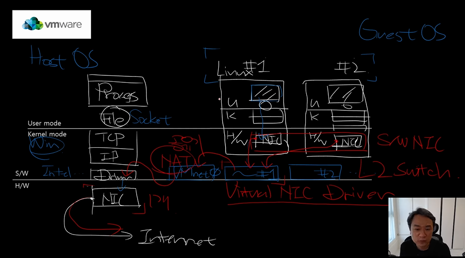
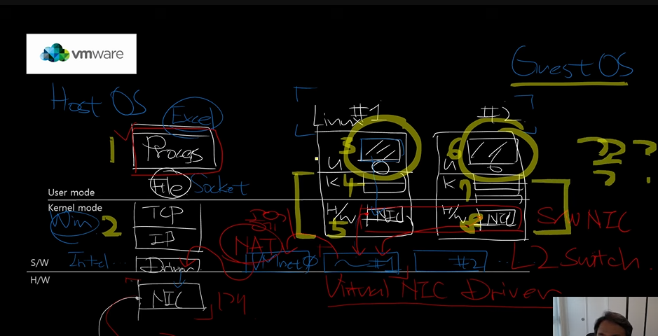

# 20분 만에 전공자처럼 도커, 가상화 이해하기

> https://www.youtube.com/watch?v=zh0OMXg2Kog

## 프로세스

- 프로세스의 고유공간을 운영체제가 보장한다
  - 이 메모리를 Virtual Memory라고 한다
  - Virtual Memory (가상 메모리)
    - 하드디스크+RAM을 합쳐서 하나의 메모리로 추상화를 하는 것
    - 일반적으로 한 프로세스에 4GB의 가상 메모리가 주어진다(실제는 1.7GB)
      - 일반적으로 2^20에 메모리 위치를 표시하고, 2^12로 offset을 표시한다(4KB, 2^32)
    - 프로세스마다 독립적인 공간이다

## VMware의 구조



> VMware는 하이퍼바이저(VMM)를 통해 하드웨어 자원을 가상화하여 여러 OS가 동시에 동작할 수 있도록 한다.

- 가상화를 위해 하드웨어를 소프트웨어 형식으로 구현한다(VMware가)
- 실제 하드웨어 자원(NIC, 디스크 등)은 공유되지만, 가상 머신 입장에서는 독립된 자원처럼 보인다.
- VMware는 사용자 모드 애플리케이션처럼 보일 수 있지만, 실제로는 커널 모드에서 하드웨어 가상화를 처리하는 핵심 컴포넌트를 갖고 있다.

## Docker를 사용하는 이유(vs VMWARE)



- VMWare를 사용하게 된다면 과연 저 4,5,7,8(Kerner, Hardware) 이 필요한 것인가?, 없어도 되지 않을까?
  - Docker가 탄생한 이유
- Docker를 사용한다면 4,5,7,8(Kerner, Hardware)을 제거할 수 있다
- 가능한 이유?
  - Container에는 Application에 필요한 binary와 의존성이있는 라이브러리의 binary만을 넣어 놓는다
  - Docker engine이 Kerner, Hardware의 역할을 대신해서 응답을 반환해준다
- 원리는?
  - linux의 cgroups(프로세스들이 사용할 수 있는 컴퓨팅 자원들을 제한하고 격리), namespace(프로세스의 논리 공간 분리)를 사용하여 프로세스 단위로 분리시킨다
  - HostOS(Linux) 리눅스 시스템 기반이라, HostOS를 가지고 있으며 이 OS의 커널을 모든 컨테이너들이 공유해 사용해 효율적이 되는 것이다
  - Docker는 호스트 OS의 커널을 컨테이너들이 공유하면서, 각 컨테이너는 자신만의 격리된 파일 시스템, 네트워크, PID 공간 등을 가지는 것처럼 동작한다.
- 이렇게 만든 container를 대신 관리해주는 것 - Kubernetes

### 그럼 결국 커널 한개만 쓰는데 더 느려지는거아님?

- 컨테이너 여러 개가 하나의 커널을 공유하면 성능 저하가 있지 않나?
  - 컨테이너는 독립된 프로세스로 스케줄링되고, 커널은 원래 여러 프로세스를 동시에 처리하도록 설계되어 있음
- 커널이 병목이 되진 않나?
  - 일반적인 서버 환경에서는 병목이 거의 없다. 단, 모든 컨테이너가 과도한 I/O나 시스템 콜을 발생시키면 커널 레벨에서 자원 경합이 생길 수 있다
- 컨테이너는 프로세스니까 느린 거 아닌가?
  - 오히려 더 빠르다. VM처럼 전체 OS 레벨이 아니라, 필요한 실행 환경만 격리되므로 오버헤드가 훨씬 적다

## 배포에 Docker를 많이 사용하는 이유

1. 환경의 통일 (환경불일치 제거)

- 개발자가 로컬에서 docker-compose up으로 실행한 환경이 테스트 서버, 운영 서버에서도 똑같이 실행됨
- 환경의 통일은 도커 컨테이너가 독립적인 파일시스템을 가져, 독립 설정을 유지할 수 있어서 그렇다
  - 일반적인 프로세스는 파일 시스템을 공유하며, 격리되지 않는다.
  - Docker 컨테이너가 독립된 파일 시스템을 가지는 이유는 리눅스의 mount namespace, overlayfs 기술 덕분이다.
  - 그래서 Docker는 리눅스에서 훨씬 강력하게 작동하며, Windows에서는 리눅스 VM 위에서 돌아가는 이유도 바로 이것 때문이다.

2. CI/CD에 최적화

- Dockerfile, docker-compose 등으로 환경 설정 자체를 코드화
- GitHub Actions, Jenkins, GitLab CI 등에서 쉽게 통합 가능
- 즉, 코드 변경 → 이미지 빌드 → 배포까지 자동화 가능

3. 롤백이 쉬움

- 이미지 기반이기 때문에 버전 명시 가능
- ex: `my-app:20240525`
- 문제가 생기면 `my-app:20240510`으로 바로 롤백 가능

4. 스케일링 & 오케스트레이션 호환성

- Kubernetes, ECS와 사용이 쉬움
- 컨테이너 기반이라 수평 확장, 헬스체크, 자동 복구 등이 쉬움

## Docker에 사용되는 리눅스의 핵심 기술

- namespace
  - 논리적 격리
  - 하나의 커널 안에서 PID, 네트워크, 파일 시스템, 사용자, 호스트명 등을 각각 따로 보게 만듦
- cgroups
  - 자원 할당과 제한을 담당하는 커널 기능
  - 이를 통해 컨테이너가 과도하게 리소스를 점유하는 것 방지 가능
- overlayfs
  - 컨테이너 파일 시스템 구성
  - Docker 이미지는 여러 계층으로 이루어진 읽기 전용 레이어 스택
  - 컨테이너가 실행되면 읽기/쓰기 가능한 레이어 하나를 위에 얹음
  - 예시
  ```Dockerfile
    FROM ubuntu
    RUN apt install python
    COPY app.py .
  ```
  - 레이어 순서	내용
    - Layer 1 (읽기 전용)	Ubuntu OS 파일들 (/bin, /lib, /etc 등)
    - Layer 2 (읽기 전용)	Python 설치된 파일들
    - Layer 3 (읽기 전용)	app.py 복사됨
    - Layer 4 (읽기/쓰기 가능)	컨테이너 실행 시 생성됨 (네가 만드는 변경 사항 저장됨)
    - 이 모든 걸 overlayfs가 합쳐서 하나의 파일 시스템처럼 보이게 함
- seccomp/AppArmor
  - 시스템 보안
  - 커널 호출을 제한하거나, 파일 접근을 제어하는 보안 기술
- runc/containerd
  - 실행 담당 (컨테이너 런타임)
  - 실제로 위 기술들을 조합해서 컨테이너를 띄우는 도구

## Recap

- Docker는 리눅스에서 내 애플리케이션을 '격리된 프로세스'로 실행시키는 기술이다.
