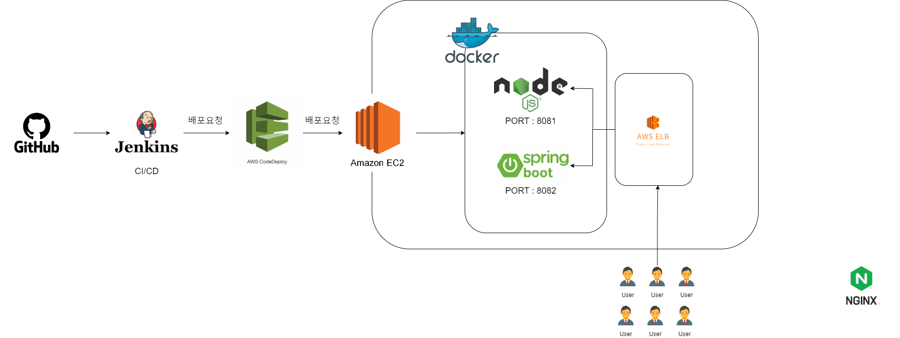
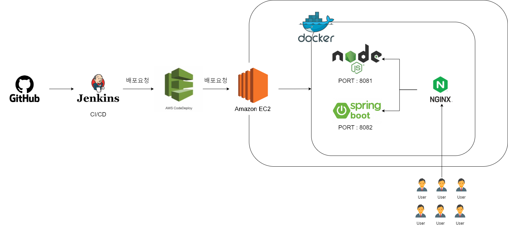

## 강의 개요

개발한 산출물을 깃에 올리고 젠킨스를 통해 배포까지 되는것을 설명한다.

## 목적

직접 작성한 코드를 소스코드 레포지토리 git 에 올리고 그걸 토대로 jenkins 가 배포하고 AWS 서버에 도커 컨테이너 기술을 이용해서 배포하는것을 목표

실제로 도메인 연결까지되어야 하는것

1. 소스코드 관리
    1. 환경 분리
2. Git 에 업로드
    1. git
        1. 브랜치 관리
            1. 상용환경, 개발 환경, QA 환경, 각 기능별 개발 브랜치
3. Jenkins 가 이 소스코드를 빌드하고, 배포하고
    1. 어떻게 떠있나?
    2. 저장소에 있는 소스코드 변경을 감지
        1. polling
        2. trigger
    3. 변경이 되면 절차를 밟는다.
        1. 컴파일/빌드
            1. 운영체제별로 어떻게 되는지?
                1. 리눅스에 배포하고 싶으면
                    1. 리눅스에서 빌드한다.
            2. 도커를 활용해서 빌드된다.
                1. 아무 운영체제에서나 가상 환경을 만들어서 똑같이 빌드 할수 있다는 말
                2. 사례로
        2. 패키지 설치
        3. 테스트 코드 실행 후 문제가 없는지 확인
        4. 배포
    4. 어떤 것들 배우냐
        1. 젠킨스 설치
        2. 젠킨스 문법
        3. 젠킨스 대시보드
            1. Linux jenkins 유저
    5. 실제 환경에서 고려할 것들
        1. 젠킨스 유저를 기준으로 한다.
        2. 필요한 환경 설치
            1. 자바, node, .. etc
        3. jenkins
4. docker
    1. 가상 운영체제
    2. 볼륨 매핑(volume mapping)
    3. 이미지란
    4. 컨테이너란
    5. 포트 매핑
        1. 컨테이너의 특정 포트와 호스트의 포트를 붙임
5. AWS 환경을 구축
    1. 서비스
        1. Load Balancer 란
            1. 하는 일들
                1. 어떤 요청을 어디로 보내는지
                2. 어떤 통신 방법에 따라서 어디로 보내는지
                3. 어떤 IP 에서만 왔을대 어떻게 된다.
                4. 특정 IP 대역에서만 요청을 받는다.
            2. Load Balancer 가 없었던 시절
        2. EC2
            1. SSH 접속
                1. 젠킨스가 서버에 접속
                2. 소스 코드 업로드
                3. 서버에 접속해서 켜는거
            2. 고려해야할 사항
                1. 돈 많이 나오는지
                    1. 어떤 사양의 컴퓨터를 쓸건지(시간당 과금)
                2. 
        3. ECS(Elastic Container Service)
            1. 똑같은 서버 10개 알아서 띄워줌
            2. 죽으면 알아서 띄워줌
            3. 원하는 갯수만큼
            4. 특정 서버의 사용률에 따라 늘렸다 줄였다도 해줌
            5. 기타 등등
            6. 위설정 인간이 해야함
            7. 돈걱정
                1. 시간당 과금
        4. 보통 많이 쓰는 리소스
            1. S3 Bucket
                1. 비용
                    1. 업로드하는 파일의 크기의 양
                    2. 보관되어 있는 크기의 양
                    3. 다운로드하는 크기의 양
                2. 고려해야할 사항
                    1. 

## 네트워크 흐름도

1. 고객(브라우저, 모바일) 요청! (https://api.mydomain.com)
2. DNS ⇒ 누군가 정해주는거 / 도메인마다
    1. host가 인근 local dns server에 domain name을 요청한다.
    2. local dns server는 root DNS Server에 요청을 보낸다.
    3. Root DNS Server는 .com 등 domain을 분석하여 해당 도메인을 관리하는 TLD DNS Server를 가르쳐 준다.
    4. Local DNS Server는 위의 TLD DNS Server로 요청을 보낸다.
    5. TLD DNS Server는 해당 Authoritative DNS Server를 가르쳐 준다.
    6. 위의 Authoritative DNS Server로 요청을 보낸다.
    7. Authoritative DNS Server는 Local DNS Server 에게 도메인을 보낸다.
    8. 도메인을 받아 host에게 돌려준다.
3. AWS 에서 도메을에 대한 요청을 처리한다 ⇒ 아마존의 네임서버를 쓰는거다.
4. 아마존에서 어떤 서버로 갈지 알려준다
5. 보통의 경우에는 그 어떤 서버란 Loadbalancer 다.
6. Load Balancer 로 보내는 이유는 여기서 각종 설정 라우팅 HTTPS 방식 통신 모든 필요한것들을 간편하게 다 할수 있어서
7. Load Balancer 가 어떤 규칙에 따라서 서버(+포트)로 요청을 보내준다.
    
    ex) [api.mydomain.com](http://api.mydomain.com) 으로 https 방식의 요청이 들어오면 내가만든 EC2 의 80 번 포트로 요청을 보내
    
8. 타겟 그룹으로 전달 (타겟그룹)
9. 결과적으로는 특정 ip 특정 포트로 간다.