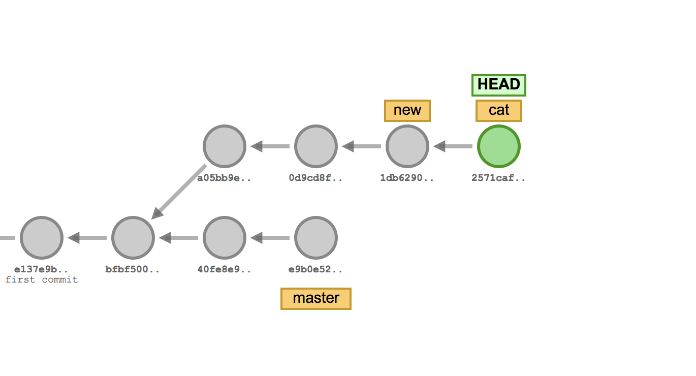

# HEAD

- HEAD가 특정 커밋에 찍혀 있을 경우 해당 브랜치의 마지막 커밋이 해당 부분이라는 것을 알 수 있게 된다. 즉, HEAD는 현재 작업중인 브랜치의 마지막 커밋에 대한 포인터이다.

- HEAD는 "분기되는 곳"에 있는 것이 아니라, 현재 작업 중인 커밋이나 브랜치를 나타내는 위치를 지칭한다.

- 최신 커밋에 대한 해쉬값이다.

# Snapshot

- 커밋은 파일 변화를 깃 저장소에 영구적으로 기록한다.
- 이러한 방식은 이전에 파일을 복사하여 관리하던 방식과는 큰 차이가 있다.
- 스냅샷은 HEAD가 가리키는 커밋을 기반으로 사진을 찍는다.
    - 깃은 시스템적인 단점을 해결하려고 변경된 파일 전체를 저장하지 않고 파일에서 변경된 부분을 찾아 수정된 내용만 저장한다. 이를 스냅샷이라고 부른다.
    - 이를 스테이지 영역과 비교하여 새로운 커밋으로 기록한다.
    - 스냅샷 방식을 이용하여 빠르게 버전의 차이점을 정리하고, 용량을 적게 사용한다.

## snapshot 동작 방식

1. 변경되지 않은 파일
- 변경되지 않은 파일은 이전 커밋의 데이터를 재사용한다. 즉, 변경되지 않은 파일은 새로 저장하지 않고, 기존 데이터의 참조를 유지한다.

2. 변경된 파일만 저장
- 변경된 파일이 있으면 해당 파일의 상태(내용)를 새롭게 저장한다. 이 때, 파일의 내용은 블롭(blob) 객체로 저장되며, Git은 파일의 해시 값을 기반으로 이를 관리한다.
- 변경된 파일의 전체를 새로운 blob객체로 저장한다. 같은 내용의 파일을 작성하더라도 서로 다른 브랜치와 커밋 버전에서 다른 파일로 인식된다.

3. 트리 구조
- Git의 스냅샷은 디렉토리 구조(트리)와 파일 데이터(blob)로 구성되며, 파일이 변동되었을 경우 해당 파일만 새로운 블롭 객체로 저장된다. 나머지는 이전 데이터를 그대로 참조한다.