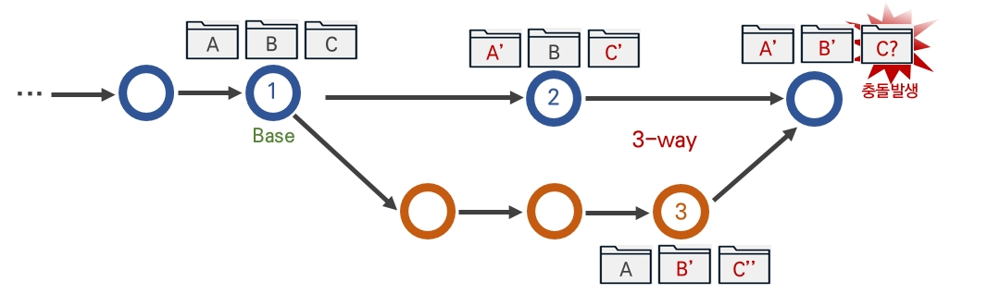
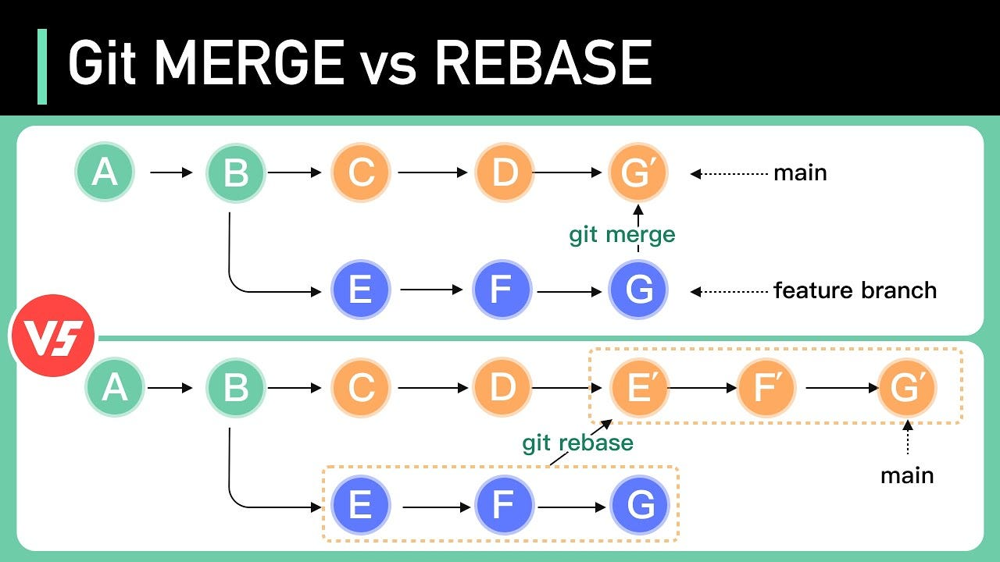

# 병합 `git merge`

## fast-forward 병합


> `git merge <branch name>` 을 통해서 실행할 수 있는 기본 병합이다

- 가장 간단한 브랜치 병합으로, 혼자 개발할때 주로 사용된다.
- 순차적 커밋에 맞추어 병합을 처리하는 방법이 fast-forward 병합이다.
- 병합한 브랜치를 원본 브랜치에 병합할 때, 병합한 브랜치의 가장 첫 번째 커밋이 원본 브랜치의 최신 커밋을 가리키도록 이동하는 방식이다. 이는 마치 원본 브랜치의 마지막 커밋이 병합한 브랜치의 커밋을 그대로 따라가도록 커밋 위치를 최신 상태로 변경하는 것과 유사하다.
- 똑같이 `git merge <branch name>` 으로 시도할 수 있다. 
    - Git은 자동으로 공통 조상(Common Ancestor)을 찾아서 병합을 시도한다. 3-way 병합은 Git이 자동으로 수행하는 과정으로, 병합하려는 두 브랜치의 공통 조상 커밋, 현재 브랜치의 최신 커밋, 그리고 병합하려는 브랜치의 최신 커밋을 비교하여 병합한다.

## 3-way 병합



> 3-way 병합은 Git에서 두 브랜치를 병합할 때 발생하는 병합 방식 중 하나로, 세 가지 주요 지점을 비교하여 병합을 수행하는 방식이다. 이 병합 방식은 Fast-forward 병합이 불가능할 때, 즉 두 브랜치가 서로 다른 커밋을 포함하고 있을 때 사용된다.

### 예시

```plaintext
A---B---C (master)
         \
          D---E (feature)
```

### 충돌 예시

```plaintext
# master 브랜치에서 시작
git init
echo "Hello, World!" > file.txt
git add file.txt
git commit -m "Initial commit on master"

# feature 브랜치 생성 및 전환
git checkout -b feature

# feature 브랜치에서 작업 추가
echo "Feature branch change" > file.txt
git add file.txt
git commit -m "Add feature changes"

# master 브랜치로 돌아가서 작업 추가
git checkout master
echo "Master branch change" > file.txt
git add file.txt
git commit -m "Add master changes"
```

```plaintext
<<<<<<< HEAD
Master branch change
=======
Feature branch change
>>>>>>> feature
```

```plaintext
# 충돌 해결 후 수정
echo "Master and Feature changes combined" > file.txt
git add file.txt
git commit -m "Resolve merge conflict"
```

### 3-way 병합의 특징

- 병합 커밋: 3-way 병합에서는 새로운 병합 커밋이 생성된다. 이 커밋은 두 브랜치가 병합된 결과를 기록한다.

- 충돌 처리: 두 브랜치에서 같은 부분을 수정한 경우, 충돌(conflict)이 발생할 수 있다. 이 경우 Git은 병합을 자동으로 완료하지 못하고, 사용자가 수동으로 충돌을 해결해야 한다.


## rebase `git rebase`



> 브랜치를 합치는 두가지 방법 중 한개(merge, rebase)

- rebase는 커밋의 트리 구조를 재배열 한다. 커밋을 재배열 하는 변경 결과가 병합과 유사하다.
- 실제로 merge 보다는 커밋을 재배열하는 rebase를 더 선호한다.
- 브랜치의 커밋 히스토리를 재구성하여, 현재 브랜치를 다른 브랜치 위에 "재적용"하는 명령이다. 이를 통해 브랜치 간의 관계를 선형적으로 만들어 깔끔한 히스토리를 유지할 수 있다.
- 병합과 다르게 병합 커밋이 존재하지 않는다.
- 베이스 커밋을 변경하여 병합하기 때문에 커밋의 해시 값이 변경된다.