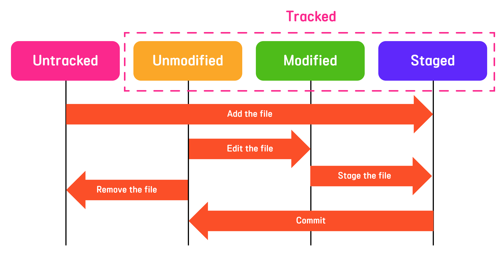

# git의 구조

## 워킹 디렉터리 working directory

>  working tree 라고 불리기도 한다.

- 깃은 저장공간을 크게 `작업을 하는 공간(working)` , `임시로 저장하는 공간(stage)` , `실제로 저장하여 기록하는 공간(repository)` 로 나눈다.

- 워킹 디렉터리는 `작업을 하는 공간` 을 의미한다.
- 로컬 저장소에 접근할 수 있으며, 실제로 파일을 생성하고 수정하는 공간

### 워킹 디렉토리 에서의 파일의 상태

- 파일의 상태는 tracked와 untracked가 있다.
- 워킹 디렉터리에 새로 생성 된 파일은 untracked 상태이다.
- tracked로 바꾸기위해서는 `git add <files>` 을 사용해야 한다.
- tracked를 untracked로 바꾸기 위해서는 `git rm --cached index.html`

## 스테이지 

- 스테이지는 워킹 디렉터리와 실제로 저장하는 공간 사이의 임시영역이다.
- stage 상태와 unstage 상태가 있다
    - stage 영역에 등록된 모든 파일은 untracked에서 tracked 상태로 변경된다.
    - 깃이 변화 이력을 기록하기 위해서는 최종 상태가 stage 상태가 되어야한다.
    - 수정이 되어 unmodified가 자동으로 modified가 되면 unstage가 되어, stage 상태로 바꾸기 위해서는 `git add <files>` 가 필요하다.
