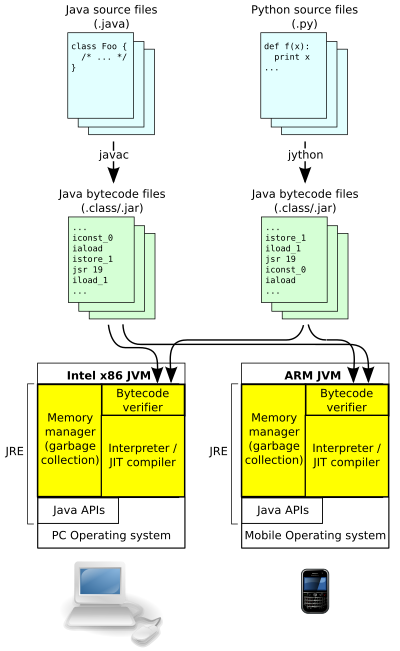

# 바이트코드
- 자바 바이트코드는 JVM(Java virtual machine)이 실행하는 명령어 집합이다. 컴파일하면 생성되는 .class 파일이 바이트코드를 담고 있다.

- 컴파일을 통해 생성된 바이트코드 파일들은 OS나 개발환경에 관계없이 같은 명령어 집합을 사용하며, 이것이 자바의 크로스 플랫폼 동작을 가능하게 해주는 부분이다

- 위 JVM 아키텍처를 자세히 보면 두 종류의 컴파일러가 있다는 것을 알 수 있다.
- 첫 번째 컴파일러는 자바 코드를 자바 클래스 파일로 만들어주는 컴파일러
    - 위 그림에서는 javac로 표기된 부분으로 JDK(Java Development Kit)에 포함된 기본 컴파일러
    - 일반적으로 자바 컴파일러를 말할 때에는 바이트코드를 생성하는 이 컴파일러를 말한다
    - JRE(Java Runtime Environment)에서 더 나은 최적화를 하기 위해서 이 단계에서는 loop unrolling, algebraic simplification, strength reduction와 같은 기본적인 최적화도 하지 않는다.
- 위 아키텍처에서 다음으로 볼 수 있는 컴파일러는 JIT(Just In Time) 컴파일러
    - JVM은 동적으로 바이트코드를 읽으며 인터프리팅을 하는데, 이 단계에서 JIT 컴파일러는 자바 애플리케이션의 성능향상을 위해 동적 컴파일을 통해 머신코드(Machine code)로 컴파일 가능한 코드들을 한 번 더 컴파일한다. 이처럼 미리 컴파일하지 않고 실행 중 동적으로 컴파일하는데, 컴파일러의 이름이 Just In Time인 이유가 바로 여기에 있다
- 즉, javac는 최적화는 거의 하지 않고, Java 소스 코드를 거의 1:1 대응되게 바이트코드(.class)로 변환한다. 실제 실행 시의 최적화는 대부분 JVM이 맡는다.(loop unrolling 등)
    - 즉, JVM도 튜닝하면 Rust의 iteration의 제로비용 추상화 같은 동작이 가능해진다