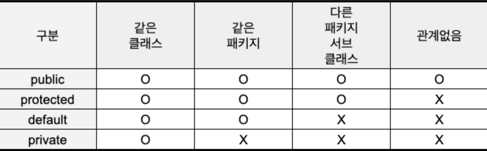

# 접근 제어자

> 접근 제어자는 위에 서술한 문제와 같이 의도치 않은 실수로 인한 동작을 줄이고 객체가 가지는 정보에 대한 접근을 막는 은닉의 목적으로 사용된다.

## public
> 모든 클래스에서 접근 가능하다. 같은 패키지 내의 클래스뿐만 아니라 다른 패키지의 클래스에서도 접근할 수 있다

## protected
> 같은 패키지 내의 클래스와 상속받은 자식 클래스에서 접근할 수 있다. 즉, 같은 패키지 내의 클래스와 그 패키지를 넘는 자식 클래스에서 접근 가능하다.

## default (package-private)
> 접근 제어자를 명시하지 않을 경우, 기본적으로 적용되는 접근 제어자이다. 같은 패키지 내의 클래스에서만 접근 가능하다. 다른 패키지의 클래스에서는 접근할 수 없다.

## private
> 해당 클래스 내에서만 접근할 수 있다. 다른 클래스나 패키지에서는 접근할 수 없다.