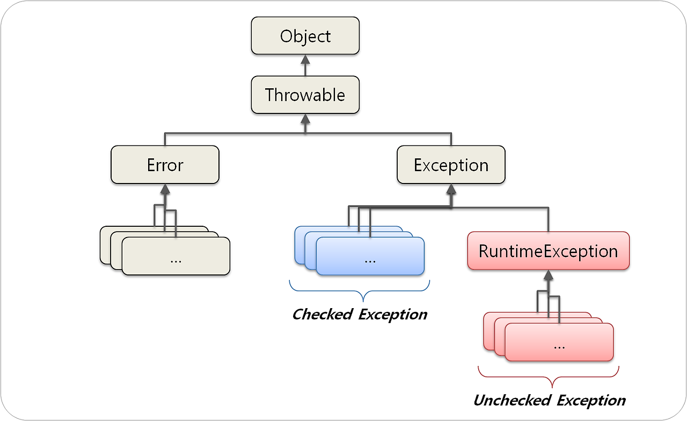

# Exception

- JAVA의 예외는 크게 Checked Excepion , Unchecked Exception(Runtime Exception) 이 존재한다.
- Spring을 다룰때는 Unchecked 예외가 특히 중요한데, 스프링 프레임워크가 제공하는 트랜잭션(@Transactional)안에서 에러 발생 시 체크 예외는 롤백이 되지 않고, 언체크 예외는 롤백이 되기 때문이다.(옵션으로 변경 가능)

## Checked Exception

- 코드에서 발생할 수 있는 예외를 컴파일러가 미리 확인하고, 이를 적절히 처리하거나 선언하도록 강제하는 Java의 예외 처리 메커니즘이다.

- Checked Exception은 프로그램 실행 중 발생할 수 있는 특정 예외 상황을 컴파일러가 인지하고, 개발자가 이를 반드시 처리해야 한다고 요구하기 위해 설계되었다.

    - Checked Exception은 중요한 작업(예: 파일 읽기/쓰기, 네트워크 연결 등)에서 발생 가능한 문제를 미리 예상하여 안전하게 처리하도록 강제한다.
    - 예외 처리를 강제하지 않으면 프로그램이 예기치 못한 상황에서 중단될 가능성이 커진다.
    - 예외를 명시적으로 처리하거나 선언함으로써 코드의 의도를 명확히 하고, 호출자가 예외 발생 가능성을 인지하도록 돕는다.

- Checked Exception은 Java의 컴파일러가 예외 처리를 강제하기 위해 도입된 기능이다.
    - 즉, Checked Exception은 개발자의 코드를 안전하기 위해 컴파일러 단계에서 강제하는 것이다.

### Checked Exception가 발생할 가능성이 있는 메서드

- 체크 예외는 보통 시스템 자원이나 외부 입력에 의존하는 작업에서 발생한다.
    - 파일 I/O (IOException)
    - 네트워크 통신 (SocketException)
    - 데이터베이스 작업 (SQLException)

### 해결 방법

- 컴파일러는 메서드 내에서 발생할 수 있는 체크 예외를 확인한다.
- 예외를 처리하지 않으면 컴파일 오류를 발생시킨다.
    - try-catch 블록으로 예외를 직접 처리.
    - throws 키워드로 예외를 상위 메서드로 전달.

## Unchecked Exception

- 컴파일러가 예외 처리를 강제하지 않는 예외를 의미한다. 즉, 런타임 예외(Runtime Exception) 또는 그 하위 클래스들이 여기에 해당한다. 개발자가 이 예외를 처리하지 않아도 컴파일 오류가 발생하지 않는다.
- 스프링이 제공하는 트랜잭션(@Transactional)안에서 에러 발생 시 체크 예외는 롤백이 되지 않고, 언체크 예외는 롤백이 되기 때문이다.(옵션으로 변경 가능)
- 컴파일러가 예외 처리를 강제하지 않으므로, try-catch 블록이나 throws 선언 없이도 발생할 수 있다.

### RuntimeException의 하위 클래스

- 모든 Unchecked Exception은 RuntimeException 클래스를 상속받거나, 그 하위 클래스들이다.
    - 예: NullPointerException, ArithmeticException, ArrayIndexOutOfBoundsException 등.
    - Unchecked Exception은 실행 시간(Runtime) 중에 발생하는 예외들로, 주로 프로그램 논리적 오류에서 발생한다.

## Checked Exception vs Unchecked Exception

| **특징**                  | **Checked Exception**                         | **Unchecked Exception**                      |
|---------------------------|----------------------------------------------|---------------------------------------------|
| **컴파일 타임 처리**        | 컴파일러가 예외 처리를 강제                  | 예외 처리 강제 없음                         |
| **상속 클래스**            | `Exception` 클래스 (그 하위 클래스들)          | `RuntimeException` 클래스 (그 하위 클래스들) |
| **처리 방법**              | `try-catch` 또는 `throws`로 처리               | 필요 시 `try-catch` 처리하거나 생략 가능   |
| **발생 시기**              | 주로 외부 요인(파일, 네트워크 등) 관련 작업에서 발생 | 주로 프로그래머의 실수나 논리적 오류에서 발생 |
| **예시**                   | `IOException`, `SQLException`               | `NullPointerException`, `ArithmeticException` |

- Unchecked Exception은 주로 프로그래머의 실수나 논리적 오류로 인해 발생하며, 컴파일러가 예외 처리 강제하지 않는다. 하지만 예외를 처리하지 않으면 실행 시 프로그램이 비정상적으로 종료될 수 있으므로, 상황에 맞게 예외를 처리하거나 예방하는 것이 중요하다.

