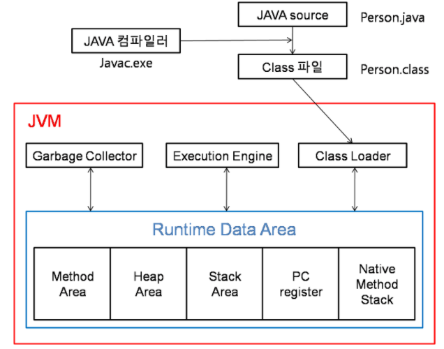
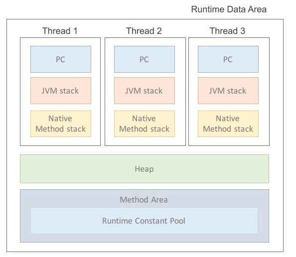
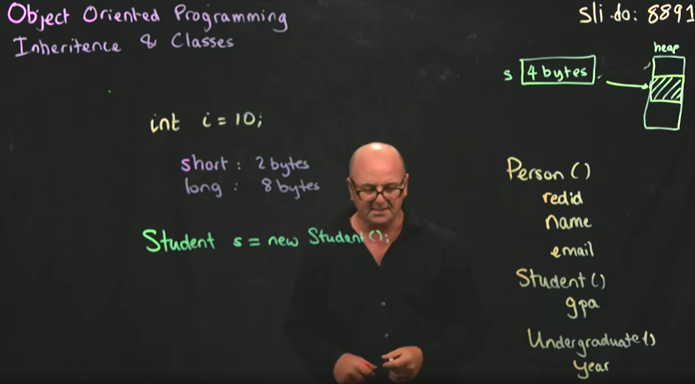
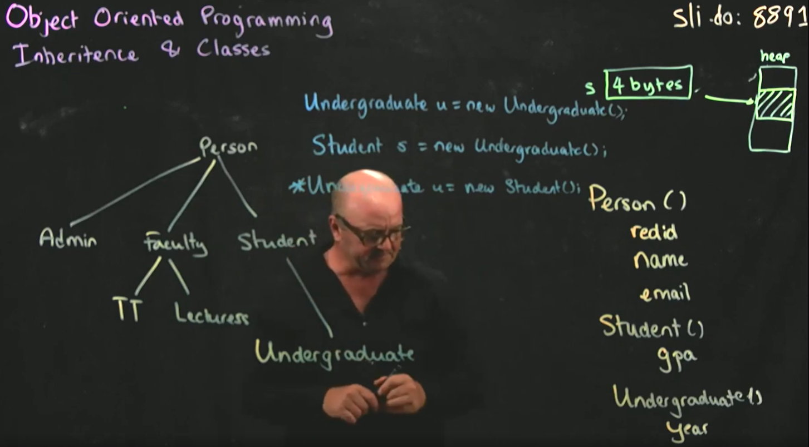

# JAVA의 메모리구조

> Java의 메모리 구조는 크게 Heap, Stack, Method Area, PC Register, Native Method Stack으로 나눌 수 있다.




## 각 영역의 특징


1. Heap

설명: 객체와 배열이 저장되는 메모리 공간이다.<br>
특징: 런타임에 동적으로 메모리를 할당하고 해제할 수 있다.
JVM이 가비지 컬렉션을 통해 사용하지 않는 메모리를 자동으로 회수한다.
모든 객체 인스턴스는 이 영역에 저장된다.

2. Stack

설명: 메서드 호출 시 생성되는 프레임이 저장되는 공간이다.<br>

특징:
각 스레드마다 고유한 스택이 존재한다.
메서드의 로컬 변수, 매개변수, 리턴 주소가 저장된다.
LIFO(Last In, First Out) 구조로 작동하며, 메서드가 종료되면 관련된 프레임이 자동으로 제거된다.


3. Method Area

설명: 클래스 관련 정보가 저장되는 메모리 공간이다.<br>
특징: 클래스의 메타데이터(클래스의 변수, 메서드, 상수풀 등)가 포함된다.
JVM에 의해 클래스가 로드될 때 이 영역에 할당된다.
가비지 컬렉션이 발생할 수 있지만, 일반적으로 자주 발생하지는 않는다.

4. PC Register

설명: 현재 실행 중인 JVM 명령어의 주소를 저장하는 레지스터이다.<br>
특징: 각 스레드마다 고유한 PC 레지스터가 있다.
스레드가 실행하는 메서드의 바이트코드의 주소를 추적한다.

5. Native Method Stack

설명: Java가 아닌 언어로 작성된 네이티브 메서드의 정보를 저장하는 스택이다.<br>

특징: JNI(Java Native Interface)를 통해 호출된 네이티브 메서드의 정보를 저장한다.
Java 스택과 유사하게 동작하지만, Java 외부의 메서드를 호출할 때 사용된다.

## JVM의 메모리할당 예시



> 다음 코드들 에서 JVM의 메모리 할당은 어떻게 될까?
```java
    int i = 10;
    // 원시형 int는 4bytes 를 차지하므로 JVM이 4bytes의 공간을 할당한다.
    // 할당되는 공간은 어디인가?
    // 메서드 내부에 선언된 원시형 변수는 스택 메모리에 저장된다.
    // 클래스의 멤버 변수로 선언된 원시형은 힙(Heap) 메모리에 저장된다.
    // static으로 선언된 원시형은 메서드 영역(Method Area)에 저장된다.
    Student s = new Student();
    // 이 경우, s는 Stack Memory 4bytes공간에 저장된다.
    // 해당 공간은 객체 s에 대한 상태를 가지고 있고, heap영역에서 student객체가 저장된 부분을 가르키는 포인터이다. (Metadata를 가지고있는 저장공간)
```

> 메모리 할당과 형변환 가능 불가능한 이유

```java
    Undergraduate u = new Undergraduate();
    // 해당 코드는 stack에 4bytes의 공간을 할당한 후 이 공간에 상속받은 모든 정보들(Person, student, undergraduate)의 정보를 넣는다.
    Student s = new Undergraduate();
    // 해당 코드는 컴파일 에러를 일으키지 않는다.
    // 이유 : Undergraduate를 stack에 클래스 정보를 넣고 heap에 객체를 할당했을때, Student에 대한
    // 정보가 들어갈 공간이 존재하기 때문이다. (없다고 넣으면 되기 때문)
    Undergraduate u = new Student();
    // 해당 코드는 컴파일 에러를 발생시킨다.
    // 이유 : Student를 stack에 클래스 정보를 넣고 heap에 객체를 할당했을때, 이 stack 공간에는
    // Undergraduate 클래스 정보가 들어갈 공간이 존재하지 않는다.
    // 그래서 해당 코드는 컴파일 에러를 발생시킨다.(넣을 수 있는 공간 자체가 할당안됬기 때문)
```

## Recap

> Java의 메모리 구조는 객체, 메서드, 클래스, 실행 중인 명령어 등을 효율적으로 관리하고, 가비지 컬렉션을 통해 메모리 사용을 최적화한다. 이러한 구조는 Java의 플랫폼 독립성과 메모리 관리의 편리함을 지원한다.