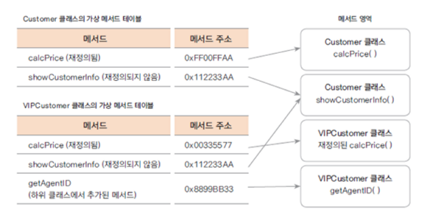

# Java의 Method

## Java의 메서드 호출

### 정적 메서드

- 클래스 레벨에서 존재하면 인스턴스 없이 호출이 가능
- 컴파일시 호출이 결정되는 정적 바인딩 동작을 한다

### 동적 바인딩

- 가상 메서드를 호출하다가 JVM이 아직 resolve 안 된 심벌을 만나면 resolve가 일어나고, 그 후에 vtable 검색을 통해 올바른 구현체가 호출된다
- 컴파일 시에는 호출 대상 타입까지만 확인하고(반환형), 런타임 시 실제 객체 타입에 따라 호출되는 메서드를 결정하는 동적바인딩 동작을 한다
```java
class Parent {
    void hello() { System.out.println("Parent"); }
}

class Child extends Parent {
    @Override
    void hello() { System.out.println("Child"); }
}

public class Main {
    public static void main(String[] args) {
        Parent p = new Child();
        p.hello(); // "Child" 출력 → 동적 바인딩
    }
}
```
- 위 예제를 바이트 코드로 바꿀 경우의 예제
```plaintext
0: aload_1        ; p 레퍼런스를 로드
1: invokevirtual #2 // Child 또는 Parent hello() 호출
4: return
```
- invokevirtual 명령어가 핵심이다
  - 런타임 객체 타입을 확인(실제 구현체)하고 가상 메서드 테이블에서 주소를 가져옴
- 반대로 static 메서드는 invokestatic 사용
  - 런타임 타입 확인 필요 없음

#### 가상 함수 Virtual function



- 가상 함수(virtual function 또는 virtual method)는 상속하는 클래스 내에서 같은 시그니처(메서드명, 매개변수, 리턴형)의 함수로 오버라이딩 될 수 있는 함수 또는 메소드를 말한다
- static이 아닌 메서드는 객체가 생성될 때 메서드 영역에 생성된다 
  - 가상 함수는 가상함수 테이블(virtual function table) 이라는 구조로 함수의 주소를 저장하고 있다
- 객체가 생성 되는 시점은 Runtime 시점으로 인스턴스의 타입을 결정지을 수 있다
  - 이때 재정의 된 메서드가 있을 경우, JVM이 가상 함수 테이블에서 메서드 주소를 이용하여 상위 클래스의 메서드가 아닌 인스턴스의 타입인 하위 클래스의 메서스(재정의 된 메서드)를 가져온다

### 메서드 호출의 오버헤드

```java
class Test {
    int compute(int x) {
        return x * 2;
    }

    public static void main(String[] args) {
        Test t = new Test();
        int sum = 0;
        for (int i = 0; i < 1000000; i++) {
            sum += t.compute(i);
        }
        System.out.println(sum);
    }
}

// javap -c {Test}
0: aload_1          ; t 객체 로드
1: iload_2          ; i 로드
2: invokevirtual #2 ; compute 호출
5: iadd             ; sum += compute 결과
6: istore_2         ; sum 저장
```
- 메서드 호출 시 동작
  - 피연산자를 스택에 푸시
  - invokevirtual 실행 → 가상 테이블(vtable)에서 메서드 주소 가져오기
  - 메서드 실행 → 결과를 스택에 반환
- invokevirtual → 동적 바인딩 발생 → 실제 메서드 주소 결정
- JIT 최적화 전에는 매번 가상 테이블 조회 → CPU 레지스터 대신 스택 사용
- JIT 후에는 컴파일 타임에 인라이닝 가능 → 레지스터에 바로 값 반환, 오버헤드 감소
