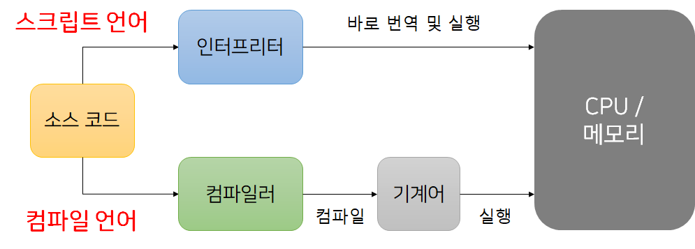

# Compiler

> 소스 코드를 전체적으로 읽어들여 기계어 또는 중간 코드로 변환한 후, 이 변환된 코드를 실행하는 방식이다.

## 특징

- 전체 변환: 프로그램의 전체 소스를 한 번에 변환한다.
- 실행 속도: 변환 후의 실행 파일을 생성하므로 실행 속도가 빠르다.
- 오류 탐지: 컴파일 단계에서 문법 오류를 확인하고 수정할 수 있다.
- 배포 용이성: 컴파일된 프로그램은 특정 플랫폼에서 실행 가능하므로, 배포가 용이하다.

## 대표적인 언어

- Java
- C
- C++

# Interpreter

> 인터프리터 언어는 **일반적**으로 스크립트 언어라고 간주된다.

> 소스 코드를 한 줄씩 읽어들여 즉시 실행하는 방식이다.

## 특징

- 실행 즉시: 코드를 한 줄씩 해석하며 실행하므로 빠르게 결과를 확인할 수 있다.
- 동적 해석: 프로그램 실행 중에 코드를 수정하고 즉시 반영할 수 있다.
    - ex) JS의 브라우저에서 실행되는 기능
    - python같은 경우엔 안됨
- 유연성: 스크립트 언어에서 주로 사용되며, 다양한 플랫폼에서 쉽게 실행 가능하다.

## 대표적인 언어
- javascript
- python
- ruby
- php

## 차이점

