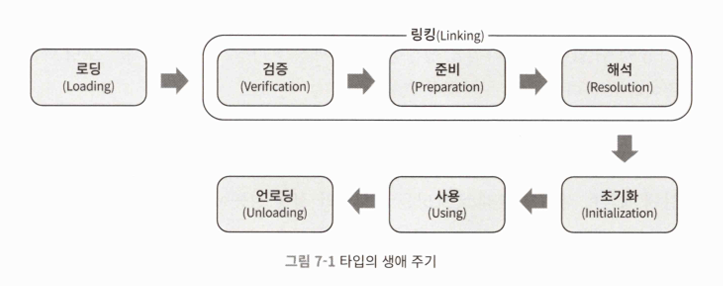

# ClassLoader

> ClassLoader의 동작은 단순한 클래스 로드일 뿐이며, new연산과는 별도의 과정이다



- 로딩, 검증, 준비, 초기화, 언로딩은 반드시 순서대로 해야한다
  - 하지만 해석 단계는 그렇지 않아 초기화 후에 시작할 수 있다
    - 런타임 바인딩(동적 바인딩)을 지원하기 위해서
  - <자바 가상 머신 명세>에는 초기화 단계가 즉시 시작되는 시점에 관한 6가지 규칙이 있고, 로딩이 시작되는 상황에 대한 명시는 되어있지 않았다
- 때로는 한 단계를 진행하는 중간에 다음 단계를 호출해 시작시키는 등 여러 단계가 병렬로 진행되기도 한다

## 1. 로딩 

- JVM은 로딩 단계에서 세 가지 작업을 반드시 수행해야한다
  1. 완전한 이름을 보고 해당 클래스를 정의하는 바이너리 바이트 스트림을 가져온다
  2. 바이트 스트림으로 표현된 정적인 저장 구조를 메서드 영역에서 사용하는 런타임 데이터 구조로 변환한다
  3. 로딩 대상 클래스를 표현하는 java.lang.Class 객체를 힙 메모리에 생성한다. 이 Class 객체는 애플리케이션이 메서드 영역에 저장된 타입 데이터를 활용할 수 있게하는 통로가된다
- <자바 가상 머신 명세>에 이 요구 사항을 너무 세세하게 정의하지는 않은 덕분에 가상 머신 구현자와 자바 애플리케이션이 취할 수 있는 운신의 폭이 매우 넓다
  - 이 자유도 때문에 자방 머신의 로딩 단계에서 광범위한 작업을 수행할 수 있게 되었다
    - 네트워크로 부터 로딩
    - java.lang.reflect.Proxy의 ProxyGenerator.generateProxyClass() 지정한 인터페이스의 `*$Proxy` 형태의 프록시 클래스에 해당하는 바이너트 스트림을 생성해준다
    - JSP 애플리케이션은 클래스 파일을 JSP파일로부터 생성한다
      - Jasper를 통해 만들어지며, java로 만든 jsp엔진 구현체이다
      - 컴파일 타임에 .java파일로 만들어진후, .class파일로 컴파일되어 런타임에 호출된다
      - .java파일로 호출시 html template를 반환받는 메서드가 생성되고, 필요한 곳에서 이를 dispatch한다

### 로딩 시점의 Class 객체

- Class 객체는 Reflection과 연관이 있는 객체이다
- 이를 사용해 JRE에서 new로 객체를 만들 수 있도록 메타데이터를 저장한다
  - java.lang.Class 객체는 각 클래스마다 하나씩만 존재한다
```java
Class<?> c1 = Class.forName("java.lang.String");
Class<?> c2 = String.class;
Class<?> c3 = "hello".getClass();

System.out.println(c1 == c2); // true
System.out.println(c2 == c3); // true
```
- 즉, 로딩의 목적은 java.lang.Class 객체에 바이너리 스트림을 읽어 Class에 관한 메타데이터를 저장하고, JRE에서 new연산을 할 수 있는 환경을 세팅하는 것이다

## 2-1. 검증(링킹 시작)

- 검증의 목적
  1. 클래스 파일의 바이트 스트림에 담긴 정보가 <자바 가상 머신 명세>에서 규정한 모든 제약 조건을 만족하는지 확인
  2. 이 정보를 코드로 변환해 실행했을 때 자바 가상 머신 자체의 보안을 위협하지 않는지 확인한다
  - 시스템을 보호하기 위한 목적이기도하며, JVM 스스로를 보호하기 위한 목적이기도 하다
- 검증하는 것
  1. 파일 형식 검증
  2. 메타데이터 검증
  3. 바이트코드 검증
  4. 심벌 참조 검증(시그니처와 비슷하지만, 시그니처보다 더 큰 개념이다)

## 2-2. 준비

- static 변수 메모리 할당 시작
  - 값이 선언되어 있더라도 기본 값으로 할당된다(0, null, false ..)
  - final같은 상수값이라면 기본 값이 아닌 상수 값이 할당된다

## 2-3. 해석

- 상수 풀의 심벌 참조(선언)를 실제 메모리 참조로 변환한다

## 3. 초기화

- static {..} 블록과 static 변수의 실제 값 할당이 실행된다 